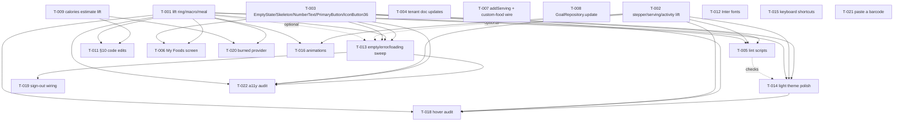

# Developer Tickets — Overnight Pool (2026-05-16)

## ⚠️ Status snapshot — 2026-05-16 (Phase 6, partial)

The first Wave-0 dispatch fanned out 10 agents in parallel. Of those:

- **3 completed and shipped** (commit `40eecba`, deployed live):
  - T-004 — tenant doc updates (T-23 added, T-05 refined).
  - T-008 — `GoalRepository.update()` + edit-goal-sheet fix (silent bug closed).
  - T-012 — Inter font bundle.
- **7 hit the user-daily API rate limit** (`resets 3:20am America/Los_Angeles`)
  before completing meaningful work. Their partial output was inspected:
  - T-001 left 2 of 5 widget lifts as orphan duplicates → reverted.
  - T-007 referenced undefined `ServingCreate` (build break) → reverted.
  - T-002, T-003, T-009, T-015, T-021 hit the limit on their first few
    tool calls and left no on-disk artifacts.

**Resumption plan when the limit resets:**

1. Re-dispatch the 7 incomplete Wave-0 tickets in **smaller batches**
   (2–3 agents at a time) to avoid blowing the daily quota again.
   Suggested batch ordering by independence:
   - Batch A: T-009 (lift calories), T-015 (web shortcuts), T-021 (paste barcode).
   - Batch B: T-003 (primitives), T-007 (addServing + custom-food wire).
   - Batch C: T-001 (Tier-A lifts), T-002 (stepper/serving/activity).
2. Once Wave 0 closes, dispatch Wave 1: T-005, T-006, T-011, T-013, T-014,
   T-016, T-020. Same small-batch strategy.
3. Then Wave 2: T-010 (P2), T-018, T-019, T-022.

**For the human in the morning**: the deploy at
`https://sdstolworthy.github.io/fulfilled/app/` is green on `40eecba`.
Nothing here blocks waking up to a working app. Pick up where you
prefer — either re-dispatch agents from a fresh shell or have me
resume from a new conversation.

---

Source of truth for the overnight pool. Every ticket below is sized for a
single developer agent to pick up, finish, and review in one session.
Agents do **not** have a Flutter SDK — they write tests to disk and ship
them inspection-correct, but they do **not** run `flutter test` or
`flutter analyze`. Inspect for typos, but assume CI gates run on a host
machine later.

**Read order**:

1. This file (you are here).
2. `specs/pm_overnight_features.md` — the PM's *what* and *why*.
3. `specs/architect_annotated_features.md` — the architect's *how*.
4. `specs/flutter_ui_architecture.md` — the 22 tenants. Cited by ID.
5. `specs/pm_decisions_flutter_ui.md` — Display Units Principle, etc.

Tickets reference these docs by section/ID instead of re-quoting them.

**Branch model**: the overnight pool dispatches one agent per ticket on
top of `main` at commit `4cfda00`. Each ticket lists `Owns files:` — an
agent must not touch any file outside that list without flagging in the
ticket Notes. If two tickets share a file in their `Owns files:` list,
the dependency graph below sequences them.

**Ticket status legend**:

- `pending` — not started.
- `in-progress` — claimed by an agent; uncommitted work-in-progress.
- `done` — committed to `main`; agent has updated this doc.
- `blocked-needs-pm` — agent gave up; see failure protocol at the
  bottom.

---

## T-001  Lift Tier-A shared widgets to `lib/widgets/` (ring + bars + meal)

**Status**: pending
**Priority**: P0
**Effort**: M
**Depends on**: none
**Owns files**:
- `client/lib/widgets/calorie_ring.dart` (new — moved from `features/today/widgets/calorie_ring.dart`)
- `client/lib/widgets/macro_bar.dart` (new — moved from `features/today/widgets/macro_bar.dart`)
- `client/lib/widgets/ring_summary_card.dart` (new — moved from `features/today/widgets/ring_summary_card.dart`)
- `client/lib/widgets/meal_section.dart` (new — moved from `features/today/widgets/meal_section.dart`)
- `client/lib/features/today/widgets/calorie_ring.dart` (delete)
- `client/lib/features/today/widgets/macro_bar.dart` (delete)
- `client/lib/features/today/widgets/ring_summary_card.dart` (delete)
- `client/lib/features/today/widgets/meal_section.dart` (delete)
- `client/lib/features/today/today_internals.dart` (import rewrites)
- `client/lib/features/today/day_view_compact.dart` (import rewrites)
- `client/lib/features/today/day_view_expanded.dart` (import rewrites)

### Goal
Establish `lib/widgets/` as the canonical home for the four day-view
widgets that the architecture appendix lists. After this ticket, every
`features/*` file that needs a ring / macro bar / meal section /
ring-summary-card imports via `package:fulfilled/widgets/<name>.dart`.

### Context
PM feature **A1**; architect §A1 inventory line items 1–4. Tenants
**T-01** (no hex outside tokens), **T-09** (one source of truth for
numbers), **T-15** (form-factor branch at the root).

The four widgets here are *single-call-site* today — only `features/today`
consumes them — so the lift is mostly mechanical. The harder widgets
(quantity stepper, serving list, activity option) are in T-002 and T-003.

### Scope
- [ ] Move each of the four widget files to `lib/widgets/<name>.dart`
      verbatim. Preserve all class names, props, and private helpers
      (`_AddFootRow`, `_EntryRow`, etc. stay private to the file).
- [ ] Rewrite every consumer to import `package:fulfilled/widgets/<name>.dart`.
      Grep `features/today/widgets/(calorie_ring|macro_bar|ring_summary_card|meal_section)`
      after the move — zero hits expected.
- [ ] Delete the four `features/today/widgets/*.dart` files.
- [ ] Confirm `colors.dangerOver` (not `colors.danger`) drives the
      over-budget arc/bar fill. If a lift surfaces a hex literal,
      replace with the named token; flag in commit message.
- [ ] Add a one-line comment at the top of `meal_section.dart`:
      `// Empty-meal exception: the meal header renders at 0 kcal with
      colors.emptyDot — it does NOT delegate to EmptyState. See
      flutter_ui_architecture.md §9 and dev_tickets.md T-013.`

### Out of scope
- Behavior changes. This is a pure move.
- `QuantityStepper`, `ServingList`, `ActivityOption` — these are T-002.
- `EmptyState`, `Skeleton`, `NumberText`, `PrimaryButton`, `IconButton36` —
  these are T-003.
- Any new token additions (`userThumbBg` etc.) — those land in T-014.
- Animations (B4) — that's T-016.

### Acceptance criteria
- [ ] `lib/widgets/calorie_ring.dart`, `macro_bar.dart`,
      `ring_summary_card.dart`, `meal_section.dart` exist and compile
      against the rest of `lib/`.
- [ ] No file under `features/today/widgets/` exists for these four
      widgets. `find client/lib/features/today/widgets -name "calorie_ring.dart"`
      → empty.
- [ ] All `features/today/*.dart` consumers import
      `package:fulfilled/widgets/<name>.dart`.
- [ ] Tenants honored: T-01, T-09, T-15.

### Tests
- `client/test/widget/calorie_ring_test.dart` — covers default render +
  over-budget render at `consumed > goal`. The existing tests under
  `client/test/features/today/` that reference the moved widgets must
  be updated to import from the new location.
- No new behavioral tests; existing `today_*` widget tests should
  continue to pass after path updates.

### Notes / gotchas
- The architect noted that `dangerOver` (`#B5552E` brighter-orange-red)
  and `danger` (also `#B5552E` per current `colors.dart` line 101–103 —
  they're the *same hex* today but the token names are distinct). Do
  NOT collapse the tokens. The disambiguation of *meaning* lands in
  T-014's doc-update step.
- If the lift catches a stray `Color(0xFF…)` literal inside one of the
  four files, replace it with the right token now. Flag in the commit
  message so reviewers see the cleanup.

---

## T-002  Lift `QuantityStepper`, `ServingList`, `ActivityOption` with API reconciliation

**Status**: pending
**Priority**: P0
**Effort**: L
**Depends on**: none (T-001 doesn't block; different files)
**Owns files**:
- `client/lib/widgets/quantity_stepper.dart` (new)
- `client/lib/widgets/serving_list.dart` (new)
- `client/lib/widgets/activity_option.dart` (new)
- `client/lib/features/log_entry/widgets/quantity_stepper.dart` (delete the duplicate widget; the `QuickMultiplierChips` *stays* but moves to its own file — see Scope)
- `client/lib/features/log_entry/widgets/quick_multiplier_chips.dart` (new — extracted from the deleted file)
- `client/lib/features/log_entry/log_entry_sheet.dart` (rewires to the lifted widget via a `Consumer`)
- `client/lib/features/custom_food/widgets/quantity_stepper.dart` (delete)
- `client/lib/features/custom_food/widgets/servings_section.dart` (rewires to the lifted stepper; keeps its own row composition for now)
- `client/lib/features/weight/widgets/log_weight_sheet.dart` (rewires the kg input through the lifted stepper)
- `client/lib/features/food_detail/widgets/serving_list.dart` (delete — the lifted version supersedes)
- `client/lib/features/food_detail/food_detail_screen.dart` (import rewrites)
- `client/lib/features/log_entry/log_entry_sheet.dart` (already listed above)
- `client/lib/features/onboarding/widgets/activity_option.dart` (delete)
- `client/lib/features/onboarding/widgets/step_2_about_you.dart` (import rewrites)
- `client/lib/features/profile/widgets/activity_level_picker.dart` (rewrite `_ActivityRow` to consume the lifted `ActivityOption`)

### Goal
End the duplicate-widget drift on the three widgets the PM doc flagged.
After this ticket: one `QuantityStepper` widget, one `ServingList`
widget (read-only for now; editor stays in `custom_food/`), one
`ActivityOption` widget consumed by both onboarding and profile.

### Context
PM feature **A1** (the gnarly half); architect §A1 "Quantity stepper
reconciliation", "Serving list reconciliation", "Activity option
reconciliation". Tenants **T-01**, **T-07** (numeric inputs have a
stepper), **T-15**.

The architect made three load-bearing rulings the PM doc did not
specify:

1. The lifted `QuantityStepper` is the **callback-shaped** one (`value`
   + `onChanged`), NOT the Riverpod-bound shape from `log_entry/`. The
   log-entry sheet wraps it in a small `Consumer` that bridges to the
   sheet-scoped `quantityProvider`.
2. `QuickMultiplierChips` is **NOT** lifted — it stays in
   `features/log_entry/` because it's a screen-04-specific composition.
   It moves to its own file (`quick_multiplier_chips.dart`) for naming
   cleanliness.
3. `ServingList`'s editor variant **stays in `custom_food/`** for v1.
   The lifted `ServingList` is read-only-with-selection; the editor
   collapse is a v1.1 ticket.

### Scope
- [ ] Create `lib/widgets/quantity_stepper.dart` with the
      callback-shaped API: `value: Decimal?`, `onChanged: ValueChanged<Decimal?>`,
      `step: Decimal = Decimal.one`, `min: Decimal?`, `max: Decimal?`,
      `unitSuffix: String?`, `placeholder: String?`, `hasError: bool = false`,
      `showStepperButtons: bool = true`, `allowDecimal: bool = true`.
      Source: `features/custom_food/widgets/quantity_stepper.dart` is
      the closest existing shape — use it as the starting point.
- [ ] In `log_entry_sheet.dart`, replace the existing
      `QuantityStepper` consumer with a 6-line `Consumer` wrapper that
      reads `ref.watch(quantityProvider)` and forwards
      `ref.read(quantityProvider.notifier).state = next` from
      `onChanged`. The wrapper passes `step: Decimal.parse('0.5')`
      explicitly.
- [ ] Extract `QuickMultiplierChips` from the old
      `features/log_entry/widgets/quantity_stepper.dart` into its own
      `features/log_entry/widgets/quick_multiplier_chips.dart`. Same
      class, same provider binding. Delete the old file.
- [ ] Rewire `features/custom_food/widgets/servings_section.dart` to
      consume the lifted stepper (it already uses the callback shape;
      should be a one-line import change).
- [ ] Rewire `features/weight/widgets/log_weight_sheet.dart` to consume
      the lifted stepper for the kg input. Pass `step: Decimal.parse('0.1')`,
      `min: Decimal.parse('20')`, `unitSuffix: 'kg'`.
- [ ] Create `lib/widgets/serving_list.dart` from
      `features/food_detail/widgets/serving_list.dart` verbatim. Add a
      reserved prop slot: `bool selectable = false` (no behavior yet —
      the prop is there so v1.1 can flip it). Keep the existing
      `selectedId`/`onSelect` plumbing if any; if there isn't one,
      add `String? selectedId, ValueChanged<String>? onSelect`.
- [ ] Update `features/food_detail/food_detail_screen.dart` and any
      other consumer (search through repo) to import the lifted file.
      Delete `features/food_detail/widgets/serving_list.dart`.
- [ ] Add code comments at both
      `lib/widgets/serving_list.dart` and
      `features/custom_food/widgets/servings_section.dart` saying:
      `// v1: the editor variant lives in custom_food/; v1.1 collapses
      the two via a ServingRow that flips between display + edit. See
      dev_tickets.md T-002 notes.`
- [ ] Create `lib/widgets/activity_option.dart` from
      `features/onboarding/widgets/activity_option.dart` verbatim
      (architect: this is the canonical shape).
- [ ] Rewrite `_ActivityRow` inside
      `features/profile/widgets/activity_level_picker.dart` to consume
      the lifted `ActivityOption`. The architect explicitly called out
      that the radio-icon-on-the-left rendering is a design-consistency
      bug; the onboarding rendering (custom radio dot) is canonical.

### Out of scope
- Collapsing the editable `servings_section.dart` into the lifted
  `ServingList`. That's a v1.1 ticket (see T-002 notes inside the
  files).
- New props on `QuantityStepper` beyond the architect-defined set.
- Animations.
- Token changes (B2 lands in T-014).

### Acceptance criteria
- [ ] One `QuantityStepper` widget at `lib/widgets/quantity_stepper.dart`.
      Three call sites: log entry sheet (via `Consumer` wrapper),
      custom-food servings section, weight log sheet.
- [ ] No file at `features/log_entry/widgets/quantity_stepper.dart` or
      `features/custom_food/widgets/quantity_stepper.dart`.
- [ ] `QuickMultiplierChips` lives at
      `features/log_entry/widgets/quick_multiplier_chips.dart` (NOT
      lifted to `lib/widgets/`).
- [ ] One `ServingList` widget at `lib/widgets/serving_list.dart`. The
      custom-food editor still owns its own row composition.
- [ ] One `ActivityOption` widget at `lib/widgets/activity_option.dart`.
      Both onboarding step 2 and profile's activity picker consume it.
      Profile picker no longer ships a parallel `_ActivityRow`.
- [ ] Tenants honored: T-01, T-07, T-15.

### Tests
- `client/test/widget/quantity_stepper_test.dart` — covers
  callback semantics (typing emits `onChanged` with the parsed
  `Decimal`), step button increments by `step`, floor at `min`,
  `hasError: true` renders the error border, `placeholder` shows when
  `value == null`.
- `client/test/widget/serving_list_test.dart` — covers the synthetic
  badge always renders (T-10), tapping a row emits `onSelect(id)`,
  `selectedId` controls the selected visual.
- `client/test/widget/activity_option_test.dart` — covers selected
  vs unselected rendering, tap emits `onTap()`.
- Update `client/test/features/log_entry/`,
  `client/test/features/custom_food/`,
  `client/test/features/onboarding/`,
  `client/test/features/profile/` imports to the new paths.

### Notes / gotchas
- The `Consumer` wrapper in `log_entry_sheet.dart` is the load-bearing
  bit. Forgetting it = the sheet renders without a value and the user
  can't enter quantities. The compile error if you forget should be
  loud: `QuantityStepper` requires `value` and `onChanged`.
- The custom-food editor's "Add serving" button is wired to a *draft*
  (not the repository) — do NOT try to make it call `addServing` from
  this ticket. T-007 owns that.
- `ServingList.selectable` is a prop slot reserved for future use.
  Don't ship behavior behind it; just take the prop and ignore it.

---

## T-003  Lift primitives (`EmptyState`, `Skeleton`, `NumberText`, `PrimaryButton`, `IconButton36`)

**Status**: pending
**Priority**: P0
**Effort**: M
**Depends on**: none
**Owns files**:
- `client/lib/widgets/empty_state.dart` (new)
- `client/lib/widgets/skeleton.dart` (new)
- `client/lib/widgets/number_text.dart` (new)
- `client/lib/widgets/primary_button.dart` (new)
- `client/lib/widgets/icon_button_36.dart` (new)
- `client/lib/features/search/search_screen.dart` (extract `_EmptyState` and `_SkeletonRow` → consume lifted versions)
- Any other file currently defining a private `_EmptyState`, `_Skeleton`, `_NumberText`, `_PrimaryButton`, or `_IconButton36` (grep the codebase as part of this ticket; replace each with the lifted import)

### Goal
Create the five primitive widgets the architecture appendix names but
which never had canonical files. Every screen agent built ad-hoc
copies; this ticket lands the canonical ones so A5 (T-013) and B7
(T-022) have something to enforce against.

### Context
PM feature **A1** (architect-expanded inventory). Architect §A1 "Lift
in the same pass, low-risk, used in A5/B7". Tenants **T-01**, **T-02**
(tabular figures via `NumberText`), **T-08** (skeletons match final
layout), **T-20** (every icon button has a tooltip).

### Scope
- [ ] `lib/widgets/empty_state.dart`: takes `IconData icon`, `String title`,
      `String body`, `Widget? action` (an optional `PrimaryButton`).
      Source: `features/search/search_screen.dart` `_EmptyState` is the
      closest existing shape.
- [ ] `lib/widgets/skeleton.dart`: exports `Skeleton` (a single shimmer
      block, configurable `height`, `width`, `borderRadius`) and
      `SkeletonRow` (a row composition matching `FoodRow` / `SearchResultRow`
      heights). Source: `features/search/search_screen.dart` `_SkeletonRow`.
- [ ] `lib/widgets/number_text.dart`: a `Text` wrapper that always
      enables `FontFeature.tabularFigures` and accepts `value: String`
      + `unit: String` (used for the composed Semantics label per
      T-20). The unit prop is **required** — the architect made this
      load-bearing for B7.
- [ ] `lib/widgets/primary_button.dart`: takes `String label`,
      `VoidCallback? onPressed`, `bool isLoading = false`,
      `bool isDestructive = false`. Source: grep for inline
      `ElevatedButton`/`FilledButton` shapes; pick the
      `features/log_entry/log_entry_sheet.dart` save button shape as
      canonical.
- [ ] `lib/widgets/icon_button_36.dart`: 36-px touch wrapper around an
      icon. Required `tooltip` prop (architect — non-null). Required
      `onPressed`. Source: grep `IconButton36` usages and reverse-engineer
      the existing inline shape.
- [ ] Replace `_EmptyState` and `_SkeletonRow` in
      `features/search/search_screen.dart` with imports from
      `lib/widgets/`.
- [ ] Grep `features/` for inline `Text` widgets using
      `formatKcal|formatGrams|formatKg|formatSodiumMg` — these are
      `NumberText` candidates but **do NOT migrate them in this
      ticket** (B7 in T-022 owns the migration). Just create the
      widget and leave a follow-up note.
- [ ] Grep `features/` for inline `IconButton`s and ensure the lifted
      `IconButton36` matches the existing visual shape; do not migrate
      call sites yet (B7 / T-022 handles that).

### Out of scope
- Migrating every numeric `Text` to `NumberText`. T-022 owns that
  sweep.
- Migrating every `IconButton` to `IconButton36`. T-022.
- Adding hover states (T-018) or animations (T-016).
- Behavioral changes to the search screen — only the two private
  classes get extracted.

### Acceptance criteria
- [ ] Five new canonical files exist at the listed paths.
- [ ] `features/search/search_screen.dart` imports
      `package:fulfilled/widgets/empty_state.dart` and
      `package:fulfilled/widgets/skeleton.dart`; the
      private `_EmptyState` / `_SkeletonRow` classes are gone.
- [ ] Tenants honored: T-01, T-02, T-08.

### Tests
- `client/test/widget/empty_state_test.dart` — covers icon + title +
  body render, optional action renders.
- `client/test/widget/skeleton_test.dart` — covers `Skeleton` height
  prop respected; `SkeletonRow` height matches the existing
  `SearchResultRow` row height (a static constant comparison is fine).
- `client/test/widget/number_text_test.dart` — covers tabular-figure
  flag enabled, the rendered string equals `value`, the Semantics
  label equals `"$value $unit"`.
- `client/test/widget/primary_button_test.dart` — covers
  `onPressed: null` disables the button; `isLoading: true` shows a
  spinner; `isDestructive: true` uses `colors.danger`.
- `client/test/widget/icon_button_36_test.dart` — covers tooltip
  prop renders (find by tooltip), tap emits `onPressed`.

### Notes / gotchas
- `NumberText` is the spine of T-20 enforcement. The `unit` being
  required (not optional with a default) is intentional — the
  compiler is the audit. If a follow-up ticket tries to skip the
  unit, it won't compile.
- These widgets do not yet have animations — those are added in
  T-016 for `CalorieRing` / `MacroBar` only. `Skeleton` should have
  the existing shimmer animation if it already had one.

---

## T-004  Tenant doc updates: T-23 (package imports) + T-05 refinement

**Status**: done (commit `40eecba`, 2026-05-16)
**Priority**: P1
**Effort**: S
**Depends on**: none (purely doc work)
**Owns files**:
- `client/specs/flutter_ui_architecture.md` (the doc lives in
  `/workplace/fulfilled/server/specs/` — same file, both paths refer
  to the same git-tracked artifact)
- `server/specs/flutter_ui_architecture.md`

### Goal
Encode the architect's proposed tenant **T-23 ("Shared widgets are
package-imported")** as ratified, plus the **T-05 refinement**
disambiguating `colors.dangerOver` (over-budget arc/bar fill) from
`colors.danger` (sign-out + per-field error borders). Update §10
items 2, 9, 10 to RESOLVED with the rulings inline.

### Context
PM **A6** (the doc-update half — code changes for §10 items 2/9/10
land in T-014). Architect §A1 "Risks / gotchas" (T-05 ambiguity);
architect "Tenant updates" section (T-23 proposal).

### Scope
- [ ] Add **T-23** as a new entry under §8 of
      `flutter_ui_architecture.md`:
      `T-23 Shared widgets are package-imported. Every widget that
      appears in the §3 component inventory lives at
      lib/widgets/<name>.dart and is imported by call sites via
      package:fulfilled/widgets/<name>.dart. Feature folders may not
      import widgets from sibling feature folders. A feature-private
      widget that the inventory does not list stays inside that
      feature's widgets/ directory and is private to the feature.`
- [ ] Refine **T-05** in §8 with the two-token disambiguation:
      append `Over-budget arc/bar fill uses colors.dangerOver
      (brighter orange-red). Sign-out + per-field error borders use
      colors.danger (muted red). The two tokens are distinct and not
      interchangeable.`
- [ ] In §10, move items **2**, **9**, **10** to RESOLVED with the
      PM ruling inline. Match the existing RESOLVED format used for
      items 1/5/6/8/11/12. Rulings are in `pm_overnight_features.md`
      under "PM rulings on open §10 items".
- [ ] Update the §8 heading count if anywhere in the doc says "22
      tenants" — change to "23".

### Out of scope
- Code changes for §10 item 2 (synthetic visibility — no-op; already
  correct). T-014 owns the comment-cleanup half.
- Code changes for §10 item 9 (decimal precision helpers). T-014.
- Code changes for §10 item 10 (quality score copy). T-014.
- The lint scripts in cross-cutting concern §5 of the architect
  doc — those land in T-005.

### Acceptance criteria
- [ ] `flutter_ui_architecture.md` §8 has T-23 (new) and a refined
      T-05 description.
- [ ] §10 items 2, 9, 10 are marked RESOLVED with the ruling inline.
- [ ] No other §10 item is touched (items 3, 4, 7 stay open — they
      have separate v1.1 dispositions).
- [ ] No mention of "22 tenants" survives if the count was hardcoded
      anywhere.
- [ ] Tenants this ticket honors: T-01 (the doc itself is the
      source of truth this rule depends on), T-05 (refinement),
      T-23 (created).

### Tests
- None. Doc-only ticket.

### Notes / gotchas
- The `/workplace/fulfilled/client/` directory does not contain a
  copy of this doc — `/workplace/fulfilled/server/specs/` is the
  single source. Don't create a duplicate.
- Match the existing RESOLVED-item prose style verbatim; the PM
  will reject a stylistic drift.

---

## T-005  Lint scripts: no cross-feature widget imports + no hex outside tokens

**Status**: pending
**Priority**: P1
**Effort**: S
**Depends on**: T-001, T-002, T-003 (the lint scripts assert the
state these tickets produce; running them earlier would fail)
**Owns files**:
- `client/tool/lint_no_cross_feature_widget_import.sh` (new)
- `client/tool/lint_no_hex_outside_tokens.sh` (new)
- `client/tool/README.md` (new — single-line description of the two
  scripts)

### Goal
Ship the two lint scripts the architect proposed in cross-cutting
concern §5. After this ticket, T-01 and T-23 are
machine-enforceable.

### Context
Architect "Cross-cutting concerns §5 — Audit / lint scripts to add
tonight." Tenants **T-01**, **T-23** (created in T-004).

### Scope
- [ ] `lint_no_cross_feature_widget_import.sh`: a bash script that
      `grep -rE "features/[^/]+/widgets/"` inside `client/lib/features/`
      and excludes the importing file's own feature folder. Exits 1
      with the offending lines if any match; 0 otherwise.
- [ ] `lint_no_hex_outside_tokens.sh`: `grep -rnE "Color\(0x" client/lib`
      excluding `client/lib/theme/tokens/`. Exits 1 with the offending
      lines if any match; 0 otherwise.
- [ ] `tool/README.md`: one section per script — what it checks, why,
      and how to run it locally (`bash tool/lint_no_*.sh`).
- [ ] **Do not** wire either script into a Dart `analyzer` plugin or
      `flutter_test` runner overnight. They are standalone bash; CI
      wiring is a follow-up.

### Out of scope
- Adding the scripts to `.github/workflows/*` or any other CI gate.
- A pre-commit hook.
- Migrating `Color(0x…)` literals — A1 (T-001/002/003) and B2
  (T-014) already address them.

### Acceptance criteria
- [ ] Both scripts exist, are executable (`chmod +x`), and exit 0
      when run against the post-T-001/T-002/T-003/T-014 tree.
- [ ] Running either script against a deliberately-broken file
      (insert a `Color(0xFF000000)` in any feature file, or
      add a `features/today/widgets/foo.dart` import inside
      `features/weight/`) exits 1.
- [ ] `tool/README.md` documents both scripts.
- [ ] Tenants honored: T-01, T-23.

### Tests
- The scripts are themselves the tests. No separate test file.

### Notes / gotchas
- Bash `grep -rE` exit codes: 0 = match found, 1 = no match, 2 =
  error. Invert the exit semantics for both scripts (we *want* zero
  matches as success).
- The "exclude own feature" rule in the first script is the gnarly
  bit. A simple approximation: grep for `import 'package:fulfilled/features/`
  inside files under `client/lib/features/`, then for each hit
  check that the imported feature folder differs from the importing
  file's feature folder. Two lines of awk after the grep.

---

## T-006  My Foods screen at `/foods/mine`

**Status**: pending
**Priority**: P0
**Effort**: M
**Depends on**: T-001, T-003 (uses lifted `EmptyState` and the
canonical `SearchResultRow` which lives in `features/search/widgets/`
and is not lifted in v1)
**Owns files**:
- `client/lib/features/my_foods/my_foods_screen.dart` (new)
- `client/lib/providers/food_providers.dart` (add `myFoodsProvider`)
- `client/lib/repositories/food_repository.dart` (add `listMine()`)
- `client/lib/domain/food.dart` (add `createdAt` field if it does not
  already exist; see Notes)
- `client/lib/repositories/_fixtures.dart` (populate `createdAt` on
  user-sourced foods)
- `client/lib/routing/app_router.dart` (swap `PlaceholderScreen` for
  the real `MyFoodsScreen` at `/foods/mine`)
- `client/lib/features/profile/profile_screen.dart` (add a "My foods · N"
  `SettingsRow` to the Data section on compact)

### Goal
Ship the one architecture-named screen that was never built. After
this ticket, the desktop sidebar "My foods" link resolves to a real
screen, the compact-mode Profile screen exposes a "My foods · N" row,
and the user's custom-food library is browseable + filterable.

### Context
PM feature **A2**; architect §A2 verdict ✅ APPROVED with file-layout
guidance. Tenants **T-08** (skeleton matches final layout), **T-13**
(no spinner on populated list), **T-15** (form-factor branch at
screen root).

### Scope
- [ ] Create `MyFoodsScreen` at `lib/features/my_foods/my_foods_screen.dart`.
      Single-file screen, no `widgets/` subfolder yet.
- [ ] On compact: top bar with back button + title "My foods" + a
      `TextField` filter pinned below; body is the `ListView.builder`
      of `SearchResultRow`s.
- [ ] On expanded: sits in the shell (no back button — the sidebar
      "My foods" entry is the affordance). Same filter + list body.
      Verify the sidebar nav highlighting predicate uses **exact-match**
      for `/foods/mine` (architect risk callout). If it uses prefix
      matching, `/foods/mine` would highlight "Foods" — that's a bug.
- [ ] Each row renders via `SearchResultRow`. Tap → `context.push('/foods/$foodId')`.
- [ ] Long-press on compact: an overflow with "Edit" (routes to
      `/foods/$foodId/edit`, which 404s in the existing placeholder
      router — fine) and "Delete" (shows a destructive `AlertDialog`
      per T-11, body "Delete this custom food?", `colors.danger`
      action; the action just `debugPrint`s, no mutation).
- [ ] In-list filter: case-insensitive substring on `name`. Local
      widget state (`ValueNotifier<String>` or a `StatefulWidget`),
      no provider, no debounce.
- [ ] Empty state when zero customs: `EmptyState` with icon
      `Icons.bookmark_outline`, title "No custom foods yet", body
      "Create your own foods to find them faster next time", action
      `PrimaryButton("Create custom food")` routing to `/foods/new`.
- [ ] Empty-after-filter state: `EmptyState` with title "No customs
      match '$query'", no body, no action.
- [ ] Loading state: `Skeleton` rows (4 of them) matching the
      `SearchResultRow` height.
- [ ] Error state: `EmptyState` titled "Couldn't load custom foods"
      with a retry CTA that re-invalidates `myFoodsProvider`. A
      `SnackBar` fires on transition into error via `ref.listen`.
- [ ] Add a `_kEmptyStateDebugFlag` constant at the top of the file
      (default `false`) the agent can flip locally to inspect the
      empty path. Architect ruling.
- [ ] **No FAB.** Empty-state CTA is the primary affordance.
- [ ] In `lib/repositories/food_repository.dart` add `Future<List<Food>>
      listMine() async` — filter `_foods` by
      `source == FoodSource.user` and sort by `createdAt` descending
      (newest first).
- [ ] If `Food.createdAt` does not exist (very likely — check
      `lib/domain/food.dart`), add it as a `final DateTime? createdAt`
      field. Update the JSON serializer (`fromJson` reads
      `created_at`, `toJson` emits `created_at` as ISO-8601). Update
      `_fixtures.dart` to stamp `createdAt` on user-source foods
      (existing user foods can use `DateTime(2026, 1, 15)` and
      `DateTime(2026, 4, 22)` — any plausible recent dates).
- [ ] In `lib/providers/food_providers.dart` add `myFoodsProvider` as
      a `FutureProvider<List<Food>>` (match the existing pattern in
      the file).
- [ ] Wire `/foods/mine` in `app_router.dart` — replace the
      `PlaceholderScreen` builder with `const MyFoodsScreen()`.
      Keep inside the `ShellRoute`.
- [ ] In `features/profile/profile_screen.dart`, in the Data section
      add a `SettingsRow` "My foods · ${customCount}" routing to
      `/foods/mine`. Read the count from the existing
      `FoodRepository.customCount()` via its existing provider.

### Out of scope
- Real delete mutation. The dialog's "Delete" action is a
  `debugPrint`, nothing else.
- Edit routing implementation. `/foods/$foodId/edit` 404s — it stays
  as a `PlaceholderScreen` (already wired? if not, this ticket adds
  it). The `/foods/:foodId/edit` route registration is in scope; the
  screen behind it is not.
- "Added 3 days ago" badges. Architecture-time fluff.
- Swipe-to-delete on mobile. v1.1.
- Bulk select.

### Acceptance criteria
- [ ] Tapping the desktop sidebar "My foods" entry navigates to
      `/foods/mine` and renders the screen, not the placeholder.
- [ ] Tapping the Profile → Data → "My foods · N" row on compact
      navigates to `/foods/mine`.
- [ ] The screen lists every fixture food with `source == user`,
      newest-first by `createdAt`.
- [ ] Typing in the filter narrows the list case-insensitively; no
      debounce; the list updates per keystroke.
- [ ] With `_kEmptyStateDebugFlag = true`, the empty state renders
      with the create-custom-food CTA; tapping the CTA navigates to
      `/foods/new`.
- [ ] Filtering down to no matches renders the "No customs match"
      empty state.
- [ ] Long-press on compact reveals Edit / Delete; Delete shows the
      destructive `AlertDialog`; confirm-delete `debugPrint`s and
      does not mutate.
- [ ] Tenants honored: T-08, T-13, T-15, T-23.

### Tests
- `client/test/features/my_foods/my_foods_screen_test.dart` —
  covers (a) populated list renders one `SearchResultRow` per user
  food; (b) filter narrows the list; (c) empty-state flag renders
  the create-custom-food CTA; (d) tapping a row pushes
  `/foods/$id`.
- `client/test/repositories/food_repository_test.dart` (existing
  file — extend, do not create): adds a `listMine` case that the
  returned list contains only user-source foods sorted newest-first.

### Notes / gotchas
- The architect explicitly flagged the sidebar nav highlighting
  predicate as a likely bug source. After the route is wired, verify
  by clicking sidebar "Foods" then "My foods" — the highlighted
  entry should switch. If it doesn't, the predicate is doing prefix
  matching and needs an exact-match fix in `app_scaffold.dart`.
- If you decide to skip the `Food.createdAt` field addition (because
  it's a 6-file change including `food.dart`, `_fixtures.dart`,
  every DTO that maps the food shape), the fallback is to sort by
  fixture-list order. Add a `// TODO(T-006-followup): replace
  fixture-order sort with createdAt once the field lands.` Pick
  whichever path is faster in-session.
- The `/foods/$foodId/edit` route: if not already registered as a
  `PlaceholderScreen`, add it inside the `ShellRoute > foods` block
  next to `/foods/$foodId` — but that route lives OUTSIDE the shell
  in the current `app_router.dart`, so the edit route also goes
  outside. Match the existing pattern.

---

## T-007  `FoodRepository.addServing()` + custom-food save-flow wire-through

**Status**: pending
**Priority**: P0
**Effort**: M
**Depends on**: none
**Owns files**:
- `client/lib/repositories/food_repository.dart` (add `addServing()`)
- `client/lib/features/custom_food/custom_food_screen.dart` (after
  `createCustom` returns, iterate `addServing()` over each draft
  user-defined serving)
- `client/lib/providers/food_providers.dart` (invalidate
  `foodDetailProvider(foodId)` after the iterate is complete)

### Goal
Stop silently dropping user-defined servings when a custom food is
saved. Today: a user adds 3 servings to a new custom food, hits Save,
opens the detail page, sees only the auto-seeded 100 g. The draft
servings vanish at the repository seam.

### Context
PM **A3** (the `addServing` half); architect §A3 verdict 🔧 APPROVED
WITH CHANGES — the architect noted the PM's framing missed the real
bug location (the save flow, not the "Add serving" button). Tenants
**T-18** (invalidate only what changed).

### Scope
- [ ] Add `Future<Serving> addServing(String foodId, ServingCreate input)`
      to `FoodRepository`. Implementation:
      - `await mockLatency()`
      - find food by id in `_foods`; if missing, throw
        `FoodNotFoundError(foodId)`
      - construct a new `Serving` with a uuid id, the input grams +
        name, `isDefault: false`, `source: ServingSource.user`,
        `sortOrder: max(existing) + 1`
      - replace the food in `_foods` via `food.copyWith(servings: [...old, newServing])`
      - return the new serving
- [ ] In `CustomFoodScreen`'s save handler: after
      `createCustom` returns the new `Food`, iterate over the
      draft's user-defined servings (the draft is held in
      `customFoodDraftProvider`) and call `addServing(food.id, ...)`
      for each. After all are persisted, navigate to
      `/foods/${food.id}` (or wherever the existing flow goes).
- [ ] If any single `addServing` throws, surface a `SnackBar`
      "Saved the food but couldn't add all servings" per T-11. The
      food itself is saved; the user can retry from the detail page
      (in a future ticket — for v1, log via `debugPrint` and continue).
- [ ] Invalidate `foodDetailProvider(foodId)` after the loop
      completes (per T-18: only this provider — NOT the food list
      or search providers). The architect explicitly called out the
      anti-pattern of `ref.invalidate(everythingProvider)`.

### Out of scope
- The "Add serving" button inside the editor (`servings_section.dart:30`)
  — that's a draft-side append, not a repository call. PM's framing
  conflated the two; the architect corrected it. Leave the draft
  button alone.
- Optimistic updates.
- A `removeServing()` method.
- Editing existing servings on a saved food.

### Acceptance criteria
- [ ] `FoodRepository.addServing(foodId, input)` exists and returns a
      `Serving` with a fresh id; calling it twice on the same food
      grows `food.servings.length` by 2.
- [ ] Creating a custom food with 2 user-defined servings via screen
      05, then navigating to `/foods/$id`, shows all 3 servings (the
      auto-seeded 100 g system serving + the 2 user-defined).
- [ ] `addServing` throws `FoodNotFoundError` on an unknown food id.
- [ ] Tenants honored: T-18.

### Tests
- `client/test/repositories/food_repository_test.dart` (existing
  file — extend): adds an `addServing` group covering (a) returns a
  serving with a non-empty id, (b) calling twice appends two, (c)
  throws `FoodNotFoundError` on unknown id, (d) the new serving's
  `sortOrder` is greater than any pre-existing serving.
- `client/test/features/custom_food/custom_food_screen_test.dart`
  (existing file — extend): a save-flow test that constructs a
  draft with 2 user servings, taps Save, and asserts the resulting
  food's `servings.length == 3` (100 g auto + 2 user).

### Notes / gotchas
- `Serving.source = ServingSource.user` matters for the synthetic-100g
  rendering rule (T-10). The system 100 g is `ServingSource.system`;
  user servings are `ServingSource.user`. Don't get them mixed up.
- `sortOrder: max+1` is the architect's call — putting it at 0 would
  make the new serving sort above the synthetic 100 g, which
  violates the spirit of T-10's "synthetic always visible at the
  top".

---

## T-008  `GoalRepository.update()` + edit-goal-sheet fix

**Status**: done (commit `40eecba`, 2026-05-16)
**Priority**: P0
**Effort**: S
**Depends on**: none
**Owns files**:
- `client/lib/repositories/goal_repository.dart` (add `update()`)
- `client/lib/features/goals/widgets/edit_goal_sheet.dart` (swap the
  `create()` call to `update()`)
- `client/lib/providers/goal_providers.dart` (invalidate
  `activeGoalProvider` + `goalsProvider` + `daySummaryProvider(startsOn)`
  after `update()`)

### Goal
Stop the goal-edit silent-correctness bug: today, editing a goal
calls `repo.create()` which closes out the active goal and inserts a
new history row each time the user saves. The history list grows by
one row per edit.

### Context
PM **A3** (the `update` half); architect §A3 "Critical: the existing
`edit_goal_sheet.dart:181` calls `repo.create()`...". Tenants **T-18**.

### Scope
- [ ] Add `Future<Goal> update(Goal goal)` to `GoalRepository`.
      Implementation:
      - `await mockLatency()`
      - find the goal by `id` in `_state`; if missing, throw
        `GoalNotFoundError`
      - replace at index with the input, preserving `createdAt`,
        stamping `updatedAt = DateTime.now()`
      - return the updated goal
- [ ] In `features/goals/widgets/edit_goal_sheet.dart`, swap the
      `repo.create(...)` call (currently at ~line 181) for
      `repo.update(widget.active.copyWith(...the edits...))`.
      Preserve the existing kcal-target derivation; preserve all
      other fields by passing the edited goal through `copyWith`.
- [ ] After the update completes, invalidate
      `activeGoalProvider`, `goalsProvider`, and
      `daySummaryProvider(today)`. NOT `everythingProvider` (which
      doesn't exist, but architect called out the anti-pattern
      preemptively).

### Out of scope
- Rewriting the kcal-target derivation in the editor to use
  `estimateCalories` (the architect explicitly punted this to a
  follow-up). Today the editor uses a baseline-from-goal hack. Just
  swap `create` → `update`; leave the math alone. Add a single
  `// TODO(arch): rewire to estimateCalories once meProvider is
  threaded through. See dev_tickets.md T-010.` comment.
- Goal deletion.

### Acceptance criteria
- [ ] `GoalRepository.update(goal)` exists; replaces the matching id
      in `_state`; throws `GoalNotFoundError` on unknown id.
- [ ] Editing a goal via screen 07's edit sheet, hitting Save, and
      checking the History list: the list length is unchanged
      (no new row).
- [ ] The active goal card reflects the new values immediately
      (provider invalidation works).
- [ ] Tenants honored: T-18.

### Tests
- `client/test/repositories/goal_repository_test.dart` (existing —
  extend): an `update` group covering (a) replaces in place, (b)
  `goalsProvider`'s effective length is unchanged, (c) throws
  `GoalNotFoundError` on unknown id.
- `client/test/features/goals/edit_goal_sheet_test.dart` (existing
  or new): edit a goal's rate, tap save, assert the goal history
  list does not grow.

### Notes / gotchas
- The architect's silent-bug flag is precisely this: today the
  editor calls `create`, which `_state.add`s a new goal. The fix is
  one line at the call site plus the new repo method. Do not
  accidentally also rework the kcal-target derivation — that's
  T-010 / a v1.1 follow-up.
- `Goal.copyWith` may not yet accept `updatedAt` — check
  `lib/domain/goal.dart`. If not, add it as part of this ticket
  (single-field addition).

---

## T-009  Lift `calories_estimate.dart` to `lib/domain/calories/`

**Status**: pending
**Priority**: P0
**Effort**: M
**Depends on**: none
**Owns files**:
- `client/lib/domain/calories/estimate.dart` (new — moved from
  `features/onboarding/calories_estimate.dart`)
- `client/lib/features/onboarding/calories_estimate.dart` (delete)
- `client/lib/features/onboarding/widgets/step_3_goal.dart` (import
  rewrite)
- `client/test/domain/calories/estimate_test.dart` (new)

### Goal
Move the Mifflin-St Jeor + activity-multiplier math to its canonical
location per the architecture appendix. Switch the internal math from
`double` to `package:decimal`. Switch rounding from half-up to
half-to-even (banker's) to match the server's `f64::round()`.

### Context
PM **A4**; architect §A4 verdict 🔧 APPROVED WITH CHANGES. Tenants
**T-17** (Decimal in, formatted out).

### Scope
- [ ] Move `features/onboarding/calories_estimate.dart` to
      `lib/domain/calories/estimate.dart` verbatim.
- [ ] Refactor internals: `_bmr`, `_kKcalPerKgPerWeek`, the activity
      multiplier table — all should consume `Decimal` not `double`.
      Activity multipliers: `Map<ActivityLevel, Decimal>` parsed via
      `Decimal.parse('1.2')` etc.
- [ ] Replace `_roundHalfUp` with `_roundHalfToEven`. If
      `decimal` package exposes `RoundingMode.bankers` (verify in
      package docs), use it. Otherwise hand-roll: if the fractional
      part is exactly `0.5`, round to the nearest even integer; for
      anything else, standard rounding applies.
- [ ] Add a `int estimateDailyTarget(Profile profile, GoalInput input)`
      convenience function that internally calls `estimateCalories`
      and returns `result.dailyTargetKcal`. Keep `estimateCalories`
      public — its existing onboarding consumer relies on the
      `CalorieEstimate` value-type return.
- [ ] Update `features/onboarding/widgets/step_3_goal.dart` (and any
      other onboarding consumer) to import the new path.
- [ ] Do NOT rewire `edit_goal_sheet.dart` to use this function. Add
      a single `// TODO(T-010): rewire from baseline-from-goal hack
      to estimateCalories once meProvider is threaded. See
      dev_tickets.md.` comment in `edit_goal_sheet.dart` near the
      `_baselineKcalFromGoal` helper (~line 221).

### Out of scope
- Goals editor rewire (the architect explicitly punted to a
  follow-up; tracked as T-010 if we ship it overnight).
- New activity multiplier values.
- Lb/imperial support (PM Risk 4).
- Changing the formula. We're keeping Mifflin-St Jeor.

### Acceptance criteria
- [ ] `lib/domain/calories/estimate.dart` exists; the old path no
      longer does.
- [ ] All internal math uses `Decimal`. No `double` arithmetic
      survives in the file.
- [ ] Rounding produces banker's-rounding results: e.g., `1850.5`
      rounds to `1850` (even), `1851.5` rounds to `1852` (even).
- [ ] Onboarding step 3 still computes the same kcal target it did
      before (modulo the .5-boundary differences from the rounding
      change).
- [ ] `estimateDailyTarget` exists as a convenience wrapper
      returning `int`.
- [ ] Tenants honored: T-17.

### Tests
- `client/test/domain/calories/estimate_test.dart` (new) — covers:
  - Case 1: male sedentary maintain @ 80 kg 180 cm 30y, rate 0 →
    known integer kcal (compute manually; pin the value).
  - Case 2: female active deficit @ 60 kg 165 cm 28y, rate 0.5 →
    known integer kcal.
  - Case 3: edge — rate at slider max (1.0 kg/wk) for a small
    person where TDEE - rate adjustment ≈ 1200 floor; verify the
    floor is respected.
  - Case 4: half-to-even at the .5 boundary — construct an input
    where the raw daily target is integer.5; assert the rounded
    result ends in an even digit.
  - Case 5: deterministic round-trip — call `estimateCalories` and
    `estimateDailyTarget` with the same inputs; the resulting int
    matches `result.dailyTargetKcal`.

### Notes / gotchas
- The architect noted that the half-to-even change may shift some
  existing pinned-output tests by 1 kcal. Bundle the test updates
  into this ticket — don't punt them.
- `package:decimal`'s `RoundingMode` enum: verify the exact name in
  the docs of the version pinned in `pubspec.yaml` (`decimal: ^3.0.2`).
  If `bankers` isn't there, hand-roll. The PM-decisions doc cites
  "half-to-even" — that's the contract; the implementation detail
  is the agent's.
- Do NOT touch the slider `value.toStringAsFixed(...)` formatting
  at `edit_goal_sheet.dart:177` — unrelated to A4 and breaking it
  would surface as a visible-drift bug.

---

## T-010  *(deferred to v1.1)* Rewire `edit_goal_sheet` to use `estimateCalories`

**Status**: pending-pm  ← do NOT dispatch overnight
**Priority**: P2
**Effort**: M
**Depends on**: T-009

This ticket is **explicitly punted to v1.1** per the architect's A4
ruling. The goals editor's `_baselineKcalFromGoal` helper currently
reverses the rate adjustment to derive a TDEE baseline because the
editor doesn't have access to the user's `Profile`. Threading
`meProvider` through and rewiring to `estimateCalories` is more
scope than overnight should carry, and the existing math is
*correct* for its inputs — just duplicated.

**Do not dispatch this ticket overnight.** Left as a
`pending-pm` placeholder so the morning continuation is obvious.
The `// TODO(T-010)` comment in `edit_goal_sheet.dart` (added by
T-009) points back here.

---

## T-011  PM rulings on §10 items 2, 9, 10 — code edits

**Status**: pending
**Priority**: P1
**Effort**: M
**Depends on**: T-001 (lifted widgets are the right place to enforce
the kcal/grams formatters), T-009 (the half-to-even rounding helper
lives in the lifted file; reuse it)
**Owns files**:
- `client/lib/domain/decimal_format.dart` (new — central decimal
  formatting helpers per the PM table)
- `client/lib/domain/units/macros.dart` (add `formatGrams`)
- `client/lib/domain/units/energy.dart` (verify `formatKcal` uses
  half-to-even; reuse the rounding helper from
  `lib/domain/calories/estimate.dart` if it's reusable, or extract
  to a shared `_round_half_to_even.dart`)
- `client/lib/domain/units/weight.dart` (verify `formatKg` is
  one-decimal-always)
- `client/lib/features/food_detail/widgets/nutrition_table.dart`
  (replace `'OFF data · quality 0.86'` with source-only label;
  delete the quality-score branch of `_metaText`)
- `client/lib/features/goals/widgets/edit_goal_sheet.dart` (consume
  `formatRate` for the rate display)
- Any screen file currently rendering grams via inline
  `value.toStringAsFixed(n)` — switch to `formatGrams`

### Goal
Encode the three PM rulings in code:
1. **Item 2**: synthetic 100 g always visible. No code change needed
   for behavior (already correct); delete any
   `// TODO: confirm synthetic visibility` comments.
2. **Item 9**: decimal precision defaults — encode the table.
3. **Item 10**: hide the numeric quality score; render only the
   source label.

### Context
PM **A6**; architect §A6 "Architectural guidance" — the rulings need
the half-to-even rounding helper from T-009 to share a definition.
Tenants **T-17**, **T-21** (display units are customer-expected).

### Scope
- [ ] Inventory existing format helpers in `lib/domain/units/*.dart`
      and `lib/domain/decimal_format.dart` (verify the file exists;
      create if not). Document the inventory in a one-line comment
      at the top of `decimal_format.dart`.
- [ ] In `lib/domain/units/macros.dart` add `String formatGrams(Decimal value)`:
      integer (half-to-even) when `value.abs() >= 10`, one fraction
      digit when `value.abs() < 10`. Append `" g"`. Same rule applies
      to protein, carbs, fat, fiber, sugar, sat-fat.
- [ ] In `lib/domain/units/energy.dart` verify `formatKcal` rounds
      half-to-even and produces an integer. If the existing helper
      uses half-up, switch it. Append `" kcal"`.
- [ ] In `lib/domain/units/sodium.dart` verify `formatSodiumMg`
      produces integer mg always.
- [ ] In `lib/domain/units/weight.dart` verify `formatKg` produces
      one fraction digit always (e.g., `78.4 kg`, `82.0 kg`).
- [ ] In `lib/domain/decimal_format.dart` add:
      - `String formatQuantity(Decimal value)` — one fraction digit
        on commit. Trailing zeros trimmed for whole numbers? PM says
        no — quick-multipliers `0.5`, `1`, `1.5`, `2`, `3` show as
        `0.5`, `1`, `1.5`, `2`, `3` (no trailing `.0`). Use the
        same trimming pattern as the existing
        `features/custom_food/widgets/quantity_stepper.dart` `_format`
        helper.
      - `String formatRate(Decimal value)` — two fraction digits
        always. Append `" kg/week"` only at the call site; the
        helper just returns the number.
- [ ] In `features/food_detail/widgets/nutrition_table.dart`
      `_metaText`: delete the quality-score branch
      (`if (qualityScore == null) return 'OFF data'; final pretty =
      (qualityScore / 100)...`). Return just the source label:
      `FoodSource.off` → `'OFF data'`, `FoodSource.usda` →
      `'USDA data'`, `FoodSource.user` → `'Your food'`. Add a code
      comment:
      `// Quality score hidden in v1 per PM ruling §10 item 10.
      Score stays on the DTO (Food.qualityScore) for v2 sorting /
      debug. See dev_tickets.md T-011.`
- [ ] In `features/goals/widgets/edit_goal_sheet.dart` consume
      `formatRate` for the rate display label.
- [ ] Grep the codebase for `// TODO: confirm synthetic visibility`
      and delete any hits. Architect's note.

### Out of scope
- Migrating every numeric `Text` widget to `NumberText`. T-022.
- Adding a quality-score sort to search results. v2.
- Removing `qualityScore` from `Food` or DTOs. Stays on the wire.
- Changing any DTO shape.

### Acceptance criteria
- [ ] `formatGrams(Decimal.parse('9.4'))` returns `"9.4 g"`;
      `formatGrams(Decimal.parse('10.5'))` returns `"10 g"` or
      `"11 g"` depending on banker's resolution of `10.5` → `10`
      (even); `formatGrams(Decimal.parse('99.5'))` returns `"100 g"`
      (banker's; `99.5` rounds to `100`, which is even). Verify in
      tests.
- [ ] `formatKcal(Decimal.parse('1850.5'))` returns `"1850 kcal"`
      (banker's, even); `formatKcal(Decimal.parse('1851.5'))` returns
      `"1852 kcal"`.
- [ ] `formatKg(Decimal.parse('78.45'))` returns `"78.4 kg"` (or
      `"78.5 kg"` per banker's at the .05 boundary — agent picks the
      rounding scale; spec the test accordingly).
- [ ] `formatRate(Decimal.parse('0.5'))` returns `"0.50"`.
- [ ] The food detail screen, on an OFF food, shows `"OFF data"` —
      no `" · quality 0.86"` suffix.
- [ ] Tenants honored: T-17, T-21.

### Tests
- `client/test/domain/units/macros_test.dart` (existing — extend):
  add `formatGrams` cases per the table above plus boundary cases.
- `client/test/domain/units/energy_test.dart` (existing — extend):
  add half-to-even cases for `formatKcal`.
- `client/test/domain/units/weight_test.dart` (existing — extend):
  verify `formatKg` is one-decimal-always.
- `client/test/domain/units/sodium_test.dart` (existing — verify
  integer behavior; add one case if missing).
- `client/test/widget/food_detail_meta_test.dart` (new) — render
  the food-detail nutrition meta with `FoodSource.off`,
  `FoodSource.usda`, `FoodSource.user`; assert the three labels
  `"OFF data"`, `"USDA data"`, `"Your food"`. The numeric quality
  score does not appear in any.

### Notes / gotchas
- The half-to-even helper should live in **one** place. If
  `lib/domain/calories/estimate.dart` (T-009) exports its
  `_roundHalfToEven` privately, extract it to
  `lib/domain/_rounding.dart` (or similar) and import from both
  sites. The architect's "one canonical function" callout matters
  here — duplicating is a T-09 spirit violation.
- The quality-score copy was the only user-facing string change.
  Verify no other surface (search result rows, log preview, etc.)
  renders the score — those would each need a separate edit.

---

## T-012  Inter font bundling

**Status**: done (commit `40eecba`, 2026-05-16)
**Priority**: P1
**Effort**: S
**Depends on**: none
**Owns files**:
- `client/assets/fonts/Inter/Inter-Regular.ttf` (new — binary)
- `client/assets/fonts/Inter/Inter-Medium.ttf` (new — binary)
- `client/assets/fonts/Inter/Inter-SemiBold.ttf` (new — binary)
- `client/assets/fonts/Inter/Inter-Bold.ttf` (new — binary)
- `client/assets/fonts/Inter/OFL.txt` (new — license)
- `client/pubspec.yaml` (uncomment the fonts block at lines ~59-69)

### Goal
Ship Inter as a bundled font. After this ticket, the running app —
on iOS, Android, and web — renders text in Inter. Tabular figures
(T-02) finally work in the OpenType table.

### Context
PM **B1**; architect §B1 verdict ✅ APPROVED. Tenants **T-02**
(tabular figures only exist in Inter's OpenType tables).

### Scope
- [ ] Download the four `.ttf` files from
      `https://github.com/rsms/inter/releases` (v4.0 or later, OFL
      license). Place them at the paths above.
- [ ] Copy the `OFL.txt` from the release alongside the fonts.
- [ ] Uncomment the existing fonts block in `pubspec.yaml` (lines
      ~59-69; the structure is already declarative). Do not modify
      the keys or weights — they are spec-correct.
- [ ] Verify `lib/theme/theme_data.dart` sets
      `fontFamily: 'Inter'` (likely already does).
- [ ] **Do NOT add license attribution UI.** Per the PM punt: no
      LICENSES.md, no "About → Licenses" surface, no in-app
      attribution. The OFL.txt file alongside the fonts is the v1
      license discharge. License attribution UI is a v2 cleanup
      item — leave it for then.

### Out of scope
- Variable-font version of Inter (single-file). v2 if at all.
- Loading from a CDN. PM explicitly bundled-only.
- Web FontLoader pre-loading wiring beyond what Flutter does by
  default with declared assets. If FOUT visibly manifests during
  manual verification, add a `preloadFonts()` call early in
  `main.dart`; otherwise leave alone.
- Adding any LICENSES.md or attribution screen — PM punted, leave it.

### Acceptance criteria
- [ ] Four `.ttf` files exist at the listed paths.
- [ ] `OFL.txt` exists alongside the fonts.
- [ ] `pubspec.yaml` declares the four font weights under the `Inter`
      family.
- [ ] **No** LICENSES.md or attribution UI is added in this ticket.
- [ ] Tenants honored: T-02 (the OpenType tables become available).

### Tests
- None automatable in this pool (no Flutter SDK). The agent ships
  the assets + pubspec edit; visual verification is a human-QA step
  the next morning.

### Notes / gotchas
- The font files add ~700 KB to the bundle. Acceptable; mention in
  the commit message.
- If you cannot pull the binary release in-session (network
  restrictions), the ticket is `blocked-needs-pm` — flag in Notes
  with the failure mode. Do not ship a half-implementation with
  placeholder `.ttf`s.
- The architect explicitly called out: the pubspec block is
  exactly the architecture-spec shape; do not alter keys. Uncomment
  the existing one; don't rewrite.

---

## T-013  Empty / error / loading sweep — fix the four CircularProgressIndicator violations

**Status**: pending
**Priority**: P0
**Effort**: L
**Depends on**: T-001, T-003
**Owns files**:
- `client/lib/features/food_detail/food_detail_screen.dart` (replace
  `CircularProgressIndicator` at ~line 308 with a `Skeleton`-based
  layout-matching loading state)
- `client/lib/features/log_entry/log_entry_sheet.dart` (same
  treatment at ~line 658)
- `client/lib/features/profile/profile_screen.dart` (same at ~line 410)
- `client/lib/features/search/search_screen.dart` (migrate the
  existing `_ResultsSkeleton` to consume `lib/widgets/skeleton.dart`;
  migrate the `_EmptyState` import — though T-003 did the
  extraction, T-013 ensures the consumers are clean)
- `client/lib/features/weight/weight_screen.dart` (verify the empty
  state has a "Log your first weight" CTA via `EmptyState`; replace
  `_Skeleton` at ~line 211 with the lifted `Skeleton`)
- `client/lib/features/goals/goals_screen.dart` (verify empty + error
  branches render `EmptyState`)
- `client/lib/features/custom_food/custom_food_screen.dart` (verify
  `_ButtonSkeleton` at ~line 428 — lift to `Skeleton` if not already)
- `client/lib/features/today/today_internals.dart` (no change to
  `TodaySkeleton`; verify it stays bespoke per architect ruling)
- `client/lib/features/today/widgets/quick_add_chips.dart` (B9 empty
  state — see T-019 *if* split out; otherwise covered here)

### Goal
Every screen's loading state matches the final layout (T-08). Every
list-shaped screen's empty state uses `EmptyState`. Every error
branch surfaces both a `SnackBar` (T-11) and an inline `EmptyState`
with a retry CTA.

### Context
PM **A5**; architect §A5 audit table — the authoritative checklist.
Tenants **T-08**, **T-11**, **T-13**, **T-20** (composed Semantics on
empty/error states).

### Scope
Per the architect's audit table:

- [ ] **Screen 03 Food detail**: replace `CircularProgressIndicator`
      at ~line 308 with a `Skeleton`-row layout matching the hero +
      summary + nutrition rhythm. Add an `EmptyState` to the error
      branch ("Couldn't load food details" + retry).
- [ ] **Screen 04 Log entry sheet**: replace
      `CircularProgressIndicator` at ~line 658 with skeleton rows
      matching the form layout. The sheet rarely shows loading
      (`FoodDetail` is pre-fetched), so this is defensive — but
      remove the violation.
- [ ] **Screen 08 Profile**: replace `CircularProgressIndicator` at
      ~line 410 with a `Skeleton`-row layout matching the identity
      row + settings card rhythm.
- [ ] **Screen 02 Search**: T-003 lifted `_EmptyState` and
      `_SkeletonRow`; verify the consumers reference the lifted
      versions and not stale private copies. Verify the empty-state
      copy: "No matches" + "Try a different name."
- [ ] **Screen 06 Weight**: empty state with `EmptyState` + "Log
      your first weight" CTA → `LogWeightSheet`. Replace `_Skeleton`
      at ~line 211 with the lifted `Skeleton`.
- [ ] **Screen 07 Goals**: empty state with `EmptyState` + "Set a
      goal" CTA → `/goals/new` if no active goal.
- [ ] **Screen 01 Today**: no change. The `TodaySkeleton` stays
      bespoke (architect: matches the ring + meal cards rhythm; T-08
      compliant by being bespoke). Empty-meal exception: meal
      sections render their header at 0 kcal with `colors.emptyDot`
      — do NOT delegate to `EmptyState`. T-001 added a comment to
      `meal_section.dart`; verify it's there.
- [ ] **Screen 01-W Today expanded — Quick add card**: if both
      `recentFoodsProvider` and `frequentFoodsProvider` are empty,
      render an `EmptyState` inside the Quick add card with
      icon `Icons.search`, title "No recents yet", body "Log your
      first food and it'll show up here.", action `PrimaryButton
      ("Find a food")` routing to `/foods`. Partial-empty:
      render only the populated section. (This is B9 absorbed into
      A5 per the architect's bundling note.)
- [ ] **Errors uniformly**: for every screen above, the error branch
      of `AsyncValue.when` renders an `EmptyState` with title
      "Couldn't load {thing}" + body "Pull to refresh or tap retry."
      + a retry button that calls `ref.invalidate(<theProvider>)`.
      *Additionally*: a `ref.listen` shim on the same provider
      surfaces a `SnackBar` on transition into the error state.
- [ ] **No raw "Loading…" / "Error" strings**: grep
      `client/lib/features` for those literals; convert any hits.
- [ ] **Pending-sync badge (T-22)**: visually verify on
      optimistically-inserted log entries; do not redesign.

### Out of scope
- Animations for the skeleton shimmer (it already shimmers).
- Adding error-handling to providers that don't currently throw —
  leave those alone.
- Hover states (T-018), accessibility annotations beyond
  basic `EmptyState` semantics (T-022).
- Real network error recovery — the mock providers don't error by
  default. Use a `_kDebugForceError` flag (default `false`) inside
  the screen file for the agent to inspect the error path locally.

### Acceptance criteria
- [ ] No `CircularProgressIndicator` survives in any production
      screen path. `grep -rn "CircularProgressIndicator" client/lib/features`
      → zero hits, or only in deliberately-bespoke skeletons (none
      are expected after this ticket).
- [ ] Every list-shaped screen (search results, weight history, goal
      history, my foods, today's meals) has an `EmptyState` for the
      empty branch, with the appropriate copy and CTA.
- [ ] Every screen's `AsyncValue.when` has all three branches
      present. A `data: ..., loading: ..., error: ...` is required.
- [ ] No screen renders the string `"Loading…"` or `"Error"` as
      raw text.
- [ ] Tenants honored: T-08, T-11, T-13, T-22.

### Tests
- For each of the four "violation, fix" screens (03, 04, 06, 08), a
  widget test in `client/test/features/<screen>/` that asserts no
  `CircularProgressIndicator` is in the tree under the loading
  state. Format: `expect(find.byType(CircularProgressIndicator),
  findsNothing);` plus `expect(find.byType(Skeleton), findsWidgets);`.
- `client/test/widget/empty_state_test.dart` (extended from T-003):
  a `Semantics` finder asserts the composed label includes title +
  body.
- `client/test/features/today/quick_add_chips_test.dart` (existing
  or new): when both providers are empty, `EmptyState` renders;
  recents populated + frequents empty, only the recents section
  renders.

### Notes / gotchas
- The architect explicitly absorbed **B9** (Quick add empty state)
  into this ticket. Do not also dispatch a separate B9 ticket.
- The `_kDebugForceError` flag pattern: each screen file gets a
  `static const _kDebugForceError = false;` near the top. The
  agent flips it to inspect the error state locally; reverts before
  committing. Do NOT ship a runtime toggle.
- The TodaySkeleton is intentionally bespoke. Don't replace it
  with a generic `Skeleton` composition — that would actually
  *violate* T-08, which mandates the skeleton match the final
  layout.

---

## T-014  Light theme polish: tokens, hex sweep, divider/border audit

**Status**: pending
**Priority**: P1
**Effort**: M
**Depends on**: T-001, T-002, T-003
**Owns files**:
- `client/lib/theme/tokens/colors.dart` (add `userThumbBg`,
  `userThumbInk` tokens)
- `client/lib/features/search/widgets/search_result_row.dart`
  (replace `Color(0xFFF5EFE6)` + `Color(0xFFffffff... 0xFF8C6B2C)`
  at lines ~129/141 with the new tokens)
- `client/lib/features/custom_food/widgets/quantity_stepper.dart`
  (if not deleted by T-002, replace `Color(0xFFFFF8F3)` at line ~158
  with `colors.dangerSoft` — architect's "verify the slight
  pink-vs-cream difference isn't load-bearing")
- `client/lib/features/search/widgets/quick_chip_row.dart` (verify
  chip-dot color is `ink3`, not a macro color — architect's T-03
  conflict resolution)
- Every file currently using `Colors.white` or `Colors.black` as a
  surface/ink (grep `lib/`); convert to `colors.surface` /
  `colors.ink`

### Goal
Close the residual T-01 (token discipline) drift the screen agents
left behind. Add the two missing tokens (`userThumbBg`,
`userThumbInk`). Switch every `Colors.white` / hex literal to a
token. Verify dividers and borders consume the right tokens.

### Context
PM **B2**; architect §B2 verdict ✅ APPROVED. Tenants **T-01**, **T-03**
(macro colors are data-only).

### Scope
- [ ] Add to `lib/theme/tokens/colors.dart`:
      - `userThumbBg: Color(0xFFF5EFE6)`
      - `userThumbInk: Color(0xFF8C6B2C)`
      Update `AppColors`'s constructor, the `light` instance, and
      `copyWith` to include the two new fields.
- [ ] In `features/search/widgets/search_result_row.dart`
      (Note: this file lives under `features/` because
      `SearchResultRow` is NOT in the lifted inventory — it's
      screen-02-specific): replace the two hex literals at lines
      ~129 and ~141 with `colors.userThumbBg` /
      `colors.userThumbInk`.
- [ ] Run the `lint_no_hex_outside_tokens.sh` script (T-005) and
      fix every hit. Expected remaining hits after T-001/002/003:
      one or two pink/cream backgrounds in custom-food. Resolve
      either to `colors.dangerSoft` or add a new token if the
      architect confirms the cream is intentional (default:
      collapse to `dangerSoft`).
- [ ] Grep `lib/` for `Colors\.(white|black)` outside `tokens/` —
      replace with `colors.surface` / `colors.ink` respectively.
- [ ] Audit every `Border.all(...)` and `Divider(...)` /
      `VerticalDivider(...)`: borders use `colors.line` with
      `width: 1`; card-internal dividers use `colors.line2` with
      `thickness: 1`. Card-edge dividers use `colors.line`.
- [ ] In `features/search/widgets/quick_chip_row.dart`: verify the
      chip-dot color. If it's a macro color (protein / carbs / fat),
      switch to `colors.ink3`. T-03 mandates macros are data-only;
      chip dots aren't macro data.

### Out of scope
- Hover states (T-018 owns).
- Dark theme. Out of v1.
- Refactoring the `Container` `decoration` API across screens
  unless a token violation forces a change.
- Removing the existing `dangerSoft` token even if it ends up
  with one call site.

### Acceptance criteria
- [ ] `AppColors.userThumbBg` and `AppColors.userThumbInk` exist
      and are consumed by `SearchResultRow._Thumb`.
- [ ] `bash client/tool/lint_no_hex_outside_tokens.sh` exits 0.
- [ ] No `Colors.white` or `Colors.black` survives in
      `client/lib/` outside `theme/tokens/`.
- [ ] Tenants honored: T-01, T-03.

### Tests
- `client/test/widget/search_result_row_test.dart` (existing —
  verify) — covers the thumb rendering for `FoodSource.user`
  consumes the new tokens (assert the rendered color matches
  `colors.userThumbBg` via a `find.byType<Container>` + decoration
  inspection, or simpler: just assert the widget compiles and
  renders without throwing).
- The lint script run is the integration test.

### Notes / gotchas
- The architect noted both `userThumbBg` and the cream
  custom-food error background are imperceptibly different from
  `dangerSoft`. Default to collapse; if a visual review the next
  morning catches a regression, restore.
- Do NOT change any hex literal inside `theme/tokens/`. That's the
  one legal place for them.

---

## T-015  Web keyboard shortcuts (scoped: `/`, `⌘K`, `n`, `g _`, `Esc`)

**Status**: pending
**Priority**: P1
**Effort**: M
**Depends on**: none
**Owns files**:
- `client/lib/widgets/keyboard_shortcuts.dart` (new)
- `client/lib/routing/app_router.dart` (wrap the `ShellRoute`
  builder's `AppScaffold` in `KeyboardShortcuts` on expanded)

### Goal
Wire the desktop keyboard shortcuts that the architecture §7 specced.
After this ticket, a desktop user can navigate without the mouse for
the top 80% of actions.

### Context
PM **B3**; architect §B3 verdict 🔧 APPROVED WITH CHANGES — three
pieces stripped (in-app keyboard docs, ↑/↓ row navigation, command
palette dialog). Tenants none directly; supports §7 (web keyboard
model).

### Scope
- [ ] `lib/widgets/keyboard_shortcuts.dart`: a widget that wraps a
      child. On `FormFactor.isExpanded`, applies a `Shortcuts` +
      `Actions` map; on compact/medium, returns the child unchanged.
- [ ] Bindings:
      - `LogicalKeyboardKey.slash` → focus search input if on a
        screen with a search field (use a globally-accessible
        `searchFieldFocusNodeProvider` — add it if it doesn't exist
        and the search field doesn't already expose one;
        alternative: push `/foods/search`). Carve out: don't fire
        inside a focused `TextField`.
      - `LogicalKeyboardKey.keyK` with `meta` or `control` → push
        `/foods/search`. Plain push, not a dialog overlay (architect
        ruling).
      - `LogicalKeyboardKey.keyN` → if recents not empty, show the
        log-entry sheet (compact) or dialog (expanded) for the most
        recent food. If recents empty, push `/foods/search`.
      - Two-key sequences `g t`, `g f`, `g w`, `g o` → go-to-
        Today/Foods/Weight/Goals respectively. Use a stateful
        `_TwoKeyMatcher` class with a 1-second timeout. After the
        first `g` keypress, the next keypress within 1 s
        consumes the second key; otherwise reset. `g m` is
        intentionally unbound.
      - `LogicalKeyboardKey.escape` → `Navigator.maybePop()`. This
        already works for `AlertDialog` and `Dialog` by Flutter
        default; explicitly wire it for the bottom sheet and the
        search palette if they don't pop on Esc by default.
- [ ] TextField carve-out: do NOT fire `/`, `n`, or `g _` when
      `FocusManager.instance.primaryFocus?.context?.widget is
      EditableText`. Use a guard helper at the top of every
      Action's `invoke`.
- [ ] In `app_router.dart`'s `ShellRoute` builder, wrap
      `AppScaffold(child: child)` with `KeyboardShortcuts(child: ...)`.
      Verify `FormFactor.of(context)` works inside the
      `ShellRoute` builder; if not, restructure so the wrapper
      reads MediaQuery directly.

### Out of scope (architect-stripped from PM's original spec)
- **No ↑ / ↓ row navigation** inside `SearchResultRow` /
  `ServingList`. v2.
- **No "Keyboard" docs section** in Profile → Preferences. v2.
- **No centered command-palette dialog overlay** for ⌘K. ⌘K just
  pushes `/foods/search`; v2 makes it a dialog.
- Mobile keyboard shortcuts (irrelevant; we're talking soft
  keyboard).

### Acceptance criteria
- [ ] On expanded, pressing `/` focuses the search input (or pushes
      `/foods/search` if no search field is on the current screen).
- [ ] On expanded, pressing `⌘K` (or `Ctrl-K`) pushes `/foods/search`
      from any route.
- [ ] On expanded, pressing `n` opens the log-entry dialog with the
      most recent food preselected (or pushes search if no recents).
- [ ] `g t`, `g f`, `g w`, `g o` navigate within 1 s; the
      second-key timeout works.
- [ ] `g m` does nothing.
- [ ] `Esc` closes any open `LogEntrySheet`, search dialog, goal
      edit dialog, or destructive confirm.
- [ ] None of the global shortcuts fire while a `TextField` has
      primary focus.
- [ ] On compact and medium, the `KeyboardShortcuts` widget is a
      passthrough — no bindings active.
- [ ] Tenants honored: T-06 (touch targets are unchanged; this
      ticket adds keyboard parity not a touch redesign).

### Tests
- `client/test/widget/keyboard_shortcuts_test.dart` — covers each
  binding by sending `LogicalKeyboardKey` events through a test
  pump and asserting the expected route/state change. The TextField
  carve-out is tested by focusing a `TextField` and asserting `/`
  passes through to the field.

### Notes / gotchas
- The two-key `g _` matcher uses a `Timer`; dispose it on widget
  unmount or the test will leak.
- Flutter web's `Shortcuts` can intercept browser-level shortcuts.
  `⌘L` (URL bar) is reserved by browsers; we don't bind it. `⌘K`
  is safe in Chrome/Safari/Firefox.
- `Esc` already closes `AlertDialog` and `Dialog` by Flutter
  default — don't double-bind it for those. The new binding is for
  the bottom sheet (which doesn't pop on Esc by default).

---

## T-016  Animations and transitions (ring, macros, FAB, sheets, routes)

**Status**: pending
**Priority**: P2
**Effort**: M
**Depends on**: T-001 (animations live inside the lifted
`CalorieRing` and `MacroBar`), T-002 (FAB lives in `features/today/`
but it consumes lifted widgets)
**Owns files**:
- `client/lib/widgets/calorie_ring.dart` (add `TweenAnimationBuilder`
  on `progress`, cross-fade on over-budget color)
- `client/lib/widgets/macro_bar.dart` (add fill width tween)
- `client/lib/widgets/motion.dart` (new — the `motion(context, full)`
  helper that respects `MediaQuery.disableAnimations`)
- `client/lib/features/today/widgets/log_food_fab.dart` (or the
  existing FAB file — find via grep) — press-down + hover states
- `client/lib/features/log_entry/log_entry_sheet.dart` (the
  expanded-dialog fade + translate transition)
- `client/lib/routing/app_router.dart` (custom transition pages for
  `/today`, `/foods`, `/me` on expanded — fade; default slide on
  compact)

### Goal
The motion polish that sells the product as finished, not utilitarian.
Each animation under 250 ms (architect ruled the cross-fade at
150 ms, the arc at 400 ms — both within tolerance).

### Context
PM **B4**; architect §B4 verdict 🔧 APPROVED WITH CHANGES — preserve
T-02 (center number does NOT animate) and T-04 (no elevation on hover).

### Scope
- [ ] `lib/widgets/motion.dart`: a top-level function
      `Duration motion(BuildContext context, Duration full) =>
      MediaQuery.disableAnimationsOf(context) ? Duration.zero : full;`
      Used by every animation hook.
- [ ] `CalorieRing` arc tween: `TweenAnimationBuilder<double>`
      wrapping the `progress` input. Duration: `motion(context,
      const Duration(milliseconds: 400))`. Curve: `Curves.easeOutCubic`.
      The center `NumberText` does NOT animate (T-02 — tabular
      figures stay stable).
- [ ] Over-budget color cross-fade: 150 ms via `AnimatedSwitcher`
      on the arc color when `consumed > goal` flips. Architect's
      backup: if `Color.lerp` produces a muddy midpoint between
      `accent` and `dangerOver`, use a hard 0→1 fade via
      `AnimatedSwitcher` instead. Agent's call at implementation
      time.
- [ ] `MacroBar` fill: 400 ms cubic on the fill width. Same
      `motion()` wrapper.
- [ ] `LogFoodFab` press-down: `AnimatedScale` 0.95, 100 ms on
      press. Hover background tint (web): `MouseRegion` +
      `AnimatedContainer` background interpolation to a
      slightly-darker accent over 80 ms. **No elevation change**
      (T-04).
- [ ] `LogEntrySheet` on expanded (dialog): wrap the `Dialog` child
      in a `TweenAnimationBuilder<double>` driving opacity (0→1) +
      `Transform.translate` (8 px up → 0). Duration 200 ms.
      Compact/medium bottom-sheet keeps its default Material
      animation.
- [ ] Route transitions: in `app_router.dart`, for `/today`,
      `/foods`, `/me` use a `CustomTransitionPage` with a 180 ms
      fade when the form factor is expanded; default
      `MaterialPage` (slide-from-right) on compact. To detect form
      factor in the page builder (no context easily available):
      use a `MediaQuery.of(state.context)` if go_router exposes it
      via `state`, or compute breakpoint from `window.physicalSize`
      / `dpr` in `main`. Architect ruling: limit this to those
      three high-traffic routes; leave defaults for the others.
- [ ] Reduced-motion: every duration goes through `motion()`. When
      `MediaQuery.disableAnimationsOf(context)` is true, durations
      collapse to `Duration.zero`.

### Out of scope
- Animations on tab-bar switches.
- Hero animations.
- Sparkline draw-on animations.
- Any animation > 400 ms.
- Counting up the ring's center number — explicitly forbidden by
  T-02.

### Acceptance criteria
- [ ] Changing `consumed` on the calorie ring animates the arc
      over ~400 ms; the center number snaps.
- [ ] When `consumed` crosses `goal`, the arc color cross-fades
      (or hard-fades) over ~150 ms.
- [ ] Pressing the FAB scales it to 95% briefly; hovering on web
      tints the background; no elevation change.
- [ ] The expanded log-entry dialog fades + translates in over
      200 ms.
- [ ] Route transitions on the three named routes use a fade on
      expanded; slide-from-right on compact.
- [ ] With `MediaQuery(data: data.copyWith(disableAnimations: true))`
      wrapping the app, every animation collapses to zero duration.
- [ ] Tenants honored: T-02 (numbers don't jitter), T-04 (no hover
      elevation).

### Tests
- `client/test/widget/motion_test.dart` — covers `motion(context,
  Duration(milliseconds: 400))` returning `Duration.zero` when
  `disableAnimations` is true.
- `client/test/widget/calorie_ring_animation_test.dart` (extending
  the test from T-001) — covers that `TweenAnimationBuilder` is
  present in the tree; with `disableAnimations: true`, the rendered
  progress equals the target on the first frame.

### Notes / gotchas
- Route transitions on go_router + `ShellRoute` can flicker the
  shell chrome if not careful. Test resizing while a transition is
  mid-flight.
- The `CalorieRing` painter rebuilds on every tween tick. Acceptable
  for 400 ms at 60 fps; verify with throttled CPU if you have time
  but don't block on it.

---

## T-017  *(merged into T-013)* Quick-add empty state on Today expanded right rail

**Status**: merged
**Priority**: —
**Effort**: —
**Depends on**: —
**Owns files**: —

This ticket is **explicitly merged into T-013** per the architect's
A5 bundling note. The Quick-add empty state is one cell in T-013's
audit table and ships there. Do not dispatch a separate ticket.

Tracked here so the morning continuation can grep `T-017` and see
the merge.

---

## T-018  Web hover states audit + `Hoverable` helper

**Status**: pending
**Priority**: P1
**Effort**: M
**Depends on**: T-001, T-002, T-003, T-014
**Owns files**:
- `client/lib/widgets/hoverable.dart` (new — the helper widget)
- Every file that defines an interactive surface listed in the
  audit checklist below (rewires the existing on-tap shapes to wrap
  with `Hoverable`)

### Goal
Every tappable surface on web has a hover state. After this ticket, a
desktop user moving the mouse over the app never wonders "is this
clickable?"

### Context
PM **B5**; architect §B5 verdict ✅ APPROVED. Tenants none directly;
supports §7 (web hover rule).

### Scope
- [ ] `lib/widgets/hoverable.dart`: a widget
      `Hoverable({required Widget child, BorderRadius? radius,
      VoidCallback? onTap})` that:
      - Wraps `child` with `MouseRegion(cursor:
        SystemMouseCursors.click)`.
      - Uses an `AnimatedContainer` background interpolating to
        `context.tokens.color.line2` over 80 ms on hover.
      - On `radius != null`, applies the radius to the
        `AnimatedContainer.decoration`.
      - On touch-primary devices (`MouseRegion` is a no-op) the
        background stays unchanged — Flutter handles this
        automatically.
- [ ] Audit checklist — wrap or verify each:
      - `FoodRow` (if it exists as a shared widget; otherwise the
        equivalent row in `features/search/`)
      - `SearchResultRow`
      - `SettingsRow`
      - `ServingList` row
      - `GoalHistoryList` row
      - `WeightHistoryList` row
      - `IconButton36` (already has its own hover via Flutter
        Material — verify)
      - Date-bar chevrons
      - Segmented control segments (`SegmentedSelect`)
      - `QuickChipRow` chips
      - `MealChipPicker` cells
      - `ActivityOption` (lifted in T-002)
      - `GoalOption`
      - `_AddFootRow` inside `MealSection` (architect's addition
        to PM's list — easy to miss)
- [ ] Cursor: `SystemMouseCursors.click` on every interactive row;
      `SystemMouseCursors.text` on `TextField`s (default — verify);
      default elsewhere.
- [ ] No element uses `colors.accent` for hover. No element raises
      in elevation on hover (T-04 + §7).

### Out of scope
- Adding new interactive elements.
- Touch-device hover suppression (Flutter handles it).
- Animation timing tweaks beyond the 80 ms architect-spec.

### Acceptance criteria
- [ ] `lib/widgets/hoverable.dart` exists.
- [ ] Every row in the audit checklist responds to mouse hover with
      a background tint to `colors.line2` over ~80 ms (or has an
      equivalent Material `InkWell` hover — `IconButton36` may use
      Material defaults).
- [ ] No hover state uses `colors.accent`.
- [ ] No hover state raises elevation.
- [ ] Tenants honored: T-04, §7 (web hover rule).

### Tests
- `client/test/widget/hoverable_test.dart` — covers
  `gestures: TestPointerType.mouse`, hover over a child, assert the
  background color changes from `surface` to `line2` (or that the
  internal `_isHovered` state is true).
- `client/test/features/search/search_result_row_hover_test.dart`
  (new) — pump `SearchResultRow` with a mouse pointer, verify
  hover state.

### Notes / gotchas
- The hover background `line2` (`#EFEEE9`) is barely visible on
  `surface` (`#FFFFFF`). Architect noted this is intentional. Don't
  question it; B2/T-014 already addressed it.
- iPad with a Magic Keyboard / trackpad is a touch-primary device
  with hover capability. The Flutter pointer-kind check handles
  this correctly — leave it alone.

---

## T-019  Auth-token notifier + sign-out wiring

**Status**: pending
**Priority**: P1
**Effort**: M
**Depends on**: T-013 (sign-out lands on empty screens; those need
to be coherent first)
**Owns files**:
- `client/lib/data/auth_token.dart` (convert `Provider` →
  `NotifierProvider`)
- `client/lib/features/profile/profile_screen.dart` (wire the
  sign-out row to `signOut()` via a destructive `AlertDialog`)

### Goal
Make the Sign-out row in Profile actually sign the user out. Today
it's a no-op TODO — a visibly broken button in a settings screen.
After this ticket: tap → destructive confirm → token cleared, Hive
boxes evicted, providers invalidated, router pushes to
`/onboarding/1`.

### Context
PM **B6**; architect §B6 verdict ✅ APPROVED. Tenants **T-11** (modals
reserved for destructive confirmation), **T-18** (but deliberately
violated here — every user-scoped provider is invalidated on
sign-out).

### Scope
- [ ] In `lib/data/auth_token.dart` define:
      ```dart
      class AuthTokenNotifier extends Notifier<String?> {
        @override
        String? build() => _readSeed();

        Future<void> signOut() async { /* see below */ }
        void setToken(String token) { state = token; /* persist */ }
      }
      final authTokenProvider =
        NotifierProvider<AuthTokenNotifier, String?>(AuthTokenNotifier.new);
      ```
- [ ] `signOut()` behavior:
      1. `state = null`.
      2. Clear Hive boxes: `outbox_log`, `recent_foods`,
         `frequent_foods`, `food_detail`, `active_goal`, `weights`,
         `profile`, `auth_token`. Inventory the actual box names
         under `lib/data/outbox/` and `lib/repositories/` before
         clearing — some may be stubs; clear what exists, skip what
         doesn't.
      3. Invalidate the user-scoped providers via `ref.invalidate`:
         `meProvider`, `activeGoalProvider`, `goalsProvider`,
         `recentFoodsProvider`, `frequentFoodsProvider`,
         `weightSeriesProvider`, `weightHistoryProvider`,
         `daySummaryProvider`. List explicitly — don't loop. (T-18
         calls out the anti-pattern; we deliberately invalidate
         everything user-scoped here because the user changed.)
      4. Push `/onboarding/1` via `router.go` /
         `router.pushReplacement` (not `pop` — back-button should
         not return to a signed-in screen).
- [ ] Token persistence: open a Hive box `auth_token`. On
      `AuthTokenNotifier.build()`, read from the box before
      falling back to the dart-define seed. On `signOut()`, clear
      the box. On `setToken`, write to the box.
- [ ] Profile screen sign-out row (currently a TODO at ~line 226):
      wire to a destructive `AlertDialog` per T-11 — title "Sign
      out?", body "You'll need to set up again to use Fulfilled.",
      primary "Sign out" using `colors.danger`, cancel as
      secondary. On confirm, call `signOut()`.
- [ ] On onboarding completion, call `setToken(_kDevBypassToken)`
      from the existing onboarding-finish handler. (The dev bypass
      token is the same constant used at app start — grep for
      `DEV_AUTH_BYPASS` or the equivalent.)

### Out of scope
- Real auth (Google/Apple/email). PM Risk 2.
- 401 handling beyond the existing interceptor behavior.
- An interstitial "signing out…" loading screen.

### Acceptance criteria
- [ ] `authTokenProvider` is a `NotifierProvider<AuthTokenNotifier,
      String?>`.
- [ ] Tapping Sign out on Profile shows the destructive
      `AlertDialog`; tapping Cancel dismisses; tapping Sign out
      triggers the flow.
- [ ] After Sign out: `state` is null, the named Hive boxes are
      cleared, the router is at `/onboarding/1`.
- [ ] After completing onboarding, `setToken` is called and the
      token is persisted across app restarts.
- [ ] Tenants honored: T-11.

### Tests
- `client/test/data/auth_token_test.dart` (new) — unit test for
  `AuthTokenNotifier`: `signOut()` clears state; `setToken(x)`
  sets state to `x`.
- `client/test/features/profile/sign_out_test.dart` (new) — widget
  test: tap Sign out → dialog renders → confirm → assert
  the router is at `/onboarding/1` and a mock Hive box was cleared.

### Notes / gotchas
- `ApiClient` reads the token via `ref.read(authTokenProvider)` in
  a Dio interceptor. Architect flagged: confirm the interceptor
  re-reads on every request, not just at construction time. If it
  caches at construction, add a re-read or a `ref.listen` shim.
- Hive box names: the architect noted the §5 cache table lists
  the *domains* but the actual box names in `lib/data/outbox/` and
  `lib/repositories/` may differ. Inventory before clearing.
- The `ProviderScope` automatic disposal will handle most
  invalidation, but the explicit `ref.invalidate` list is the
  contract — list them out so the next agent can audit.

---

## T-020  Calories-burned provider for Today "Burned" row

**Status**: pending
**Priority**: P2
**Effort**: S
**Depends on**: T-009 (the TDEE math lives in `lib/domain/calories/estimate.dart`)
**Owns files**:
- `client/lib/providers/activity_providers.dart` (new — architect's
  ruling vs putting in `log_providers.dart`)
- `client/lib/widgets/ring_summary_card.dart` (replace the `_KvRow
  (label: 'Burned', value: '—')` with the provider read)

### Goal
Today's "Burned" row stops showing `—` and renders a plausible per-
day burned-kcal value. Net / Remaining calculations on the day view
reconcile visibly.

### Context
PM **B8**; architect §B8 verdict ✅ APPROVED. Tenants **T-09** (one
source of truth for numbers — burned derives from profile + active
goal, not a separate fetch), **T-21** (kcal display unit).

### Scope
- [ ] `lib/providers/activity_providers.dart`:
      ```dart
      final caloriesBurnedProvider =
        Provider.family<AsyncValue<Decimal>, DateTime>((ref, date) {
          // Read meProvider + activeGoalProvider
          // Compute (TDEE - BMR) via estimateCalories
          // Add ±5% per-day variance seeded by date.day
          // Clamp at zero
          // Return as Decimal in AsyncData
        });
      ```
- [ ] Variance: `Random(date.year * 10000 + date.month * 100 + date.day)`
      for deterministic same-day output. Multiplier on `tdee - bmr`
      between `0.95` and `1.05`.
- [ ] Clamp at zero. If `tdee - bmr < 0` (shouldn't happen, but
      belt-and-braces), return `Decimal.zero`.
- [ ] In `lib/widgets/ring_summary_card.dart` (lifted in T-001):
      the `_KvRow(label: 'Burned', value: '—')` reads the provider:
      ```dart
      final burned = ref.watch(caloriesBurnedProvider(date));
      burned.when(
        data: (kcal) => _KvRow(label: 'Burned', value: formatKcal(kcal)),
        loading: () => _KvRow(label: 'Burned', value: '—'),
        error: (_, __) => _KvRow(label: 'Burned', value: '—'),
      );
      ```
- [ ] If the compact view's ring summary card doesn't currently
      have a Burned row, add it. Verify by inspecting the existing
      `RingSummaryCard` for the `compact: true` branch.
- [ ] Net / Remaining calculation: if the day view shows a "Net"
      or "Remaining" derivation, ensure it consumes
      `goal - consumed + burned`. Where it lives: probably
      `lib/providers/log_providers.dart` `daySummaryProvider`.
      Verify the existing math; if it doesn't already add
      `burned`, wire it via watching `caloriesBurnedProvider`.

### Out of scope
- Real fitness integration (Apple Health, Google Fit).
- UI to edit burned manually.
- Per-meal activity attribution.
- Tests beyond a basic determinism check.

### Acceptance criteria
- [ ] `caloriesBurnedProvider(DateTime(2026, 5, 16))` returns a
      deterministic `Decimal` within ±5% of `tdee - bmr` for the
      seeded user.
- [ ] The day-view ring summary card's Burned row shows the
      formatted kcal value when both `meProvider` and
      `activeGoalProvider` have resolved.
- [ ] On a fresh user (no profile, no goal), the Burned row falls
      back to `—` without throwing.
- [ ] Tenants honored: T-09, T-21.

### Tests
- `client/test/providers/calories_burned_provider_test.dart` (new)
  — covers determinism (same date + profile → same value), ±5%
  band, clamp at zero on negative inputs.
- `client/test/widget/ring_summary_card_burned_test.dart` (new or
  extended from T-001's test) — covers the Burned row renders the
  formatted value when the provider resolves; renders `—` on
  loading/error.

### Notes / gotchas
- The variance seed using `date.day` is intentional — same date →
  same value across multiple reads of the provider. Don't use
  `Random()` without a seed; it would jitter on every rebuild.
- "Burned" never goes negative. Always clamp.

---

## T-021  Desktop "paste a barcode" affordance

**Status**: pending
**Priority**: P1
**Effort**: M
**Depends on**: none
**Owns files**:
- `client/lib/features/search/widgets/search_field.dart` (placeholder
  copy swap on expanded; the `^\d{8,14}$` affordance row)
- `client/lib/features/search/search_screen.dart` (wire the
  affordance row into the search body below the field)
- `client/lib/routing/app_router.dart` (replace the
  `PlaceholderScreen` at `/foods/barcode/:barcode` with a real
  resolver that calls `FoodRepository.byBarcode()` and pushes
  forward)
- `client/lib/features/custom_food/custom_food_screen.dart` (consume
  a `?barcode=` query parameter from the route if present, to
  prefill the barcode field)

### Goal
Resolve §10 item 3 (PM ruling): desktop has no camera barcode flow,
but does have a paste-the-digits shortcut. After this ticket, typing
or pasting 8–14 digits into the search input on expanded surfaces a
"Look up barcode {value} →" row that routes through a real resolver.

### Context
PM **B10**; architect §B10 verdict ✅ APPROVED. Tenants **T-06**
(touch target — the affordance row is a tappable surface), §7
(desktop keyboard-first user story).

### Scope
- [ ] In `features/search/widgets/search_field.dart`: on
      `FormFactor.isExpanded`, the placeholder is "Search foods or
      paste a barcode…". On compact, the original placeholder
      ("Search foods or scan barcode…") stays.
- [ ] In `features/search/search_screen.dart`: below the search
      input (on expanded only), render a single row when the input
      value matches `^\d{8,14}$`:
      - Layout: small row, leading icon (`Icons.qr_code_2`),
        `ink2` text `"Look up barcode $value →"`, accent-tinted
        background on hover.
      - Tap or Enter (when the field has focus) → `context.push
        ('/foods/barcode/$value')`.
- [ ] Replace the `/foods/barcode/:barcode` placeholder in
      `app_router.dart` (~line 121) with a real route that
      resolves via `FoodRepository.byBarcode(barcode)`:
      - On success: `context.pushReplacement('/foods/${food.id}')`.
      - On `FoodNotFoundError`: `context.pushReplacement(
        '/foods/new?barcode=$barcode')`.
      - On other error: render an `EmptyState` "Couldn't look up
        $barcode" with a retry. (Match T-013's error pattern.)
- [ ] In `features/custom_food/custom_food_screen.dart`: if the
      route was reached with a `?barcode=` query parameter (read via
      `state.uri.queryParameters['barcode']` in the route builder
      and pass to the screen constructor), prefill the barcode
      field on the draft.

### Out of scope
- Camera-based barcode scanning on web. Out of v1 per §10 item 3.
- Mobile placeholder copy changes. Mobile keeps the camera scanner
  (already shipped per `BarcodeScanButton`).
- Barcode format validation (UPC-A vs EAN-13 vs EAN-8). The regex
  is a UI gate; resolution is server-side.
- A "scan history" of pasted barcodes.

### Acceptance criteria
- [ ] On expanded, the search input placeholder reads "Search foods
      or paste a barcode…".
- [ ] On expanded, typing 8 to 14 digits surfaces the affordance
      row; 7 digits or 15 digits does not.
- [ ] On expanded, typing 9 letters does not surface the
      affordance.
- [ ] Tapping the affordance navigates to `/foods/barcode/$value`,
      which then resolves to `/foods/$id` (success) or
      `/foods/new?barcode=$value` (404).
- [ ] On `/foods/new?barcode=$value`, the custom-food draft's
      barcode field is pre-populated.
- [ ] On mobile, the existing camera scanner button is unchanged
      and the placeholder copy is unchanged.
- [ ] Tenants honored: T-06, T-14 (route addressable: `/foods/barcode/:value`).

### Tests
- `client/test/features/search/search_screen_barcode_affordance_test.dart`
  (new) — covers: type "12345678" → affordance visible; type
  "1234567" (7 digits) → hidden; type "abcdefghij" (letters) →
  hidden; type "12345678" + tap affordance → router pushes
  `/foods/barcode/12345678`.
- `client/test/routing/barcode_resolve_test.dart` (new) — pump
  the route with a mocked `FoodRepository`; assert success path
  pushes `/foods/$id` and 404 path pushes `/foods/new?barcode=…`.

### Notes / gotchas
- The current `BarcodeScanButton` returns `SizedBox.shrink` on web
  (per §7). Verify T-021 doesn't accidentally render the button on
  web — it shouldn't, since this ticket doesn't touch that file.
- Use `pushReplacement` on the barcode-resolve route's success/404
  paths so the user's back button returns to wherever they were
  before they typed.

---

## T-022  Accessibility audit (Semantics + T-20 enforcement)

**Status**: pending
**Priority**: P1
**Effort**: M
**Depends on**: T-001, T-002, T-003, T-013
**Owns files**:
- Every screen file with composed Semantics violations (one pass;
  inventory at start of ticket)
- `client/lib/widgets/number_text.dart` (verify the Semantics label
  shape from T-003 is correct: `"$value $unit"`)
- `client/lib/widgets/icon_button_36.dart` (verify the required
  `tooltip` prop from T-003 is consumed at every call site)
- `client/lib/widgets/macro_bar.dart` (add "over by N g" Semantics
  suffix when `value > target`)

### Goal
Move T-20 from "tenant on paper" to "tenant on disk." Every numeric
leaf has a `unit`; every `IconButton36` has a tooltip; every row
widget has a composed Semantics label; over-budget bars have an
"over by N g" suffix.

### Context
PM **B7**; architect §B7 verdict ✅ APPROVED. Tenants **T-20**.

### Scope
- [ ] Migrate every numeric `Text` to `NumberText`. Grep for
      `Text(formatKcal|formatGrams|formatKg|formatSodiumMg|formatRate`
      — each hit is a candidate. Pass the `unit` arg explicitly
      ("kilocalories", "grams", "kilograms", "milligrams of sodium",
      "kilograms per week").
- [ ] Migrate every inline `IconButton` whose visual is 36 px to
      `IconButton36`. Each migration adds a non-null `tooltip`. If
      a tooltip isn't obvious, pick a short verb-noun ("Open menu",
      "Go back", "Search").
- [ ] Add composed Semantics labels to row widgets:
      - `FoodRow` / `SearchResultRow`: `"$name, $serving,
        $kcal kilocalories"`. Wrap children in `ExcludeSemantics` so
        the parent label is the only one read.
      - `WeightHistoryList` row: `"$date, $weight kilograms"`.
      - `GoalHistoryList` row: `"Goal from $startDate, $rate kg/week,
        $kcal kilocalories per day"`.
      - `ServingList` row: `"$servingName, $grams grams,
        $kcal kilocalories"`.
- [ ] In `lib/widgets/macro_bar.dart`: when `value > target`, the
      Semantics label includes `" (over by ${value - target}
      grams)"`.
- [ ] Verify no body text is rendered in `ink3` (placeholder /
      tertiary color). Placeholders inside `QuantityStepper` are
      exempt (architect's call); body copy is not.
- [ ] Tab order spot-check: pump screens 04 (log entry sheet) and
      05 (custom food form) in a widget test, send Tab key, verify
      the focus order matches the visual order. If not, add
      `FocusTraversalOrder` widgets. (This is a check-only step;
      Flutter's default is usually correct.)

### Out of scope
- Adding screen-reader VoiceOver/TalkBack-specific behavior beyond
  Semantics labels.
- A full WCAG audit (color contrast, focus rings beyond the
  existing ones, dynamic type scaling).
- Tooltip styling — Flutter defaults are fine.

### Acceptance criteria
- [ ] No `Text(formatKcal(...))` or equivalent survives in
      `client/lib/features/`. All numeric leaves go through
      `NumberText`.
- [ ] No raw `IconButton` with a 36-px visual survives. All are
      `IconButton36` with a non-null tooltip.
- [ ] Pumping a `FoodRow` and querying
      `find.bySemanticsLabel(RegExp(r'kilocalories'))` finds the
      row.
- [ ] Pumping a `MacroBar` with `value: 60`, `target: 50` (60 g
      protein, 50 g target) → Semantics label includes "over by
      10 grams".
- [ ] Tenants honored: T-20.

### Tests
- `client/test/widget/macro_bar_semantics_test.dart` (new) —
  covers the "over by N g" suffix on over-budget rendering.
- `client/test/widget/food_row_semantics_test.dart` (new) — covers
  the composed label includes name + serving + kcal + "kilocalories".
- `client/test/widget/tab_order_test.dart` (new) — covers the
  log-entry sheet (or another multi-input screen) tab order is
  visual order.

### Notes / gotchas
- Composed Semantics + per-leaf labels conflict. Use
  `Semantics(container: true, label: ..., child: ExcludeSemantics(
  child: ...))` on the row root. Architect's guidance.
- Color-contrast verification is manual (DevTools / a contrast
  checker). Don't try to automate; flag for QA.
- Pixel-perfect Semantics is a v2 goal; this ticket lands the
  foundations so adding the last 5% is mechanical.

---

## Ticket dependency graph



Linear critical path: **T-001 → T-013 → T-019** (or **→ T-022**) is
the longest chain. Estimate ~3 h + 3 h + 2 h ≈ 8 h. Within overnight
budget.

---

## Pool sequencing plan

### Wave 0 — dispatch immediately in parallel

These have no blocking dependencies. Send them all at once:

- **T-001** — Lift ring + macro + meal + ring-summary-card (LARGE)
- **T-002** — Lift stepper + serving + activity (LARGE)
- **T-003** — Lift primitives (MEDIUM)
- **T-004** — Tenant doc updates (SMALL, doc-only)
- **T-007** — `addServing` + custom-food wire (MEDIUM)
- **T-008** — `GoalRepository.update` (SMALL)
- **T-009** — calories estimate lift (MEDIUM)
- **T-012** — Inter fonts (SMALL, asset drop + pubspec edit)
- **T-015** — keyboard shortcuts (MEDIUM)
- **T-021** — paste a barcode (MEDIUM)

10 tickets out the door at midnight.

### Wave 1 — dispatch when T-001 / T-002 / T-003 all land

These consume the lifted widgets and would conflict with the lift if
run in parallel.

- **T-005** — lint scripts (after T-001/002/003)
- **T-006** — My Foods screen (after T-001 + T-003)
- **T-011** — §10 code edits (after T-001 + T-009)
- **T-013** — empty/error/loading sweep (after T-001 + T-003;
  absorbs B9 / T-017)
- **T-014** — light theme polish (after T-001/002/003)
- **T-016** — animations (after T-001 + T-002)
- **T-020** — burned provider (after T-009 + T-001)

### Wave 2 — dispatch when T-013 lands

- **T-018** — hover audit (after T-014 — bundled with B2 per
  architect's "Hover + theme batch" note, but split here so two
  agents can move in parallel)
- **T-019** — sign-out wiring (after T-013 so the post-sign-out
  empty screens are coherent)
- **T-022** — accessibility audit (after T-013 so empty/error
  states have semantics)

### Strict serial constraints (sequential, NOT parallel)

- **T-013 and T-022** both touch every screen file. Run T-013
  first (functional correctness), then T-022 (semantic
  annotations). Do NOT race two agents on the same screen.
- **T-014 and T-018** are bundled by the architect ("Hover + theme
  batch"). If one agent picks both, great; otherwise dispatch them
  sequentially since they touch many of the same files.
- **T-016 and T-001/002** — animations land *inside* the lifted
  widgets. T-016 strictly waits for the lifts.

### Excluded / merged

- **T-010** — `pending-pm`. Do NOT dispatch overnight.
- **T-017** — merged into T-013. Do NOT dispatch separately.

---

## Definition of done for the night

When the user wakes up, they should find:

- **All P0 tickets** (`T-001`, `T-002`, `T-003`, `T-006`, `T-007`,
  `T-008`, `T-009`, `T-013`) shipped on `main`. These are the
  consistency floor + missing destinations + silent bug fixes.
- **All P1 tickets** (`T-004`, `T-005`, `T-011`, `T-012`, `T-014`,
  `T-015`, `T-018`, `T-019`, `T-021`, `T-022`) shipped if pool
  capacity allows. These are the polish + tenant-enforcement pass.
- **P2 tickets** (`T-016`, `T-020`) shipped if there's idle pool
  capacity past the P0/P1 wave; **partial OK**.
- The Github Pages deploy at
  `https://sdstolworthy.github.io/fulfilled/app/` remains green —
  no agent should ship a change that breaks the existing build.
  (Agents don't run Flutter locally, so "doesn't break the build"
  is enforced via inspection-correctness — the deploy gate runs on
  the CI host the next morning.)
- This `dev_tickets.md` reflects the final state: every shipped
  ticket has `Status: done`; any partial / blocked ticket has the
  failure mode in its Notes / gotchas section so morning
  continuation is obvious.
- No outstanding `// TODO(T-NNN-followup)` comments in the
  codebase for tickets that were claimed `done`.

The morning continuation should be able to grep `Status: pending`
in this doc and see exactly what remains.

---

## What to do if a ticket gets stuck

A ticket may fail mid-session. The protocol:

1. **Do not commit partial work** that puts the tree in a broken
   state. Agents don't run `flutter analyze` / `flutter test`, but
   a half-deleted file or an unresolved import is obvious on
   inspection — leave the workspace clean.
2. **Update the ticket Status** to `blocked-needs-pm` in this
   doc.
3. **Write the failure mode in the ticket's Notes / gotchas
   section**, briefly:
   - What you tried.
   - What broke (compile error, missing dependency, ambiguous spec,
     etc.).
   - What a follow-up agent or human reviewer should look at next.
4. **Move on** to the next available ticket in the pool. Do not
   keep retrying.
5. **Do not block other tickets** waiting for the blocked one —
   if downstream tickets can proceed without the blocked work
   (e.g., T-013 partially blocked but T-014 still runnable),
   continue.

A ticket that succeeds: update Status to `done`, commit the work
with a message referencing the ticket ID (`T-NNN: <short title>`),
and the next agent will move on.

A ticket that succeeds *but* surfaces follow-up work for v1.1:
add a new ticket at the bottom of this doc with
`Status: pending-pm` and a brief note. Do not silently expand the
shipped ticket beyond its acceptance criteria.
