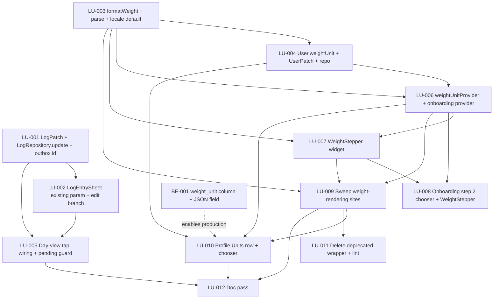

# Developer Tickets — Editable Log Entries + User-Selectable Weight Units (2026-05-16)

Source of truth for the post-overnight pool focused on the two new
features. Every ticket below is sized for a single developer agent to
pick up, finish, and review in one session. Agents do **not** have a
Flutter SDK — they write tests to disk and ship them inspection-correct,
but they do **not** run `flutter test` or `flutter analyze`. Inspect for
typos; assume CI gates run on a host machine later.

**Read order**:

1. This file (you are here).
2. `specs/pm_log_edit_and_units.md` — the PM's *what* and *why*.
3. `specs/architect_log_edit_and_units.md` — the architect's *how*.
4. `specs/flutter_ui_architecture.md` — the 23 tenants. Cited by ID.
5. `specs/pm_decisions_flutter_ui.md` — Display Units Principle, etc.
6. `specs/dev_tickets.md` — the prior pool's tickets (T-NNN). The
   tickets here use the `LU-NNN` prefix so they don't collide.

Tickets reference these docs by section/ID instead of re-quoting them.

**Branch model**: the pool dispatches one agent per ticket on top of
`main` at the head of the prior overnight pool (`f0ae6bd` as of writing
+ any `LU-NNN` commits that landed first). Each ticket lists
`Owns files:` — an agent must not touch any file outside that list
without flagging in the ticket Notes. If two tickets share a file in
their `Owns files:` list, the dependency graph below sequences them.

**Ticket status legend**:

- `pending` — not started.
- `pending (backend ticket)` — assigned to the backend team; the
  Flutter pool does not pick this up.
- `in-progress` — claimed by an agent; uncommitted work-in-progress.
- `done` — committed to `main`; agent has updated this doc.
- `blocked-needs-pm` — agent gave up; see failure protocol at the
  bottom.

---

## LU-001  `LogPatch` + `LogRepository.update` + outbox optimistic-id reconciliation

**Status**: shipped (commit `81ff22e`)
**Priority**: P0
**Effort**: M
**Depends on**: none
**Owns files**:
- `client/lib/domain/log_entry.dart` (add `LogPatch` class + helpers)
- `client/lib/repositories/log_repository.dart` (add `update`,
  `isPendingSync`; mock + real-wire implementations)
- `client/lib/data/outbox/outbox_entry.dart` (add `optimisticId`
  field if absent; ensure outbox stores the same id `LogEntry.id` will
  have when the optimistic row renders)
- `client/lib/data/outbox/log_outbox_notifier.dart` (set
  `optimisticId` on `enqueue`; preserve through retries)
- `client/lib/providers/repository_providers.dart` (pass the outbox
  notifier into `LogRepository` on compact only)
- `client/test/repositories/log_repository_update_test.dart` (new)
- `client/test/data/outbox/optimistic_id_reconciliation_test.dart` (new)

### Goal
Land the repository surface Feature A needs: a `LogPatch` payload, a
mock-backed `LogRepository.update(id, patch)` that mirrors `PATCH
/log/{id}`, and a `LogRepository.isPendingSync(entryId)` predicate that
returns `true` when an outbox entry for that id is `pending` or
`failed`. Unify the optimistic id pattern between the log-entry sheet
and the outbox so the predicate has a key to look against.

### Context
Architect §2.4, §2.6, §4.5 ("Sub-tasks that can run in parallel"
item 3 and 4). PM §2 "Backend implications — there is an endpoint"
and "Conflict + concurrency". Tenants **T-11** (errors inline),
**T-17** (Decimal in / formatted out), **T-22** (pending sync visible),
**T-18** (provider invalidation minimal). The OpenAPI shape for the
endpoint is in `specs/openapi.yaml` (`PATCH /log/{id}` →
`update_log_entry`).

### Scope
- [ ] Add `class LogPatch` to `lib/domain/log_entry.dart`, sibling to
      the existing `LogCreate`. Fields: `String? servingId`,
      `DateTime? consumedOn`, `Meal? meal`, `Decimal? quantity`,
      `String? note`, `bool clearNote = false`. `toJson()` emits
      sparse keys — omit any null, but emit `'note': null` when
      `clearNote == true && note == null`. Never emit `food_id`.
- [ ] Add `bool get isEmpty` returning true when every field is null
      and `clearNote == false`. The submit handler uses this to skip
      no-op PATCHes.
- [ ] In `LogRepository`:
  - Add `Future<LogEntry> update(String entryId, LogPatch patch)`.
    Mock implementation: locate the entry by id in the in-memory
    store; recompute the nutrition snapshot from the (possibly new)
    serving + quantity against the food's `nutritionPer100g` the same
    way `create` does (extract the existing recomputation into a
    private helper if duplication appears); bump `updatedAt`; return
    the new entry. Throw `LogEntryNotFoundError` (new typed error in
    the same file) on miss.
  - Add `bool isPendingSync(String entryId)`. Reads
    `_outbox?.state.entries` and returns `true` iff any
    `OutboxEntryRecord` with `optimisticId == entryId` has status
    `pending` or `failed`. Always `false` when `_outbox == null`.
  - Add a nullable constructor parameter
    `LogOutboxNotifier? outbox` and an `final LogOutboxNotifier?
    _outbox` field. Existing call sites pass `null` (medium/expanded);
    compact wires the real notifier from
    `repository_providers.dart`.
- [ ] In `outbox_entry.dart`: ensure `OutboxEntryRecord` exposes a
      `String optimisticId` field (verify shape; add if missing).
      `LogOutboxNotifier.enqueue` populates it with the same string
      pattern the log-entry sheet uses today for its optimistic
      `LogEntry.id` (`'optimistic_${microsecondsSinceEpoch}'`).
- [ ] In `repository_providers.dart`: extend the existing
      `logRepositoryProvider` to read the form factor and pass the
      outbox notifier only when `ff.isCompact`. The notifier is read
      via `ref.watch(logOutboxProvider.notifier)`. Medium/expanded
      pass `outbox: null`.
- [ ] When a real wire-call lands later, the `update` method will hit
      `PATCH /log/{id}` with `patch.toJson()`. For v1 (mock-only) keep
      a `// TODO(LU-001-wire): replace mock with ApiClient.patch
      ('/log/$entryId', patch.toJson())` comment marking the swap
      site.

### Out of scope
- The day-view tap wiring (LU-005).
- The `LogEntrySheet` `existing:` plumbing (LU-002).
- Any UI surface that calls `isPendingSync` (LU-005 consumes it).
- The optimistic edit-apply on medium/expanded — architect §2.7
  ruled **no** optimistic update for edits.

### Acceptance criteria
- [ ] `LogPatch().toJson()` is `{}` (empty map). `LogPatch(note:
      'x').toJson()` is `{'note': 'x'}`. `LogPatch(clearNote:
      true).toJson()` is `{'note': null}`. `LogPatch(note: 'x',
      clearNote: true).toJson()` emits `'note': 'x'` (the explicit
      value wins; `clearNote` only fires when the note is null).
- [ ] `LogPatch` never serialises a `food_id` key under any input.
- [ ] `LogRepository.update` on the mock returns a `LogEntry` whose
      `nutritionSnapshot` matches what `create` would compute for the
      same `(food, serving, quantity)` triple.
- [ ] `LogRepository.update` on the mock with a `consumedOn` change
      moves the entry to the new day on subsequent
      `getEntriesForDay(newDate)` calls and removes it from
      `getEntriesForDay(oldDate)`.
- [ ] `LogRepository.isPendingSync(id)` returns `true` only for an
      entry whose outbox record has status `pending` or `failed`;
      `false` for `success`, `false` when `_outbox == null`.
- [ ] Outbox `enqueue` populates `optimisticId` with the same
      identifier the log-entry sheet's `_buildOptimisticEntry` (or
      equivalent) uses for the corresponding `LogEntry.id`. A regression
      test asserts the two strings match.
- [ ] Tenants honored: T-11, T-17, T-18, T-22.

### Tests
- `client/test/repositories/log_repository_update_test.dart`:
  - `update with new quantity recomputes nutritionSnapshot`
  - `update with new servingId picks the new serving`
  - `update with new consumedOn moves entry to new day`
  - `update on missing id throws LogEntryNotFoundError`
  - `LogPatch.toJson sparse — omits unset, includes set, null note
    only with clearNote`
- `client/test/data/outbox/optimistic_id_reconciliation_test.dart`:
  - `enqueue stores optimisticId that matches the resulting
    LogEntry.id`
  - `isPendingSync returns true for pending entries`
  - `isPendingSync returns false on null outbox`

### Notes / gotchas
- The architect (§2.6) flagged the optimistic-id reconciliation as a
  half-hour mini-ticket folded inside this one — do not split it out.
  Without the unification, `isPendingSync` has no key to query.
- Do NOT alter the outbox's `LogCreate` enqueue payload shape. The
  outbox stays create-only. Edits never queue.
- `package:decimal` only — no `double` math in `quantity`.

---

## LU-002  `LogEntrySheet existing:` param + edit-mode plumbing

**Status**: shipped (commit `f935db8`)
**Priority**: P0
**Effort**: M
**Depends on**: LU-001
**Owns files**:
- `client/lib/features/log_entry/log_entry_sheet.dart` (add
  `existing:` param to `showLogEntrySheet` + `LogEntrySheetBody`;
  edit-mode header / footer label / save-button enablement /
  submit-branch split)
- `client/test/features/log_entry/log_entry_sheet_edit_mode_test.dart`
  (new)

### Goal
Promote `LogEntrySheet` from create-only to dual-mode. A new
`LogEntry? existing` constructor parameter pre-seeds the form, swaps
the CTA label to "Save changes", disables save until the form differs
from the seed, and routes submit through `LogRepository.update`
instead of `create` / outbox enqueue. Create-mode behaviour is
unchanged.

### Context
Architect §2.2, §2.3, §2.5. PM §2 "Decision: where the edit lives",
"How tap-to-edit lands in the widget tree". Tenants **T-08**
(skeletons match final layout), **T-11** (errors inline), **T-15**
(form-factor branches at the root — the shell decision is unchanged).

### Scope
- [ ] Extend the `showLogEntrySheet(...)` signature with `LogEntry?
      existing`. Forward to `LogEntrySheetBody.existing`.
- [ ] In `LogEntrySheetBody`:
  - Add `final LogEntry? existing` field + `bool get _isEditing =>
    widget.existing != null;` getter.
  - `initState` pre-seed (architect §2.3): meal, serving, date, note
    derived from `widget.existing` when present; existing
    `defaultMeal` ignored in edit mode (document the precedence in a
    code comment).
  - The `quantityProvider` override in `showLogEntrySheet`'s contents
    builder seeds from `existing?.quantity ?? Decimal.one`.
- [ ] In `_Header`: append a small `(editing)` suffix in `text.meta`
      `ink2` style on the title line when `editing == true` (new
      bool prop on `_Header`, defaulting false). No new tokens, no
      `IconButton36`, no extra widget primitive — one extra `Text`.
- [ ] In `_Footer`: promote the CTA label to a constructor param
      `final String label`. `LogEntrySheetBody.build` passes
      `'Save changes'` in edit mode, `'Save to log'` otherwise.
- [ ] Split `_onSavePressed` into `_onCreatePressed` (today's logic,
      unchanged) and `_onEditPressed` (new — see LU-003 for the body).
      For now, `_onEditPressed` is a thin wrapper that builds the
      patch, calls `LogRepository.update`, performs the invalidation
      list (architect §2.5), and pops with the server response. On
      failure, surface a SnackBar (`"Could not save changes: $e"`)
      and reset `_submitting`.
- [ ] Add `_isUnchanged()` predicate: returns true when (quantity,
      serving id, meal, date, note) all match `widget.existing!`.
      Disable the CTA when `_isEditing && _isUnchanged()`.
- [ ] Add private `_buildLogPatch()` that emits a sparse `LogPatch`
      from current form state vs. `widget.existing!`. Honours
      `clearNote: true` when the user blanked a previously-non-null
      note (per architect §2.4 / PM "Open question 2" — auto-clear is
      the v1 behaviour).
- [ ] Add private `_sameDay(DateTime, DateTime)` helper used for the
      old-date invalidation branch.

### Out of scope
- The day-view row tap handler (LU-005).
- The pending-sync guard's call site (LU-005).
- `WeightStepper` or any unit work (LU-007, LU-008).
- Adding a "Delete" affordance inside the sheet — PM left it as
  optional and we punt to v1.1.

### Acceptance criteria
- [ ] `showLogEntrySheet(context, food: f, existing: entry)` opens
      the sheet pre-seeded with `entry`'s serving, quantity, meal,
      date, and note. `_Header` shows the food's name with the
      `(editing)` suffix.
- [ ] The footer button reads `'Save changes'` in edit mode and
      `'Save to log'` otherwise. Disabled while
      `_isEditing && _isUnchanged()`; enabled the moment any field
      changes.
- [ ] `_onEditPressed` calls `LogRepository.update` and on success
      invalidates `daySummaryProvider(newDate)`,
      `logEntriesProvider(newDate)`, `recentFoodsProvider`,
      `frequentFoodsProvider`. If the date changed, also
      `daySummaryProvider(originalDate)` and
      `logEntriesProvider(originalDate)`.
- [ ] On `update` failure, the sheet stays open with input intact, a
      SnackBar surfaces the error, and `_submitting` returns to false.
- [ ] On dismiss (close / cancel / swipe-down), the original entry
      is unchanged.
- [ ] `food_id` is never sent in the PATCH body (asserted by reading
      the `LogPatch` returned from `_buildLogPatch()` in a test).
- [ ] Tenants honored: T-08, T-11, T-15.

### Tests
- `client/test/features/log_entry/log_entry_sheet_edit_mode_test.dart`:
  - `existing pre-seeds quantity / serving / meal / date / note`
  - `header shows (editing) suffix`
  - `footer reads Save changes`
  - `save disabled until form differs from seed`
  - `submit invokes LogRepository.update with sparse LogPatch`
  - `submit on failure keeps sheet open and surfaces SnackBar`
  - `blanking a previously-non-null note emits clearNote: true`
  - `food_id is never present in the emitted LogPatch.toJson()`

### Notes / gotchas
- The `quantityProvider` is sheet-scoped via a `ProviderScope.override`
  in `showLogEntrySheet`. Pass `Decimal.one` as the seed for create,
  `existing.quantity` for edit — do **not** read the entry from
  inside the provider.
- Note auto-clear: the architect's reading (and recommendation) is
  to emit `clearNote: true` when the user explicitly blanked a
  previously-non-null note. If the PM's "Open question 2" answer
  changes during review, the only edit is in `_buildLogPatch()`.
- Do not introduce `@freezed` — `LogPatch` is a plain class with a
  hand-written `toJson` (architect §2.4). Constraint per ticket
  cover sheet.

---

## LU-003  `formatWeight` + `parseWeightToKg` + locale default seam

**Status**: shipped (commit `81ff22e`)
**Priority**: P0
**Effort**: M
**Depends on**: none
**Owns files**:
- `client/lib/domain/enums.dart` (add `WeightUnit { kg, lb, st }`)
- `client/lib/domain/units/weight.dart` (rewrite to expose
  `formatWeight`, `formatWeightWithUnit`, `parseWeightToKg`,
  `parseStoneToKg`; keep `formatWeightKg` as a `@Deprecated` wrapper
  for the duration of the sweep)
- `client/lib/domain/locale_defaults.dart` (new — exports
  `defaultWeightUnitForLocale({String? countryCodeOverride})`)
- `client/test/domain/units/weight_format_test.dart` (new)
- `client/test/domain/units/weight_parse_test.dart` (new)
- `client/test/domain/locale_defaults_test.dart` (new)

### Goal
Land the formatter / parser seam Feature B sweeps every call site
through. The single file that knows about lb/st arithmetic is
`weight.dart`; everywhere else reads a `WeightUnit` and calls the
seam.

### Context
Architect §3.2, §3.4, §3.5–§3.8. PM §3 "Display format per unit",
"Inputs", "Decision: locale default". Tenants **T-01** (no hex /
literals — the only "literal" allowed here is the `kg ↔ lb`
conversion constant, named), **T-17** (Decimal in / formatted out;
`.toDouble()` only at the `NumberFormat` leaf), **T-21** (display
units customer-expected — this is the v2-ticket fulfilment).

### Scope
- [ ] Add `WeightUnit` enum to `lib/domain/enums.dart` with `kg, lb,
      st`, `String get wire => name`, `String get shortLabel => name`,
      and `String get longLabel` returning `'kilograms' | 'pounds' |
      'stones and pounds'`. Strict `fromWire(String)` throws on
      unknown — matches every other enum in this file.
- [ ] Rewrite `lib/domain/units/weight.dart`:
  - Module-level constants `final Decimal _kgPerLb =
    Decimal.parse('0.45359237');` and `final Decimal _lbPerKg =
    Decimal.parse('2.2046226218487758');`.
  - Public `String formatWeight(Decimal kg, WeightUnit unit,
    {String? locale})` switching on `unit`.
  - Public `String formatWeightWithUnit(Decimal kg, WeightUnit unit,
    {String? locale})` returning `formatWeight(...)` + `' ${unit.shortLabel}'`
    (kg/lb) or the bare composite (st — units inline).
  - Private `_formatKg(kg, locale)` — body of today's `formatWeightKg`.
  - Private `_formatLb(kg, locale)` — multiply by `_lbPerKg`,
    `roundHalfToEvenScaled(..., 1)`, format with `NumberFormat`.
  - Private `_formatStone(kg)` — algorithm in architect §3.5: total
    pounds → round to integer → divmod 14; render `'$st st $lb lb'`
    or `'$st st'` when remainder is 0.
  - Public `Decimal parseWeightToKg(String input, WeightUnit unit)`
    — kg: comma-normalise then `Decimal.parse`; lb: parse decimal,
    multiply by `_kgPerLb`; st: parse `"<st> <lb>"`, `"<st>"`, or
    `"<st> st <lb> lb"`, call `parseStoneToKg`.
  - Public `Decimal parseStoneToKg(int stones, int pounds)` — typed
    overload the `WeightStepper` calls directly (architect §3.8).
  - `@Deprecated('Use formatWeight(kg, unit) — kg is no longer the
    only unit.') String formatWeightKg(Decimal kg, {String? locale}) =>
    _formatKg(kg, locale: locale);` — kept as a thin wrapper for the
    duration of the sweep. LU-009 deletes it after migration.
- [ ] Create `lib/domain/locale_defaults.dart` exporting
      `defaultWeightUnitForLocale({String? countryCodeOverride})`
      with the chain from architect §3.4: `US/LR/MM → lb`,
      `GB/IM/JE/GG → st`, else `kg`. Falls back to `kg` on null
      country code.

### Out of scope
- The `weightUnitProvider` (LU-006).
- The `WeightStepper` widget (LU-007).
- Any consumer-side migration of `formatWeightKg → formatWeight`
  (LU-009 owns the sweep).
- Editing `_rounding.dart` — reuse `roundHalfToEvenScaled` as-is.

### Acceptance criteria
- [ ] `formatWeight(Decimal.parse('79.4'), WeightUnit.kg)` →
      `'79.4'`.
- [ ] `formatWeight(Decimal.parse('79.4'), WeightUnit.lb)` →
      `'175.1'` (half-to-even from `175.0470...`).
- [ ] `formatWeight(Decimal.parse('88.9'), WeightUnit.st)` →
      `'14 st'` (carry edge: 195.99 lb → 196 lb → 14 st 0 lb →
      drops the trailing zero).
- [ ] `formatWeight(Decimal.parse('88.85'), WeightUnit.st)` →
      `'13 st 13 lb'` (just below carry).
- [ ] `formatWeight(Decimal.zero, WeightUnit.st)` → `'0 st'`.
- [ ] `formatWeightWithUnit(Decimal.parse('79.4'), WeightUnit.kg)` →
      `'79.4 kg'`. `formatWeightWithUnit(Decimal.parse('79.4'),
      WeightUnit.st)` → `'12 st 7 lb'` (no extra suffix).
- [ ] `parseWeightToKg('175.1', WeightUnit.lb)` →
      `Decimal.parse('79.4...')` matching `175.1 * _kgPerLb`.
- [ ] `parseWeightToKg('70,5', WeightUnit.kg)` →
      `Decimal.parse('70.5')` (comma normalised).
- [ ] `parseStoneToKg(12, 7)` → matches `(12 * 14 + 7) * _kgPerLb`
      to within `1e-10`.
- [ ] `defaultWeightUnitForLocale(countryCodeOverride: 'US')` →
      `WeightUnit.lb`; `'GB'` → `WeightUnit.st`; `'DE'` →
      `WeightUnit.kg`; `null` → `WeightUnit.kg`.
- [ ] `formatWeightKg(value)` still works at every existing call
      site (deprecation warning is fine; compile error is not).
- [ ] Tenants honored: T-01, T-17, T-21.

### Tests
- `weight_format_test.dart`:
  - Each row of the carry table in architect §3.7:
    `(0, '0 st')`, `(6.35, '1 st')`, `(45.36, '7 st 2 lb')`,
    `(79.4, '12 st 7 lb')`, `(88.9, '14 st')`,
    `(88.85, '13 st 13 lb')`, `(127.0, '20 st')`.
  - `lb` cases at `79.4 kg → '175.1'`, `82.0 kg → '180.8'`.
  - `kg` cases unchanged from the existing `formatWeightKg` tests.
- `weight_parse_test.dart`:
  - `kg` parse with `.` and `,` separators.
  - `lb` parse round-trip stability — `175.1 lb → kg → lb`
    asserts ≤ 0.1 lb drift (document the bound in the test name).
  - `st` string parses `'12 7'`, `'12 st 7 lb'`, `'12'`, all
    equal-via-`parseStoneToKg(12, 7)` or `(12, 0)`.
  - `parseStoneToKg(12, 7)` returns the expected `Decimal kg`.
  - `parseWeightToKg('not a number', WeightUnit.kg)` throws
    `FormatException`.
- `locale_defaults_test.dart`:
  - Each country code → unit, including the non-metric carve-outs
    (`LR`, `MM`) and the British Crown Dependencies (`IM`, `JE`,
    `GG`).
  - `null` country code → `kg`.
  - `''` country code → `kg`.

### Notes / gotchas
- Float safety (architect §3.6): every multiplication happens in
  `Decimal` space. The only `.toDouble()` is inside `_formatKg` /
  `_formatLb` at the `NumberFormat.format(...)` boundary.
- Locale-aware decimal separator: `lb` formatting uses
  `NumberFormat.decimalPatternDigits(locale: locale, decimalDigits:
  1)` — same shape as today's `_formatKg`.
- `parseWeightToKg('175,1', WeightUnit.lb)` — be tolerant of comma
  separators on the input string in non-en-US locales. PM punted
  the locale decision; the architect's bias is "tolerate both". Do
  that.

---

## LU-004  `User.weightUnit` + `UserPatch` plumbing + `ProfileRepository.update`

**Status**: shipped (commit `f935db8`)
**Priority**: P0
**Effort**: S
**Depends on**: LU-003 (needs the `WeightUnit` enum)
**Owns files**:
- `client/lib/domain/user.dart` (add `weightUnit` field, copyWith,
  fromJson tolerant of missing, toJson always emits; extend
  `UserPatch`)
- `client/lib/repositories/profile_repository.dart` (pass
  `weight_unit` through `update`)
- `client/lib/repositories/_fixtures.dart` (mock seed user gains
  `weightUnit` param defaulting to `WeightUnit.kg`)
- `client/test/domain/user_weight_unit_test.dart` (new)

### Goal
Add the new `weight_unit` field to the client-side `User` model and
`UserPatch`, keep `fromJson` tolerant of the field being missing so
the client sweep can ship before the backend migration, and pass the
field through the existing `ProfileRepository.update` path.

### Context
Architect §3.1, §3.3, §4.2 ("Pre-backend window"). PM §3
"Decision: where the preference lives", "Backend implication". Tenant
**T-17** (Decimal in / formatted out — though here the field is an
enum, the discipline of "wire string in, typed value out" is the
same).

### Scope
- [ ] `User` constructor gains `this.weightUnit =
      WeightUnit.kg`. The field is non-nullable on the model; the
      default makes existing tests / fixtures keep compiling.
- [ ] `User.fromJson` reads `json['weight_unit']` and uses
      `WeightUnit.kg` when null/absent (pre-backend tolerance).
- [ ] `User.toJson` always emits `'weight_unit': weightUnit.wire`.
- [ ] `User.copyWith(weightUnit: ...)` — standard.
- [ ] `User.==` / `hashCode` include `weightUnit`.
- [ ] `UserPatch` gains optional `WeightUnit? weightUnit` field;
      `toJson()` emits `'weight_unit': weightUnit!.wire` only when
      non-null.
- [ ] `ProfileRepository.update(UserPatch data)` accumulates the new
      key the same way the others are accumulated. One extra
      `if (data.weightUnit != null)` branch.
- [ ] In `_fixtures.dart`, `buildSeedUser` gains a `WeightUnit
      weightUnit = WeightUnit.kg` param and stores it on the User.

### Out of scope
- The `weightUnitProvider` (LU-006).
- The Profile → Units chooser (LU-010).
- Onboarding's draft write (LU-008).

### Acceptance criteria
- [ ] `User.fromJson({'id': '...', /* no weight_unit */ })` returns a
      `User` with `weightUnit == WeightUnit.kg`.
- [ ] `User(weightUnit: WeightUnit.lb).toJson()['weight_unit']` is
      `'lb'`.
- [ ] `UserPatch(weightUnit: WeightUnit.st).toJson()` includes
      `'weight_unit': 'st'`. `UserPatch().toJson()` does not include
      the key.
- [ ] `ProfileRepository.update(UserPatch(weightUnit: WeightUnit.lb))`
      → the next `meProvider` read returns a `User` with
      `weightUnit == WeightUnit.lb` (mock).
- [ ] Tenants honored: T-17.

### Tests
- `user_weight_unit_test.dart`:
  - `fromJson with missing field defaults to kg`
  - `fromJson with unknown wire value throws ArgumentError`
  - `toJson always emits weight_unit`
  - `copyWith preserves other fields`
  - `UserPatch.toJson sparse — emits only when set`
  - `ProfileRepository.update writes weight_unit through to the
    cached User`

### Notes / gotchas
- This is the half of Feature B that lets the rest of the sweep ship
  without waiting for the Rust migration. Don't gate any code on the
  field being present on the wire.
- The wire string for `WeightUnit` is lowercase enum name (`'kg' |
  'lb' | 'st'`) — same as every other enum here. Do not invent a
  separate marshalling helper.

---

## LU-005  Day-view tap-to-edit wiring + pending-sync guard call site

**Status**: shipped (commit `3d71c51`)
**Priority**: P0
**Effort**: S
**Depends on**: LU-001, LU-002
**Owns files**:
- `client/lib/features/today/day_view_compact.dart` (pass
  `onEntryTap` to `MealSection`)
- `client/lib/features/today/day_view_expanded.dart` (same)
- `client/lib/features/today/today_internals.dart` (add an
  `editLogEntry(ref, context, entry)` helper if a shared handler
  reads cleaner; otherwise inline)
- `client/lib/widgets/meal_section.dart` (Semantics label on
  `_EntryRow` only — no behavioural change)
- `client/test/features/today/edit_log_entry_tap_test.dart` (new)

### Goal
Wire the day-view's currently-no-op row tap to the `LogEntrySheet`
in edit mode. On compact, route through the pending-sync guard so
tapping a row whose POST hasn't acked surfaces a SnackBar instead of
the sheet. Add the row-level `Semantics` label that announces
`"<food>, <serving>, <kcal> kilocalories, edit"`.

### Context
Architect §2.1, §2.6, §2.8. PM §2 "How tap-to-edit lands in the
widget tree", "Conflict + concurrency". Tenants **T-20**
(Semantics + accessibility), **T-22** (pending-sync visible — the
SnackBar surface is the user-recovery path), **T-15** (form-factor
branch sits at the screen root, not inside `MealSection`).

### Scope
- [ ] In `day_view_compact.dart` and `day_view_expanded.dart`,
      construct `MealSection(..., onEntryTap: (entry) =>
      _onEntryTap(ref, context, entry))`. The handler:
      1. Read `ref.read(logRepositoryProvider).isPendingSync(entry.id)`.
         On `true`, show a SnackBar `'Still syncing — edit when sync
         finishes.'` and return.
      2. Read the food asynchronously:
         `await ref.read(foodDetailProvider(entry.foodId).future)`.
         On error, show SnackBar `"Couldn't load food. Try again."`
         and return.
      3. Call `showLogEntrySheet(context, food: food, existing:
         entry)`. Discard the return value (the sheet handled
         invalidation).
- [ ] Factor the handler into `today_internals.dart` as
      `Future<void> editLogEntry(WidgetRef ref, BuildContext context,
      LogEntry entry)` if the two screens would otherwise duplicate
      it verbatim. Architect's preference; lean **do** factor.
- [ ] In `meal_section.dart`, wrap `_EntryRow`'s build content in a
      `Semantics(button: true, label: ..., child: ExcludeSemantics
      (child: ...))`. The label string is
      `"${entry.foodName}, ${entry.servingName ?? ''}, ${formatKcal
      (entry.kcal)} kilocalories, edit"`. **No behavioural change**
      to `MealSection` — the callback was already plumbed.

### Out of scope
- `WeightStepper` or any unit work.
- Adding an "Edit" icon button to the row — the whole row is the
  target (PM "How tap-to-edit lands…").
- Animating the row hover state — already exists; this ticket does
  not touch it.
- The pending-sync **badge** rendering inside `_EntryRow` — that's a
  separate T-22 surface and predates this work. Out of scope.

### Acceptance criteria
- [ ] Tapping a non-pending row on compact opens
      `LogEntrySheet(existing: entry)`.
- [ ] Tapping a non-pending row on expanded opens the dialog form of
      the same sheet (via the existing form-factor branch in
      `showLogEntrySheet`).
- [ ] Tapping a pending row on compact does **not** open the sheet
      and surfaces the "Still syncing…" SnackBar.
- [ ] On medium/expanded, the pending-sync check is a no-op (the
      repository's `_outbox` is null per LU-001's wiring).
- [ ] On a `foodDetailProvider` 404, no sheet opens; the
      "Couldn't load food. Try again." SnackBar surfaces.
- [ ] `_EntryRow` carries a `Semantics` label of the documented
      shape; `find.bySemanticsLabel(RegExp(r', edit$'))` finds the
      row.
- [ ] Tenants honored: T-15, T-20, T-22.

### Tests
- `client/test/features/today/edit_log_entry_tap_test.dart`:
  - `tap on non-pending row opens LogEntrySheet`
  - `tap on pending row shows SnackBar, does not open sheet`
  - `food load failure shows SnackBar, does not open sheet`
  - `Semantics label includes ", edit" suffix`
  - `MealSection unchanged — its widget contract is the same as
    before` (asserts the prop list is identical to today's)

### Notes / gotchas
- `foodDetailProvider(...).future` may be unfamiliar; it's the
  standard Riverpod async access pattern. If the provider is keyed
  by `foodId` and the cache is warm, the future completes
  synchronously — the sheet opens on the same frame.
- Do not wrap the food fetch in a separate provider; the handler
  reads `foodDetailProvider` directly. Adding indirection would
  fight T-09 (one source of truth) for the food row in the header.
- The `_EntryRow`'s `InkWell.onTap` already conditions on
  `onEntryTap != null` — passing the handler from the screen is
  what enables the row visually.

---

## LU-006  `weightUnitProvider` + `_onboardingWeightUnitProvider`

**Status**: shipped (commit `3d71c51`)
**Priority**: P0
**Effort**: S
**Depends on**: LU-003, LU-004
**Owns files**:
- `client/lib/providers/profile_providers.dart` (add
  `weightUnitProvider`)
- `client/lib/providers/draft_providers.dart` (add
  `_onboardingWeightUnitProvider`)
- `client/lib/domain/drafts.dart` (add `WeightUnit? weightUnit` to
  the onboarding draft)
- `client/test/providers/weight_unit_provider_test.dart` (new)

### Goal
The two providers every weight-rendering widget reads: the global
`weightUnitProvider` derived from `meProvider`, and the
onboarding-local provider that reads the draft and falls back to
`defaultWeightUnitForLocale()`.

### Context
Architect §3.10, §3.11. PM §3 "Decision: where the preference
lives" (client storage section). Tenant **T-18** (provider
invalidation explicit and minimal — `weightUnitProvider` derives
from `meProvider` so a single `meProvider` invalidation propagates).

### Scope
- [ ] In `profile_providers.dart`:
  ```dart
  final weightUnitProvider = Provider<WeightUnit>((ref) {
    return ref.watch(meProvider)
        .whenData((u) => u.weightUnit)
        .valueOrNull
        ?? WeightUnit.kg;
  });
  ```
- [ ] In `drafts.dart`: add `final WeightUnit? weightUnit;` field on
      the onboarding draft. Update `copyWith` and `==` / `hashCode`.
      Default to `null` in the constructor (meaning "use locale
      default at submit time").
- [ ] In `draft_providers.dart`:
  ```dart
  final _onboardingWeightUnitProvider = Provider<WeightUnit>((ref) {
    final draft = ref.watch(onboardingDraftProvider);
    return draft.weightUnit ?? defaultWeightUnitForLocale();
  });
  ```
  Export it (visible to onboarding's step 2 widget). The underscore
  prefix is a convention — if Dart linting flags the export, drop
  the underscore.

### Out of scope
- Onboarding's step 2 chooser UI (LU-008).
- The Profile → Units row (LU-010).
- Anywhere that reads `weightUnitProvider` (LU-009 sweeps).

### Acceptance criteria
- [ ] `weightUnitProvider` returns `WeightUnit.kg` while `meProvider`
      is `AsyncLoading` or `AsyncError`.
- [ ] `weightUnitProvider` returns the user's `weightUnit` once
      `meProvider` resolves.
- [ ] Overriding `meProvider` in tests with a `User(weightUnit:
      WeightUnit.lb)` flips `weightUnitProvider` to `lb`.
- [ ] `_onboardingWeightUnitProvider` reads the draft first, falls
      back to `defaultWeightUnitForLocale()` on null.
- [ ] Tenants honored: T-18.

### Tests
- `weight_unit_provider_test.dart`:
  - `provider returns kg while meProvider is loading`
  - `provider returns the user's weightUnit when meProvider resolves`
  - `_onboardingWeightUnitProvider reads draft first`
  - `_onboardingWeightUnitProvider falls back to locale default
    (use defaultWeightUnitForLocale's override seam)`

### Notes / gotchas
- This is the provider every weight-rendering widget will read. Keep
  it cheap — no `Future`, no `StreamProvider`. Synchronous derived
  `Provider<WeightUnit>` only.
- The onboarding provider lives next to the draft providers so the
  onboarding screen doesn't depend on `profile_providers.dart`
  (it predates the User existing on the wire).

---

## LU-007  `WeightStepper` widget

**Status**: shipped (commit `1ac6495`)
**Priority**: P0
**Effort**: M
**Depends on**: LU-003, LU-006
**Owns files**:
- `client/lib/widgets/weight_stepper.dart` (new)
- `client/test/widget/weight_stepper_test.dart` (new)

### Goal
The single new lifted widget Feature B introduces: a
`WeightStepper(valueKg, onChangedKg, unit, minKg, maxKg,
semanticsLabel)` that wraps `QuantityStepper` for kg/lb (one field
with unit suffix) and renders two side-by-side `QuantityStepper`s
for st (stones + pounds 0–13). Internal model is always
`Decimal kg`.

### Context
Architect §3.9. PM §3 "Inputs". Tenants **T-01** (no hex — composes
existing primitives), **T-07** (numeric inputs always have a
stepper), **T-17** (Decimal in / formatted out), **T-23** (lifted
widgets package-imported).

### Scope
- [ ] Create `lib/widgets/weight_stepper.dart` exposing
      `WeightStepper` per architect §3.9 signature:
  ```dart
  class WeightStepper extends StatelessWidget {
    const WeightStepper({
      super.key,
      required this.valueKg,
      required this.onChangedKg,
      required this.unit,
      this.minKg,
      this.maxKg,
      this.semanticsLabel,
    });
    final Decimal? valueKg;
    final ValueChanged<Decimal?> onChangedKg;
    final WeightUnit unit;
    final Decimal? minKg;
    final Decimal? maxKg;
    final String? semanticsLabel;
  }
  ```
- [ ] Build behaviour:
  - `kg` → one `QuantityStepper(value: valueKg, step: 0.1,
    unitSuffix: 'kg', min: minKg, max: maxKg)`. `onChanged` forwards
    `Decimal? next` straight to `onChangedKg`.
  - `lb` → one `QuantityStepper`; the displayed value is the lb
    conversion of `valueKg` (compute via `formatWeight` /
    `parseWeightToKg`), `step: 0.2`, `unitSuffix: 'lb'`. `min`/`max`
    are converted to lb for the stepper's clamp. `onChanged` parses
    back to kg via `parseWeightToKg(raw, WeightUnit.lb)` and calls
    `onChangedKg(kg)`.
  - `st` → a `Row` with two `QuantityStepper`s: stones (integer:
    `allowDecimal: false`, `step: 1`, `min: 0`, no max), pounds
    (integer, `step: 1`, `min: 0`, `max: 13`, label `"lb (0-13)"`).
    On change of either, recompute `kg = parseStoneToKg(stones,
    pounds)` and call `onChangedKg(kg)`. Internal `setState` holds
    the two integer values.
- [ ] No hex literals, no raw paddings. Read tokens via
      `context.text`, `context.colors`, `context.space`.
- [ ] Pass `semanticsLabel` through to the underlying
      `QuantityStepper`'s `Semantics` wrapper (or compose).

### Out of scope
- Wrap-on-overflow for the pounds sub-stepper (architect §3.9
  named this nice-to-have; v1 ships max-clamp at 13).
- Reading `weightUnitProvider` internally — the `unit` is a
  constructor param. Callers pass `ref.watch(weightUnitProvider)`
  (or the onboarding-local provider).
- Animating the kg ↔ lb ↔ st mode swap.
- A "show kg even though I picked lb" debug mode.

### Acceptance criteria
- [ ] `WeightStepper(unit: kg, valueKg: 79.4)` renders one stepper
      showing `'79.4'` with suffix `'kg'`.
- [ ] `WeightStepper(unit: lb, valueKg: 79.4)` renders one stepper
      showing `'175.1'` with suffix `'lb'`.
- [ ] `WeightStepper(unit: st, valueKg: 79.4)` renders two side-by-
      side steppers showing `12` (stones) and `7` (pounds).
- [ ] Tapping the + on the lb stepper bumps `valueKg` by
      `0.2 * _kgPerLb` ≈ `0.0907 kg`. The widget converts back via
      `parseWeightToKg`.
- [ ] Entering `14` into the pounds sub-stepper clamps to `13`.
- [ ] No `Color(0xFF…)` literal, no hard-coded padding number; all
      tokens via `context.tokens`.
- [ ] Tenants honored: T-01, T-07, T-17, T-23.

### Tests
- `weight_stepper_test.dart`:
  - `kg renders one stepper with kg suffix`
  - `lb renders one stepper with lb suffix; value is converted`
  - `st renders two steppers, stones + pounds`
  - `onChangedKg fires with the canonical kg value across all
    three modes`
  - `pounds sub-stepper clamps at 13`
  - `Semantics label propagates`

### Notes / gotchas
- The widget composes `QuantityStepper` from `lib/widgets/`. Import
  via `package:fulfilled/widgets/quantity_stepper.dart` (T-23).
- Stone input ergonomics on iPhone SE (390 wide) — the architect
  flagged this as risk 5. The two-stepper row may not fit with the
  +/− buttons beside each field. **First implementation: render
  the two steppers in a row with `showStepperButtons: false`** on
  the pounds sub-field (the +/− buttons collapse to a row above);
  the architect's fallback. Document in a code comment.
- Reuse `_kgPerLb` / `_lbPerKg` from `weight.dart` — do not
  re-define the constant.

---

## LU-008  Onboarding step 2 — `WeightStepper` + unit chooser + draft write

**Status**: shipped (commit `3470aa5`)
**Priority**: P1
**Effort**: M
**Depends on**: LU-006, LU-007
**Owns files**:
- `client/lib/features/onboarding/widgets/step_2_about_you.dart`
  (swap kg-only stepper for `WeightStepper`; add unit chooser
  segmented select above the row; replace `_formatWeightKgLabel`
  with inline `formatWeightWithUnit`)
- `client/lib/features/onboarding/onboarding_screen.dart` (PATCH at
  finish writes `weightUnit: draft.weightUnit ??
  defaultWeightUnitForLocale()`)
- `client/test/features/onboarding/step_2_about_you_test.dart` (new)

### Goal
Onboarding step 2 picks a unit from the locale (with an explicit
chooser the user can override), seeds the weight input in that unit,
and writes the picked unit on the final PATCH.

### Context
Architect §3.11. PM §3 "Decision: locale default". Tenants
**T-07**, **T-15** (the chooser layout doesn't form-factor branch —
the segmented select is the same on every breakpoint per
architecture §1 segmented-select rules).

### Scope
- [ ] Above the weight stepper row, render a `SegmentedSelect`
      with three options (`Kilograms (kg)`, `Pounds (lb)`,
      `Stones (st)`). The selected segment is
      `ref.watch(_onboardingWeightUnitProvider)`. Tapping a segment
      writes `weightUnit` on the draft via
      `ref.read(onboardingDraftProvider.notifier).setWeightUnit
      (unit)` (new notifier method on the draft notifier — add it
      in this ticket).
- [ ] Replace the kg-only stepper with `WeightStepper(unit:
      ref.watch(_onboardingWeightUnitProvider), valueKg:
      draft.weightKg, onChangedKg: ...)`.
- [ ] Delete `_formatWeightKgLabel` (~lines 343–345); inline
      `formatWeightWithUnit(value, unit)` at the call site.
- [ ] In `onboarding_screen.dart`'s submit handler (~line 89), pass
      `weightUnit: draft.weightUnit ?? defaultWeightUnitForLocale()`
      on the `UserPatch`.

### Out of scope
- The Profile → Units row (LU-010) — the chooser lives there too,
  but that's a separate ticket.
- Changing the existing onboarding fields (height stepper, sex
  picker, activity option). All non-weight fields are untouched.
- A "you picked lb but the system locale is GB — are you sure?"
  confirmation. None.

### Acceptance criteria
- [ ] Pumping step 2 with `defaultWeightUnitForLocale(
      countryCodeOverride: 'US')` overridden in a Riverpod test
      shows the `Pounds (lb)` segment selected by default.
- [ ] Pumping step 2 in a `'GB'` locale shows `Stones (st)`
      selected by default.
- [ ] Tapping a different segment updates the weight stepper's
      `unit` parameter and writes `weightUnit` on the draft.
- [ ] Finishing onboarding PATCHes `UserPatch(..., weightUnit:
      pickedUnit)` — verify via a mock `ProfileRepository`.
- [ ] Tenants honored: T-07, T-15, T-17.

### Tests
- `step_2_about_you_test.dart`:
  - `locale default selects the matching segment on first build`
  - `tapping a segment updates the draft.weightUnit`
  - `WeightStepper unit reflects the picked segment`
  - `finishing onboarding PATCHes the picked unit`
  - `null draft.weightUnit + locale default still PATCHes a
    non-null weight_unit`

### Notes / gotchas
- The `_onboardingWeightUnitProvider` is the read side. The write
  side is the draft notifier — the segmented select calls a
  notifier method, not the provider directly.
- `SegmentedSelect` is the existing widget from
  `lib/features/onboarding/widgets/segmented_select.dart`. Three
  options is the same shape as the sex picker.
- Do **not** show the chooser only when the locale is ambiguous.
  Always show it — the user explicitly asked for control.

---

## LU-009  Sweep all weight-rendering sites through `formatWeight`

**Status**: shipped (commit `3470aa5`)
**Priority**: P0
**Effort**: L
**Depends on**: LU-003, LU-006, LU-007
**Owns files**:
- `client/lib/features/profile/profile_screen.dart` (line 171:
  current weight render; lines 191–209: Units row caption only —
  the interactivity lands in LU-010)
- `client/lib/features/profile/widgets/current_weight_sheet.dart`
  (swap to `WeightStepper`; replace `_format` with
  `formatWeight(_kg, unit)`)
- `client/lib/features/weight/weight_screen.dart` (docstring
  reference to `formatWeightKg`)
- `client/lib/features/weight/widgets/weight_summary_card.dart`
  (all `formatWeightKg` × 4 + `kg` literal × 3 sites)
- `client/lib/features/weight/widgets/weight_sparkline.dart` (the
  painter gains a `unit` param; axis ticks + dashed-goal label
  compute in the display unit)
- `client/lib/features/weight/widgets/weight_history_list.dart`
  (per-row weight; Semantics)
- `client/lib/features/weight/widgets/log_weight_sheet.dart`
  (swap to `WeightStepper`; toast text uses
  `formatWeightWithUnit`; quick-chip label)
- `client/lib/features/goals/widgets/goal_active_card.dart` (start
  / target weight rendering only — rate stays `kg/week`)
- `client/lib/features/goals/widgets/new_goal_dialog.dart`
  (display-only previews of start/target if any)
- `client/lib/features/goals/widgets/edit_goal_sheet.dart` (same)
- `client/lib/features/today/widgets/mini_weight_sparkline.dart`
  (header weight + delta; stone-case suffix collapse)
- `client/test/features/weight/weight_summary_card_unit_test.dart`
  (new)
- `client/test/features/weight/weight_sparkline_unit_test.dart`
  (new)
- `client/test/features/weight/log_weight_sheet_unit_test.dart`
  (new)
- `client/test/features/today/mini_weight_sparkline_unit_test.dart`
  (new)
- `client/test/features/goals/goal_active_card_unit_test.dart` (new)

### Goal
The mechanical sweep: every site in architect §3.13's inventory that
renders a weight gets `ref.watch(weightUnitProvider)` and calls
`formatWeight` / `formatWeightWithUnit` instead of `formatWeightKg +
' kg'`. The sparkline painter takes the unit as a constructor
param and converts ticks at painter setup, not via a callback.
After this ticket lands, a `grep` for `formatWeightKg(` in
`lib/features/` and `lib/widgets/` returns zero hits.

### Context
Architect §3.13 (the 23-surface inventory, 12 widget-level swap
sites), §3.14 (sparkline Y-axis). PM §3 "Where this lands"
(file inventory). Tenants **T-01**, **T-17**, **T-21**.

### Scope
- [ ] For each file in `Owns files:` above, replace every
      `formatWeightKg(value)` (and the adjacent `' kg'` `Text` /
      string) with `formatWeightWithUnit(value, unit)` where `unit
      = ref.watch(weightUnitProvider)`.
- [ ] Sites that render the number in one `Text` and the unit in a
      separate `Text` (e.g. `mini_weight_sparkline.dart`) keep the
      two-`Text` split for kg / lb but **drop the second `Text`
      when `unit == WeightUnit.st`** (the composite string already
      includes its units). Architect's call (§3.10).
- [ ] `weight_sparkline.dart`: add a `WeightUnit unit` field to
      `WeightSparkline` (the public widget) and `_WeightSparklinePainter`.
      Pre-convert each point's `weightKg` to a display-unit
      `Decimal` at painter setup; compute min/max + tick interval
      in the display unit. For `st`, the y-axis math runs in total
      pounds (linear), and tick labels render via
      `_formatStone(kg)`. Render the dashed-goal label via
      `formatWeightWithUnit(goalKg, unit)`.
- [ ] `log_weight_sheet.dart`: replace the `QuantityStepper`
      direct usage with `WeightStepper(unit: ref.watch(
      weightUnitProvider), valueKg: _weightKg, onChangedKg: ...)`.
      Update the success toast (`'Logged ${formatWeightKg(_weightKg)}
      kg for ...'`) to use `formatWeightWithUnit(_weightKg, unit)`.
      Update the quick-chip label (`formatWeightKg(v)` at ~line
      396) similarly.
- [ ] `current_weight_sheet.dart`: same `WeightStepper` swap;
      replace the display `Text` formatter.
- [ ] `goal_active_card.dart`: render `Goal.startWeightKg` and
      `Goal.targetWeightKg` via `formatWeightWithUnit`. The rate
      label (`'$rate kg / week'`) is **unchanged** — PM punted rate
      to v2; lint check below confirms.
- [ ] `mini_weight_sparkline.dart`: header weight + delta. The
      `'±0.0 kg'` zero case becomes `'±0 st'` when `unit == st`
      (architect §3.13 row); use `formatWeightWithUnit`.
- [ ] `weight_screen.dart` docstring: replace the stale
      `formatWeightKg` reference with `formatWeight`. No behaviour
      change in this file.
- [ ] Semantics labels everywhere that render weight gain the
      `unit.longLabel` suffix where they previously hardcoded
      `'kilograms'`. (Architect §3.15 last bullet.)

### Out of scope
- The Profile → Units row's `onTap` and chooser (LU-010).
- Deleting the `@Deprecated formatWeightKg` wrapper (LU-011).
- Any change to `Goal.rate` rendering — explicitly out.
- New tokens, new widgets.

### Acceptance criteria
- [ ] `grep -rn 'formatWeightKg(' client/lib/features
      client/lib/widgets` returns zero hits after the sweep.
- [ ] `grep -rn "2\.2046" client/lib/features client/lib/widgets`
      returns zero hits (the constant only lives in `weight.dart`).
- [ ] `grep -rn "/ 14" client/lib/features client/lib/widgets`
      returns no stone-arithmetic hits in feature code (excluding
      paint-coordinate math).
- [ ] Pumping `WeightSummaryCard` with
      `weightUnitProvider.overrideWith((_) => WeightUnit.lb)`
      renders the hero number in lb without changing the cached
      `weightKg` data.
- [ ] Pumping `WeightSparkline` with `unit: WeightUnit.st` renders
      composite tick labels (`'12 st 7 lb'` shape) on the Y-axis.
- [ ] Pumping `MiniWeightSparkline` with `unit: st` renders one
      header `Text` (the composite) and no separate `'kg'` suffix.
- [ ] `LogWeightSheet` save toast under `unit: lb` reads `"Logged
      175.1 lb for Wednesday"`.
- [ ] `GoalActiveCard` under `unit: lb` renders start/target in
      lb; the rate label still says `'kg / week'`.
- [ ] Tenants honored: T-01, T-17, T-21.

### Tests
- `weight_summary_card_unit_test.dart` — hero number + delta pill
  in each of kg / lb / st.
- `weight_sparkline_unit_test.dart` — Y-axis labels in each unit;
  the goal-line label uses `formatWeightWithUnit`.
- `log_weight_sheet_unit_test.dart` — stepper + toast in each unit.
- `mini_weight_sparkline_unit_test.dart` — header + delta in each
  unit; the stone-case suffix collapse.
- `goal_active_card_unit_test.dart` — start/target weight in each
  unit; rate label stays `'kg / week'` under all three.

### Notes / gotchas
- This is the big sweep. It can be done one feature folder at a
  time — there's no inter-folder ordering. A reviewer should run
  the grep checks above as the first acceptance pass.
- Do **not** read `weightUnitProvider` from inside a widget's
  `build` when the widget is going to be reused across screens —
  pass `unit` as a constructor param (sparkline, stepper,
  history-list row) and let the screen-level Consumer do the
  watch. The hero card and the toast read the provider directly
  because they are screen-level.
- The sparkline painter's `unit` change is the load-bearing part of
  this ticket. Get the tick-interval picker right for the stone
  case — total pounds is the right linear axis; the label is the
  composite. Architect §3.14 spelled the algorithm out.

---

## LU-010  Profile → Preferences → Units row interactivity + chooser widget

**Status**: shipped (commit `92c74bf`)
**Priority**: P1
**Effort**: M
**Depends on**: LU-004, LU-006, LU-009 (it reads the active unit
the sweep made visible)
**Owns files**:
- `client/lib/features/profile/profile_screen.dart` (lines 191–209
  Units row: replace `onTap: null` with the chooser launcher;
  update `value`, `semanticsLabel`)
- `client/lib/features/profile/widgets/weight_unit_chooser.dart`
  (new — feature-private chooser; bottom sheet on compact, popup
  menu on medium/expanded)
- `client/test/features/profile/units_row_test.dart` (new)
- `client/test/features/profile/weight_unit_chooser_test.dart` (new)

### Goal
The Units row in Profile → Preferences becomes interactive. Tapping
opens a chooser; selecting a unit PATCHes `weight_unit`, invalidates
`meProvider`, and the change reflects across the app on the next
frame via `weightUnitProvider`.

### Context
Architect §3.12. PM §3 "Where the toggle lives". Tenants **T-15**
(form-factor branch at the screen edge — the chooser shell differs,
the chooser body is the same), **T-18** (only `meProvider`
invalidates), **T-20** (Semantics label includes the active unit's
long name).

### Scope
- [ ] Update `profile_screen.dart`'s Units row:
  - `value: '${user.weightUnit.shortLabel}, cm, kcal, g'`
  - `onTap: () => showWeightUnitChooser(context, ref, initial:
    user.weightUnit)`
  - `semanticsLabel: 'Weight unit: ${user.weightUnit.longLabel}.
    Tap to change.'`
- [ ] Create `lib/features/profile/widgets/weight_unit_chooser.dart`:
  ```dart
  Future<void> showWeightUnitChooser(BuildContext context,
      WidgetRef ref, {required WeightUnit initial}) async {
    // FormFactor.of(context).isCompact → showModalBottomSheet
    // with three ActivityOption-shaped rows.
    // medium/expanded → showMenu / a popup menu anchored to the row.
  }
  ```
  Body widget options: `'Kilograms (kg)'` caption
  `'Common worldwide'`; `'Pounds (lb)'` caption
  `'Common in the US'`; `'Stones & pounds (st)'` caption
  `'Common in the UK'`. The `ActivityOption` widget from
  `lib/widgets/activity_option.dart` is the row shape — reuse it.
- [ ] On selection: read
      `ref.read(profileRepositoryProvider).update(UserPatch(
      weightUnit: picked))`. On success,
      `ref.invalidate(meProvider)`. Close the sheet/menu.
- [ ] On failure: surface a SnackBar (`"Couldn't update unit. Try
      again."`), do not close.

### Out of scope
- A "system" / "auto" option that re-reads the locale. PM ruled
  the three explicit options; locale is only the *default*, not a
  live source.
- Animating the sheet open. Stock Flutter defaults.
- Persisting the unit to local Hive cache directly — `meProvider`
  is the cache (existing behaviour).

### Acceptance criteria
- [ ] The Units row is tappable on every breakpoint. Tapping opens
      a chooser.
- [ ] On compact, the chooser is a `showModalBottomSheet` with
      three rows. On medium/expanded, a popup menu.
- [ ] Selecting a unit PATCHes `weight_unit` and invalidates
      `meProvider` only.
- [ ] After a successful PATCH, the active unit propagates across
      every weight-rendering widget on the next frame (verified by
      pumping a screen that consumes `weightUnitProvider`).
- [ ] On PATCH failure, the chooser stays open and a SnackBar
      surfaces.
- [ ] `Semantics` label on the row reads "Weight unit: kilograms.
      Tap to change." (or pounds / stones and pounds).
- [ ] Tenants honored: T-15, T-18, T-20.

### Tests
- `units_row_test.dart`:
  - `row is tappable; tap opens chooser`
  - `Semantics label includes the active unit's long name`
- `weight_unit_chooser_test.dart`:
  - `compact uses showModalBottomSheet with three rows`
  - `selection PATCHes weight_unit`
  - `successful PATCH invalidates meProvider`
  - `failed PATCH keeps chooser open + shows SnackBar`

### Notes / gotchas
- This is feature-private (not in `lib/widgets/`). Per T-23 the
  lifted-widget inventory is the architecture's §3 list; this
  chooser isn't in it.
- The "Coming soon" SnackBar PM mentioned doesn't exist on the
  Units row today — `onTap: null` makes the row inert. So this
  ticket is *adding* interactivity, not replacing a guard.
- The chooser writes through `ProfileRepository.update`, which
  already exists. LU-004 added the `weightUnit` pass-through.
  No new repository method.

---

## LU-011  Delete `@Deprecated formatWeightKg` + final lint check

**Status**: shipped (commit `3e832fa`)
**Priority**: P2
**Effort**: S
**Depends on**: LU-009 (sweep landed and zero call sites remain)
**Owns files**:
- `client/lib/domain/units/weight.dart` (remove the deprecated
  wrapper)
- `client/tool/lint_no_weight_kg_inline.sh` (new — a grep that
  fails CI if `2.2046` or `~/ 14` or `formatWeightKg` reappear in
  `lib/features/` or `lib/widgets/`)

### Goal
Cap off Feature B by removing the backward-compat wrapper now that
the sweep is done, and add a lint script that prevents regression.

### Context
Architect §3.5 ("after the sweep lands, the wrapper is deleted in
a follow-up"), §4.4 ("Lint compliance"). PM §3 acceptance criteria
("`formatWeightKg` continues to exist as a thin wrapper or is
deleted with all call sites migrated").

### Scope
- [ ] Delete `formatWeightKg` from `lib/domain/units/weight.dart`.
      Also delete any tests that exercise the wrapper directly
      (they have already been replaced in LU-003 by `formatWeight`
      tests).
- [ ] Create `client/tool/lint_no_weight_kg_inline.sh`:
  ```sh
  #!/usr/bin/env bash
  set -euo pipefail
  cd "$(dirname "$0")/.."
  fail=0
  for needle in 'formatWeightKg' '2\.2046' '0\.45359237'; do
    hits=$(grep -RnE "$needle" lib/features lib/widgets || true)
    if [ -n "$hits" ]; then
      echo "Inline weight conversion / kg-only formatter resurfaced:"
      echo "$hits"
      fail=1
    fi
  done
  exit $fail
  ```
  Mark executable; document in repo README of `tool/` (one-line
  add).

### Out of scope
- Other lint scripts; this is only the weight-related one.
- A pre-commit hook wiring.

### Acceptance criteria
- [ ] `lib/domain/units/weight.dart` no longer exports
      `formatWeightKg`.
- [ ] `lint_no_weight_kg_inline.sh` exits 0 on a clean tree.
- [ ] Re-introducing `formatWeightKg` in any feature file would
      cause the script to exit 1.

### Tests
- No new Dart tests. The lint script is the test.

### Notes / gotchas
- Run this last. If LU-009 missed a call site, the deletion fails
  to compile — fix the call site, don't restore the wrapper.

---

## LU-012  Documentation pass — architecture & PM addenda

**Status**: shipped (commit `3e832fa`)
**Priority**: P2
**Effort**: S
**Depends on**: LU-009 (sweep) + LU-010 (chooser) + LU-005 (edit
wiring)
**Owns files**:
- `client/lib/widgets/README.md` (or the §3 component inventory —
  add `WeightStepper`)
- `specs/flutter_ui_architecture.md` (amend T-21 wording; one
  sentence)
- `specs/pm_decisions_flutter_ui.md` (mark PM Risk 4's weight-unit
  deferral as **resolved** — point to this ticket pack)

### Goal
Keep the architecture and PM decision docs honest. Three small
amendments after Features A and B both ship.

### Context
Architect §5 ("Tenant updates"). PM doc punt-list shipped item
("v2 ticket for weight units" → no longer punted).

### Scope
- [ ] Architecture §3 component inventory: add a row for
      `WeightStepper` with the signature in LU-007.
- [ ] T-21 wording change: "body weight in kg for v1" →
      "body weight in the user's chosen unit (kg / lb / st),
      persisted on `User.weight_unit`."
- [ ] In `pm_decisions_flutter_ui.md`, find PM Risk 4 (the
      weight-unit deferral) and add a `RESOLVED` line pointing at
      `dev_tickets_log_edit_and_units.md`.

### Out of scope
- A retrospective on the sweep.
- Adding a new tenant. Architect explicitly noted "no new tenants"
  for this work.

### Acceptance criteria
- [ ] The architecture doc lists `WeightStepper` in its component
      inventory.
- [ ] T-21's wording reflects the v2 follow-through.
- [ ] PM Risk 4 in `pm_decisions_flutter_ui.md` is marked resolved
      with a pointer.

### Tests
- None. Doc-only ticket.

### Notes / gotchas
- Match the wording style of the existing tenant entries; one
  sentence each.
- If the doc has already been amended by a parallel reviewer
  (rare), reconcile rather than overwrite.

---

## BE-001  Add `weight_unit` column + `User`/`ProfilePatch` JSON field

**Status**: pending (backend ticket)
**Priority**: blocking client production
**Effort**: S (backend team)
**Depends on**: none
**Owns files** (backend repo, not this Flutter pool):
- Rust migration adding `weight_unit` to `users` (Postgres enum or
  text + check constraint)
- `users` row default value `'kg'`
- OpenAPI schema (`specs/openapi.yaml`): add `WeightUnit` schema
  + add field to `User` (required) and `ProfilePatch` (optional)
- `GET /me` handler returns the field
- `PATCH /me` handler accepts and persists the field

### Goal
Land the wire change that makes Feature B's preference cross-device.
The Flutter client can ship without this (per architect §4.2; the
client tolerates missing field and writes are mock-backed in v1) —
but the user's preference will not survive a re-login until this
ticket ships.

### Context
PM §3 "Decision: where the preference lives", "Backend implication
— flag for the user, do not design unilaterally". Architect §3.1,
§4.2. PM also flagged in their Open Question 4 ("does the current
Rust API ignore unknown JSON keys, or 400?") — this ticket is
predicated on the answer being "ignore", which is the architect's
expectation.

### Scope
- [ ] Rust migration on the `users` table:
  ```sql
  ALTER TABLE users
    ADD COLUMN weight_unit TEXT NOT NULL DEFAULT 'kg'
    CHECK (weight_unit IN ('kg', 'lb', 'st'));
  ```
  (Or a Postgres enum, backend team's call — keep the wire string
  the same.)
- [ ] OpenAPI schema:
  ```yaml
  WeightUnit:
    type: string
    enum: [kg, lb, st]
  User:
    required: [..., weight_unit]
    properties:
      ...
      weight_unit: { $ref: '#/components/schemas/WeightUnit' }
  ProfilePatch:
    properties:
      ...
      weight_unit: { $ref: '#/components/schemas/WeightUnit' }
  ```
- [ ] `GET /me` returns the field for every user (existing rows
      default to `'kg'`).
- [ ] `PATCH /me` accepts the field. Validates membership in
      `{kg, lb, st}`; returns 400 with an explicit message
      otherwise.
- [ ] If the server currently 400s on unknown JSON keys for `PATCH
      /me`, decide whether to relax that for this field (the
      Flutter client may emit `weight_unit` before this ticket
      ships, depending on which one merges first).

### Out of scope
- Any change to `WeightEntry` shape. Body weight on the wire stays
  `weight_kg`. The Display Units Principle is bidirectional in the
  client, not the server.
- A separate `display_units` blob for future kJ / ft etc. — PM
  punted the v2 conversation; one field, three values is the v1
  contract.
- Server-side analytics / dashboards on the unit distribution.

### Acceptance criteria
- [ ] A migrated user with no explicit preference shows
      `weight_unit: 'kg'` on `GET /me`.
- [ ] `PATCH /me { weight_unit: 'lb' }` persists and the next
      `GET /me` returns `'lb'`.
- [ ] `PATCH /me { weight_unit: 'unknown' }` returns 400.
- [ ] OpenAPI doc compiles and matches the client's
      `User`/`UserPatch` shape (LU-004).

### Tests
- Backend integration tests on the two handlers; format per backend
  team's existing conventions.

### Notes / gotchas
- Pre-backend window: the Flutter client can ship without this
  ticket landing first. When it ships, the only visible change is
  "the picked unit persists across sessions." If the order swaps
  (backend ships first), nothing breaks on the client.
- **PMgr to user:** the architect's Risk 4 question — "does the
  current Rust API ignore unknown JSON keys?" — needs an answer
  before we know whether the client sweep can ship ahead of this
  ticket without an env flag. See the decisions section below.

🔗 See `backend_tickets_ledger.md` BE-001 (canonical ID unchanged).

---

## Dependency graph



**Wave 1 (no client-side deps)**: LU-001, LU-003, BE-001 (backend).
**Wave 2**: LU-002 (needs LU-001), LU-004 / LU-006 / LU-007 (all
need LU-003).
**Wave 3**: LU-005 (needs LU-001 + LU-002), LU-008 / LU-009 (need
LU-003+LU-006+LU-007).
**Wave 4**: LU-010 (needs LU-009 to render correctly), LU-011 /
LU-012 (clean-up).

Linear critical path on the Flutter side:
**LU-003 → LU-006 → LU-007 → LU-009 → LU-010 → LU-012**. Five
sequential hops; estimate M + S + M + L + M + S ≈ 12–14 hours total
across the chain.

The Feature A chain is shorter:
**LU-001 → LU-002 → LU-005 → LU-012**. Four hops, ≈ 6 hours.

---

## Dispatch plan

### Wave 1 — dispatch immediately in parallel

These have no upstream dependencies. Send them at once.

- **LU-001** — `LogPatch` + repository update + outbox optimistic id
  (M, Feature A foundation)
- **LU-003** — `formatWeight` + parse + locale default (M, Feature B
  foundation)
- **BE-001** — backend `weight_unit` column (non-coding; backend
  team picks up)

The two Flutter tickets touch entirely disjoint files. They can
run in two agents in parallel.

### Wave 2 — dispatch when Wave 1 lands

- **LU-002** — `LogEntrySheet existing` (after LU-001)
- **LU-004** — `User.weightUnit` (after LU-003)
- **LU-006** — `weightUnitProvider` (after LU-003 and LU-004 — but
  LU-004 is quick; the agent can start once LU-003 lands and
  rebase if LU-004 isn't in yet, since the diff is two file
  additions)
- **LU-007** — `WeightStepper` (after LU-003 and LU-006)

LU-002 is on the Feature A chain; LU-004 / LU-006 / LU-007 are on
the Feature B chain. They are file-disjoint from each other and
can run as three parallel agents.

### Wave 3 — dispatch when Wave 2 lands

- **LU-005** — day-view tap wiring (after LU-002)
- **LU-008** — onboarding step 2 (after LU-006 + LU-007)
- **LU-009** — the sweep (after LU-003 + LU-006 + LU-007)

LU-008 and LU-009 both touch onboarding-adjacent code, but LU-008
owns `step_2_about_you.dart` and `onboarding_screen.dart`; LU-009
touches neither. Safe to run in parallel.

### Wave 4 — after the sweep lands

- **LU-010** — Profile → Units chooser
- **LU-011** — delete deprecated wrapper + lint
- **LU-012** — doc pass

LU-010 is the only one that adds user-visible behaviour in Wave 4.
LU-011 / LU-012 are cleanup; dispatch them after LU-010 to avoid
a merge race on `weight.dart`'s deprecation removal vs. a stray
sweep regression.

### Strict serial constraints (sequential, NOT parallel)

- **LU-002 and LU-005** both depend on the `LogEntrySheet existing`
  shape. Run them in order.
- **LU-009 and LU-011** strictly serialised — the lint script in
  LU-011 will fail until the sweep removes every `formatWeightKg`
  call site.
- **LU-009 and LU-010** — LU-010 needs the active unit to flow
  through `weightUnitProvider` to every rendering site (otherwise
  flipping the unit in the chooser shows half the screen still in
  kg). Run LU-009 first.

### Pre-backend window — Flutter ships first is OK

Per architect §4.2, the entire Flutter sweep (LU-003 through
LU-011) can ship before BE-001 lands, provided:

1. `User.fromJson` tolerates missing `weight_unit` → ✓ LU-004
   acceptance criterion.
2. `UserPatch.toJson` only emits when set → ✓ LU-004.
3. Mock `ProfileRepository.update` accepts and writes the field
   → ✓ LU-004.

The only user-visible difference: the picked unit persists in the
mock for the session but not across re-installs / sign-outs. When
BE-001 lands, no client change is required.

**Decision needed** (see below) on whether to ship the chooser
behind an env flag in the pre-backend window or just go.

---

## Architect's 4 flagged risks

The architect (§6) listed five open items; the PMgr classification:

### Converted to acceptance criteria

1. **Optimistic id reconciliation** (§6 #1) → bundled into LU-001.
   Acceptance criterion: "Outbox `enqueue` populates `optimisticId`
   with the same identifier the log-entry sheet uses for the
   corresponding `LogEntry.id`."

2. **`note: null` semantics on `LogPatch`** (§6 #2) → bundled into
   LU-002. Acceptance criterion: "Blanking a previously-non-null
   note emits `clearNote: true`." This implements the architect's
   *recommendation* (auto-clear); the PM call sits in the
   decisions list below.

3. **Live-flip behaviour of `weightUnitProvider`** (§6 #3) → the
   architect already answered this ("yes, propagates on next
   frame"). The acceptance criterion in LU-010 ("after a
   successful PATCH, the active unit propagates across every
   weight-rendering widget on the next frame") captures the
   behaviour as testable. No decision needed.

### Punted as decisions needed (user — please answer)

4. **Pre-backend window — does the Rust API ignore unknown JSON
   keys on `PATCH /me`?** (§6 #4). If **yes** (architect's
   expectation), the Flutter sweep can ship before BE-001 lands
   safely. If **no** (server returns 400), then either:
   - BE-001 ships first; or
   - LU-010 ships behind an env-flag bypass that writes
     `weight_unit` only to the local Hive cache until BE-001 is
     live.

   **PMgr asks the user**: do we (a) sequence backend-then-client,
   (b) verify the API tolerance and ship in either order, or
   (c) gate the chooser behind an env flag pre-BE-001?

5. **Stone input ergonomics on iPhone SE** (§6 #5). The architect
   flagged that two side-by-side steppers may not fit a 390-wide
   compact viewport with the +/− buttons beside each field.
   LU-007's Notes / gotchas section names the fallback
   (`showStepperButtons: false` on the pounds sub-field) as the
   first implementation. This is captured in implementation; if
   QA finds the visual is still cramped, the second fallback
   (collapse +/− to a row above) lands as a follow-up ticket.

   **PMgr to user**: this is a "test on a real iPhone SE before
   shipping" item. Flagging here so it isn't forgotten.

### Architect's risk #6.2 cross-check

The PMgr's read on "note clearing" matches the architect's
recommendation (auto-clear when the user blanks a previously-non-null
note). If the user disagrees, the change is one line in
`_buildLogPatch()` — delete the `clearNote: !hasNote && ...` clause
and the patch silently leaves the note alone.

---

## Definition of done

When all tickets ship, the user should see:

**Feature A (Edit a log entry):**

- On the day view (compact, medium, expanded), tapping a food row
  opens the log-entry sheet pre-filled with that entry's serving,
  quantity, meal, date, and note.
- The save button reads **"Save changes"** and is disabled until
  the user actually changes something.
- On save, the entry updates server-side (via `PATCH /log/{id}`)
  and the day view re-renders the new totals. If the date changed,
  the entry moves to the new day.
- On compact, tapping a row whose POST is still pending the outbox
  shows a "Still syncing — edit when sync finishes" SnackBar and
  does **not** open the sheet.
- On dismiss, the original entry is untouched.
- Screen readers announce `"<food>, <serving>, <kcal>
  kilocalories, edit"` for each row.

**Feature B (User-selectable weight units):**

- A new "Units" preference exists on the user profile. The wire
  has a `weight_unit` field with `kg | lb | st`. Default on first
  boot for a new user is locale-driven (`US → lb`, `GB → st`,
  else `kg`; with the non-metric carve-outs for `LR`, `MM`, `IM`,
  `JE`, `GG`).
- Onboarding step 2 shows a three-way unit chooser above the
  weight stepper. The picked unit lands on the final profile
  PATCH.
- Profile → Preferences → Units is tappable; it opens a chooser
  (bottom sheet on compact, popup menu on medium/expanded).
  Selecting a unit PATCHes the preference and every weight on the
  next frame respects the choice.
- Every weight-rendering surface (current weight, weight log,
  sparkline, history, mini sparkline, goal active card, log /
  edit goal previews) renders in the user's unit:
  - kg → `"79.4 kg"` shape
  - lb → `"175.1 lb"` shape
  - st → `"12 st 7 lb"` composite (no decimal stones)
- Inputs accept values in the user's unit. The stone input is
  two side-by-side steppers (stones + pounds 0–13).
- Macros, sodium, energy, height, and **goal rate** stay in their
  v1 units (g / mg / kcal / cm / kg/week) — unchanged.
- The GitHub Pages deploy at
  `https://sdstolworthy.github.io/fulfilled/app/` stays green
  across both feature drops.
- This `dev_tickets_log_edit_and_units.md` reflects the final
  state: every shipped ticket has `Status: done`; any
  partial/blocked ticket has the failure mode in its Notes
  section so morning continuation is obvious.

---

## What to do if a ticket gets stuck

A ticket may fail mid-session. The protocol:

1. **Do not commit partial work** that puts the tree in a broken
   state. Agents don't run `flutter analyze` / `flutter test`, but
   a half-deleted file or an unresolved import is obvious on
   inspection — leave the workspace clean.
2. **Update the ticket Status** to `blocked-needs-pm` in this doc.
3. **Write the failure mode in the ticket's Notes / gotchas
   section**, briefly:
   - What you tried.
   - What broke (compile error, missing dependency, ambiguous
     spec, etc.).
   - What a follow-up agent or human reviewer should look at next.
4. **Move on** to the next available ticket in the pool. Do not
   keep retrying.
5. **Do not block other tickets** waiting for the blocked one. If
   downstream tickets can proceed without the blocked work, run
   them (the dependency graph above is the authority).

A ticket that succeeds: update Status to `done`, commit the work
with a message referencing the ticket ID (`LU-NNN: <short title>`),
and the next agent will move on.

A ticket that succeeds *but* surfaces follow-up work for v1.1: add
a new ticket at the bottom of this doc with `Status: pending-pm`
and a brief note. Do not silently expand the current ticket's
scope.
