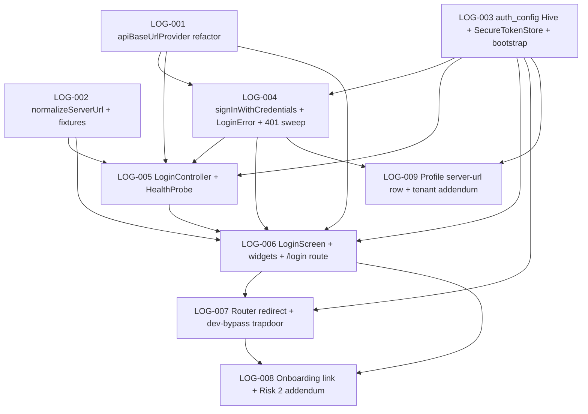

# Developer Tickets — Self-Hosted Login

Source of truth for the login pack. Every ticket below is sized for a
single developer agent to pick up, finish, and review in one session
(1–4 focused hours; ~10–25 agent-minutes per ticket). Agents do **not**
have a Flutter SDK — they write tests to disk inspection-correct, but
they do **not** run `flutter test` or `flutter analyze`. Inspect for
typos; assume CI gates run on a host machine later.

**Read order**:

1. This file (you are here).
2. `specs/pm_login.md` — the PM's *what* and *why*: the three-field
   mobile form, the two-field web form, the on-submit `/health`
   probe + `/auth/login` POST, the HTTPS-default-with-per-session-HTTP
   disclosure, the `auth_config` persistence model, the §9
   anti-recommendations (no biometric / multi-account / social /
   refresh tokens in v1).
3. `specs/architect_login.md` — the architect's *how*: file-level
   seams, the four-PR sequencing in §14, the seven open questions
   in §10, the `apiBaseUrlProvider` resolution chain in §2.2, the
   `LoginError` sealed hierarchy in §3.2, the redirect rule in
   §7.2, the `flutter_secure_storage` ratification flag in §10.3,
   the file inventory in §13.
4. `specs/flutter_ui_architecture.md` — the 24 tenants. Cited by ID.
   T-04 (accent only on primary actions), T-08 (skeletons not
   spinners), T-11 (inline errors), T-14 (routes vs sheets), T-15
   (form-factor branches at root), T-20 (a11y), T-24 Case 2
   (post-mutation `context.go`) are the load-bearing ones in this
   pack.
5. `specs/pm_decisions_flutter_ui.md` — Risk 2 (the prior "remove
   the I-already-have-an-account link" ruling that this pack
   reverses with an addendum).
6. `specs/openapi.yaml` — `/health` (lines 67–89), the `bearerAuth`
   scheme (lines 761–770). `/auth/login` is not yet on the spec;
   BE-008 lands it.
7. `specs/backend_tickets_ledger.md` — BE-008 (`POST /auth/login`)
   + BE-009 (`/health` canonical mount + CORS). New sections
   appended at the bottom by this pack.
8. `specs/dev_tickets.md`, `specs/dev_tickets_log_edit_and_units.md`,
   `specs/dev_tickets_barcode.md`, `specs/dev_tickets_qol.md`,
   `specs/dev_tickets_ux_pack.md` — prior ticket shapes. Same
   conventions; same Owns-files discipline.

Tickets reference these docs by section/ID instead of re-quoting them.

**Numbering note.** Prior packs used `T-`, `LU-`, `SC-`, `QL-`,
`UX-`, `BE-` prefixes. To avoid collision this pack prefixes its
tickets `LOG-001 … LOG-NNN`. The PM doc's user stories (LOG-S1 …
LOG-S7) and the architect's PR numbers (PR 1 … PR 4) map to
`LOG-NNN` via the "Per-item map" table near the end of this doc.

**Branch model**: dispatch on top of `main`. Each ticket lists
`Owns files:` — an agent must not touch any file outside that list
without flagging in the ticket Notes. If two tickets share a file
in their `Owns files:` list, the dependency graph below sequences
them.

**Ticket status legend**:

- `pending` — not started.
- `pending (backend)` — assigned to the backend team; the Flutter
  pool does not pick this up.
- `pending-pm` — surfaced as v1.1 by the architect or PMgr; not
  blocking and not in this pack's scope.
- `in-progress` — claimed by an agent; uncommitted work-in-progress.
- `done` — committed to `main`; agent has updated this doc.
- `blocked-needs-pm` — agent gave up; see failure protocol at the
  bottom.

---

## LOG-001  `apiBaseUrlProvider` runtime base-URL seam (PR 1 core)

**Status**: pending
**Priority**: P0
**Effort**: M
**Depends on**: none
**Owns files**:
- `client/lib/providers/api_base_url_provider.dart` (new)
- `client/lib/data/api_client.dart` (delete `_baseUrlFromEnv`
  top-level const; delete `ApiClient.defaultBaseUrl`; rewire
  `apiClientProvider` to `ref.watch(apiBaseUrlProvider)` and rebuild
  Dio on change; **do NOT** add the 401-sweep branch yet — that
  lands in LOG-004)
- `client/test/data/api_base_url_provider_test.dart` (new — the
  test-file rename per architect §10.6; PMgr ratified)
- the **one** existing api-client test fixture's
  `String.fromEnvironment`-driven override (the architect §2.5 "one
  hit" file) migrates to `apiBaseUrlProvider.overrideWith` — the
  exact file path is the one returned by `grep -rn
  "defaultBaseUrl\|fromEnvironment.*API_BASE_URL" client/test` at
  the time of pickup; flag in Notes if the grep returns more than
  one hit

### Goal
Land the foundational refactor: a runtime `apiBaseUrlProvider`
that resolves the API base URL via three rules (debug
`--dart-define` override → web `Uri.base.origin + '/api/v1'` →
mobile `auth_config` Hive read), with `apiClientProvider`
rebuilding Dio whenever the provider's value changes. The
compile-time `String.fromEnvironment('API_BASE_URL')` const goes
away as a global; it survives only inside the provider's debug
override branch. Behaviour-preserving on the dev loop (`flutter
run --dart-define=API_BASE_URL=...` still works) — no
user-visible change yet; LOG-006 hangs the login screen off this
seam.

### Context
Architect §2 (full refactor — the three resolution rules in §2.2,
the rebuilt `apiClientProvider` in §2.3, the migration of
existing callers in §2.5, the acceptance criteria in §2.6). PM
§5 (the mobile flow that this provider serves) and §6.3 (the
`serverConfigProvider` naming — renamed by the architect to
`apiBaseUrlProvider` per the per-axis pattern from
`architect_qol.md` §2.1; PMgr ratified). Tenants: **T-15** (the
platform branch happens at the provider root, not sprinkled
through repositories).

### Scope
- [ ] Create `client/lib/providers/api_base_url_provider.dart`
      exporting `final apiBaseUrlProvider = Provider<String?>((ref) {
      ... });` with the three rules in this exact order:
      1. If `kDebugMode && const String.fromEnvironment('API_BASE_URL',
         defaultValue: '').isNotEmpty`, return the dart-define value.
         **This is the only `String.fromEnvironment('API_BASE_URL')`
         call site in the codebase after this ticket lands.**
      2. If `kIsWeb`, return `Uri.base.origin + '/api/v1'`. Ignore
         Hive entirely on web.
      3. Otherwise: `ref.watch(authConfigBoxProvider).get(AuthConfigKey.baseUrl)`.
         May be `null` on a fresh install — the redirect rule
         (LOG-007) prevents that state from reaching a non-login
         route in practice.
- [ ] Promote `authConfigBoxProvider` as an `UnimplementedError`-stub
      provider in this same file (one liner; same shape as
      `outboxBoxProvider`). The real override lands in LOG-003's
      `main.dart` extension. Reference the new import path from
      `AuthConfigKey` (also a stub here; one constant `static const
      baseUrl = 'base_url';`). **Note**: LOG-003 owns the
      `auth_config_box.dart` file with the full `AuthConfigKey`
      class; for this ticket inline a minimal `AuthConfigKey._stub`
      with just `baseUrl` so the provider compiles. Flag in Notes if
      a cleaner shape suggests itself; the architect's expectation
      is the full class lands in LOG-003 and this ticket's stub is
      replaced.
- [ ] In `client/lib/data/api_client.dart`:
      - Delete the top-level `_baseUrlFromEnv` const (lines ~29-32).
      - Delete `ApiClient.defaultBaseUrl` (the static).
      - Rewrite `apiClientProvider` so it `ref.watch`es
        `apiBaseUrlProvider`. When the value is `null`, fall through
        to a sentinel `'about:invalid'` baseUrl (per architect §2.3
        — fail-loud guardrail equivalent to today's empty-string
        fallback).
      - `BaseOptions(baseUrl: ...)` — unchanged otherwise.
      - **Do NOT add the 401-sweep interceptor branch in this
        ticket.** That's LOG-004's scope.
- [ ] Migrate the one test fixture flagged by `grep -rn
      "defaultBaseUrl\|fromEnvironment.*API_BASE_URL" client/test`
      from a static-const override to `apiBaseUrlProvider.overrideWith(
      (_) => 'https://test.example/api/v1')` inside the test's
      `ProviderScope` overrides list.
- [ ] Write `client/test/data/api_base_url_provider_test.dart`:
      - Three test cases covering the three resolution rules. Use
        `ProviderContainer` directly (no widget mount needed).
      - Case 1 (debug override): assert that when `kDebugMode` is
        true *and* a non-empty `--dart-define` was supplied, the
        provider returns it. This case is **simulation-only** in
        the test (no real `--dart-define` is set during `flutter
        test`); document inline that the value is read via a
        `bool.fromEnvironment` shim provider that tests inject, so
        the test asserts the *branch* not the actual env read.
      - Case 2 (web): override `kIsWebProvider` (a one-line bool
        provider added in this same file alongside
        `apiBaseUrlProvider` — see Notes for the rationale on the
        shim) to `true`, assert provider returns the test's seeded
        `Uri.base.origin + '/api/v1'`.
      - Case 3 (mobile Hive): override `authConfigBoxProvider` with
        a fake `Box<String>` that returns
        `'https://hive.example/api/v1'` for `AuthConfigKey.baseUrl`,
        assert the provider returns that. Assert that on `null`
        from the box, the provider returns `null`.
- [ ] `grep -rn 'API_BASE_URL\|defaultBaseUrl' client/lib client/test`
      must return exactly **two** hits after this ticket: (a) the
      provider's debug-override branch reading
      `String.fromEnvironment('API_BASE_URL', ...)`, and (b) this
      same provider's import side. (Adjust the assertion in the
      acceptance criteria below if the grep returns more — flag.)

### Out of scope
- The full `auth_config` Hive box schema + bootstrap — LOG-003 owns
  `client/lib/data/auth_config_box.dart` and `main.dart`.
- The 401-sweep Dio interceptor branch — LOG-004 owns
  `signInWithCredentials` and the interceptor `onError` branch.
- The login screen / controller / widgets — LOG-005, LOG-006.
- `normalizeServerUrl` — LOG-002 ships the pure function and its
  test fixture table.
- Removing the dev-bypass token — see architect §7.3 / §10.1 +
  LOG-007 dispatch plan. The dev-bypass survives on debug builds.

### Acceptance criteria
- [ ] `client/lib/providers/api_base_url_provider.dart` exists and
      exports `apiBaseUrlProvider` returning `String?`.
- [ ] The three resolution rules from architect §2.2 are honored in
      the exact order: debug dart-define → web `Uri.base.origin` →
      mobile Hive read.
- [ ] `apiClientProvider` `ref.watch`es `apiBaseUrlProvider`. A
      widget test that swaps the override and asserts the new
      `dio.options.baseUrl` proves the rebuild.
- [ ] `ApiClient.defaultBaseUrl` and the top-level `_baseUrlFromEnv`
      const are removed.
- [ ] `grep -rn 'dart-define.*API_BASE_URL' client/lib` returns
      exactly one hit (the debug-override branch in the provider).
- [ ] All existing repository tests pass with no source changes
      other than the one fixture override swap. Tenants honored:
      **T-15**.

### Tests
- `client/test/data/api_base_url_provider_test.dart` covers the
  three resolution rules per the Scope's case list.
- The existing api-client test (whichever file grep surfaces) gets
  its one-line override migration; no new test cases added there in
  this ticket.

### Notes / gotchas
- Per-axis-provider naming is the architect's call (architect §2.2,
  §10.6). PM §6.3 originally said "`serverConfigProvider`" but the
  shape is one axis (base URL) — the per-axis pattern from
  `architect_qol.md` §2.1 carries forward. PMgr ratified the
  rename. Update `pm_login.md` §12's verification command list in a
  separate doc-only ticket if needed; this pack does not amend the
  PM doc.
- `kIsWebProvider` shim: `kIsWeb` is a compile-time `bool` constant
  in Flutter. To make the web branch testable without spinning up a
  real web environment, wrap the check in a one-line provider:
  `final kIsWebProvider = Provider<bool>((_) => kIsWeb);`. Tests
  override this provider to flip the branch. Architect §6.3 named
  this approach for `Uri.base` testability; the same wrapping
  applies to `kIsWeb`. Define the shim provider inside
  `api_base_url_provider.dart` so the file is self-contained.
- The `Uri.base` shim: similarly, `Uri.base` returns
  `Uri.parse('about:blank')` under `flutter_test` per architect §6
  acceptance. Define `final uriBaseProvider = Provider<Uri>((_) =>
  Uri.base);` in the same file; tests override to inject a real
  origin. Document this seam in the file's dartdoc header.
- The `'about:invalid'` sentinel is the only fail-loud guardrail.
  Do NOT make `apiBaseUrlProvider` throw on null — the login flow
  itself (LOG-005, LOG-006) handles the null-base case explicitly.
- This is a pure refactor; the dev loop is unchanged so long as the
  developer keeps passing `--dart-define=API_BASE_URL=...`. If a
  reviewer reports the dev loop broke, the debug-override branch's
  `kDebugMode` gate is wrong — recheck.

---

## LOG-002  `normalizeServerUrl` pure function + test fixture table

**Status**: pending
**Priority**: P0
**Effort**: S
**Depends on**: none
**Owns files**:
- `client/lib/features/login/url_normalize.dart` (new)
- `client/test/features/login/url_normalize_test.dart` (new — the
  fixture table from architect §2.4)

### Goal
Land the pure URL-normalization function the login controller
will consume in LOG-005. The function takes a raw user-typed URL
and an `allowInsecure` flag, applies five normalization rules
(trim → strip trailing slashes → prepend `https://` if scheme-less
→ reject `http://` unless allowed → append `/api/v1` if missing),
and returns either the normalized URL or throws a typed
`UrlNormalizeError`. This ticket ships the function + an
inspection-correct fixture-table test; no UI, no widget mount.

### Context
Architect §2.4 (the function signature + the rules in order + the
fixture-table outline). PM §5.2 (the normalization rules) + LOG-S6
(scheme-less + LAN-only). Tenants: none specific — this is a
pure-Dart utility.

### Scope
- [ ] Create `client/lib/features/login/url_normalize.dart` with:
      ```dart
      String normalizeServerUrl(String raw, {bool allowInsecure = false});

      enum UrlNormalizeErrorKind { empty, malformed, insecureScheme }

      class UrlNormalizeError implements Exception {
        const UrlNormalizeError(this.kind, this.message);
        final UrlNormalizeErrorKind kind;
        final String message;
        @override
        String toString() => message;
      }
      ```
- [ ] Implement the rules in this exact order (per architect §2.4):
      1. `final trimmed = raw.trim();`
      2. If `trimmed.isEmpty` → throw
         `UrlNormalizeError(empty, 'Server URL is required.')`.
      3. Strip *all* trailing slashes (`while (trimmed.endsWith('/'))
         trimmed = trimmed.substring(0, trimmed.length - 1);`).
      4. If `!trimmed.startsWith('http://') &&
         !trimmed.startsWith('https://')`, prepend `https://`.
      5. If `trimmed.startsWith('http://') && !allowInsecure` →
         throw
         `UrlNormalizeError(insecureScheme, 'HTTPS required.
         Tap Allow HTTP for this session to use plain HTTP.')`.
      6. Parse with `Uri.tryParse(trimmed)`. If null, or
         `!parsed.isAbsolute`, or `parsed.host.isEmpty` → throw
         `UrlNormalizeError(malformed, 'Server URL is malformed.')`.
      7. If `parsed.path` does not contain `/api/v1`, append it
         (handle both `/api/v1` and `/api/v1/` correctly — strip
         trailing slash, then concat). Path-prefixed inputs like
         `example.com/fulfilled/api/v1` are preserved verbatim.
      8. Return the normalized URL string.
- [ ] **Dot-less host normalization** (architect §10.4, PMgr
      accept): `localhost:8080`, `192.168.1.5:8080`, `myserver:9000`
      — these have no dot but have a port. After step 4 prepends
      `https://`, the URI parse in step 6 produces a valid
      `Uri.absolute` with a non-empty `host`. The function accepts
      these. The fixture table includes a test row per architect
      §2.4 ("dot-less hosts with ports").
- [ ] Write `client/test/features/login/url_normalize_test.dart`
      with the fixture table from architect §2.4:
      | input | allowInsecure | expected output (or thrown kind) |
      |---|---|---|
      | `'  https://a.com  '` | false | `'https://a.com/api/v1'` |
      | `'a.com'` | false | `'https://a.com/api/v1'` |
      | `'a.com/'` | false | `'https://a.com/api/v1'` |
      | `'a.com///'` | false | `'https://a.com/api/v1'` |
      | `'https://a.com/api/v1'` | false | `'https://a.com/api/v1'` |
      | `'https://a.com/api/v1/'` | false | `'https://a.com/api/v1'` |
      | `'http://a.com'` | false | throws `insecureScheme` |
      | `'http://a.com'` | true | `'http://a.com/api/v1'` |
      | `'http://192.168.1.5:8080'` | true | `'http://192.168.1.5:8080/api/v1'` |
      | `'localhost:8080'` | false | `'https://localhost:8080/api/v1'` |
      | `'a.com/fulfilled/api/v1'` | false | `'https://a.com/fulfilled/api/v1'` |
      | `''` | false | throws `empty` |
      | `'   '` | false | throws `empty` |
      | `'not a url at all'` | false | throws `malformed` |
      | `'http://'` | true | throws `malformed` |
      Each row is one `test('...', () { ... });` call. Use
      `expect(() => normalizeServerUrl(...), throwsA(isA<UrlNormalizeError>().having((e) => e.kind, 'kind', UrlNormalizeErrorKind.X)))`
      for the throw cases.

### Out of scope
- The health probe (architect §5.4 `_probeHealth`) — LOG-005 owns
  the `HealthProbe` seam.
- Calling sites — LOG-005 wires this function into
  `LoginController.submit()`.
- Web-tier short-circuit (`kIsWeb` skips this function) — the
  function itself is platform-agnostic; the controller decides
  when to call it.

### Acceptance criteria
- [ ] `normalizeServerUrl` exists at the named path, is pure (no
      `ref.read`, no IO, no `async`), and matches the §2.4
      signature.
- [ ] `UrlNormalizeError` is a non-sealed `Exception` with `kind`
      + `message` (the PM-facing error text lives here). The three
      kinds are exactly `empty`, `malformed`, `insecureScheme`.
- [ ] Every row of the fixture table above passes by inspection
      (the test file mirrors the table in order, one `test()` per
      row, with clear assertion messages).
- [ ] No call site of `normalizeServerUrl` exists yet — LOG-005
      adds the only one. `grep -rn 'normalizeServerUrl' client/lib`
      returns one hit (the function definition).

### Tests
- `client/test/features/login/url_normalize_test.dart` is
  inspection-correct for the 15-row fixture table.

### Notes / gotchas
- The function is pure on purpose; the architect §2.4 rationale is
  that any future "switch server" affordance reuses it. Do NOT
  inline the rules into `LoginController.submit` — that breaks the
  seam.
- The error text is part of the PM's UX surface (PM §5.5 + LOG-S5
  + LOG-S6). The messages above are the canonical strings; the
  controller (LOG-005) renders them as-is under the URL field.
- The `Uri` parse in step 6 is the last line of defense; everything
  after the prepend in step 4 is expected to parse. If a fuzz case
  surfaces a parse-pass-but-host-empty input (rare), the
  `parsed.host.isEmpty` guard in step 6 catches it.
- Path-prefix preservation (the
  `a.com/fulfilled/api/v1` fixture row): per architect §10.2, v1
  web tier ships `Uri.base.origin` only — the reverse-proxy subpath
  limitation is documented. For *mobile* URL input the function
  preserves the path; an operator who reverse-proxies under
  `/fulfilled/` types the full path and the function honors it.
  This is the mobile-only path; the web tier never calls this
  function.

---

## LOG-003  `auth_config` Hive box + `SecureTokenStore` + bootstrap (PR 2)

**Status**: pending
**Priority**: P0
**Effort**: M
**Depends on**: none (file-disjoint from LOG-001 and LOG-002)
**Owns files**:
- `client/lib/data/auth_config_box.dart` (new — `AuthConfigKey`
  class + `authConfigBoxName` constant; this **replaces** the
  inline stub LOG-001 used)
- `client/lib/data/secure_token_store.dart` (new — `SecureTokenStore`
  abstract + `_FssSecureTokenStore` concrete impl backed by
  `flutter_secure_storage`)
- `client/lib/providers/auth_config_providers.dart` (new — exports
  `authConfigBoxProvider` as a `Provider<Box<String>>` with
  `UnimplementedError` stub, and `secureTokenStoreProvider` as a
  `Provider<SecureTokenStore>` with `UnimplementedError` stub)
- `client/lib/main.dart` (extend bootstrap to open `auth_config`
  alongside `outbox_log` via `Future.wait`, read the bearer from
  secure storage, and pass four overrides into `ProviderScope`)
- `client/lib/data/auth_token.dart` (add `AuthTokenNotifier.seeded(
  String? bearer)` named-constructor; `build()` returns `_seed`
  once then falls through to the dev-bypass branch — **do not
  modify** `signIn`, `signOut`, or `signInWithCredentials` in this
  ticket; LOG-004 owns the credential-flow additions and
  `signOut()` extension)
- `client/pubspec.yaml` (add `flutter_secure_storage: ^9.0.0` or
  the current pin; one new pub dep — PMgr ratified per architect
  §10.3)
- `client/test/data/auth_config_box_test.dart` (new — round-trips
  `base_url` + `last_username` through a Hive temp-dir box;
  close-and-reopen survival assertion)
- `client/test/data/fake_secure_token_store.dart` (new test
  helper — `FakeSecureTokenStore implements SecureTokenStore` with
  one `String? _value` field; shared seam used by LOG-005 + LOG-007
  tests)
- `client/test/data/test_hive.dart` (new test helper — `Future<Box<String>>
  openTestAuthConfigBox()` using `Directory.systemTemp.createTemp`
  + `Hive.init(dir.path)`; same pattern as `outboxBoxProvider`'s
  test helper if one exists)

### Goal
Land the persistence + boot plumbing for the login pack: the new
`auth_config` Hive box for non-secret server config (base URL,
last username), the `SecureTokenStore` seam for the bearer token
(platform secure storage — iOS Keychain / Android
EncryptedSharedPrefs / web `localStorage` shim via
`flutter_secure_storage`), the `main.dart` bootstrap extension
that opens both before `runApp` and seeds `AuthTokenNotifier`
from the secure-storage read, and the `AuthTokenNotifier.seeded`
named-ctor that captures the read value through Riverpod's
synchronous-`build()` constraint. Behaviour-preserving for the
existing app: a fresh install reads `null` from secure storage,
the seeded notifier returns `null`, and the dev-bypass / DEV_AUTH_TOKEN
debug branch kicks in unchanged. The redirect rule (LOG-007) is
the consumer that turns the null token into a `/login` route.

### Context
Architect §3.5 (`SecureTokenStore` shape + the
`flutter_secure_storage` pub-dep call), §4 (the box schema and the
bootstrap extension), §10.3 (the pub-dep PMgr ratification —
**accepted**). PM §5.5 (Hive box schema + sign-out keeps URL +
last_username). Tenants: none specific — this is data-layer
plumbing.

### Scope
- [ ] Create `client/lib/data/auth_config_box.dart` with:
      ```dart
      const String authConfigBoxName = 'auth_config';

      /// Non-secret app-level config. Bearer token does NOT live here —
      /// see `SecureTokenStore`. Survives sign-out per PM directive.
      abstract class AuthConfigKey {
        AuthConfigKey._();
        static const baseUrl = 'base_url';
        static const lastUsername = 'last_username';
      }
      ```
- [ ] Create `client/lib/data/secure_token_store.dart`:
      ```dart
      abstract class SecureTokenStore {
        Future<String?> read();
        Future<void> write(String token);
        Future<void> delete();
      }

      class _FssSecureTokenStore implements SecureTokenStore {
        _FssSecureTokenStore(this._fss);
        final FlutterSecureStorage _fss;
        static const _key = 'fulfilled.auth.bearer';
        @override Future<String?> read() => _fss.read(key: _key);
        @override Future<void> write(String token) =>
            _fss.write(key: _key, value: token);
        @override Future<void> delete() => _fss.delete(key: _key);
      }

      SecureTokenStore createSecureTokenStore() =>
          _FssSecureTokenStore(const FlutterSecureStorage());
      ```
- [ ] Create `client/lib/providers/auth_config_providers.dart`:
      ```dart
      final authConfigBoxProvider = Provider<Box<String>>((ref) {
        throw UnimplementedError(
          'authConfigBoxProvider must be overridden in main.dart with '
          'the open Hive box.',
        );
      });

      final secureTokenStoreProvider = Provider<SecureTokenStore>((ref) {
        throw UnimplementedError(
          'secureTokenStoreProvider must be overridden in main.dart with '
          'the real FlutterSecureStorage-backed impl.',
        );
      });
      ```
      **Remove** LOG-001's inline stub of `authConfigBoxProvider` and
      `AuthConfigKey._stub` — LOG-001 will have flagged this swap in
      its Notes. The import in `api_base_url_provider.dart` repoints
      to this file. (If LOG-001 has not yet landed: this ticket
      defers the LOG-001 stub removal; flag in Notes.)
- [ ] Extend `client/lib/main.dart`:
      - After `Hive.initFlutter()` (or equivalent), open both boxes
        in parallel: `final (outboxBox, authConfigBox) = await
        (Hive.openBox<...>(outboxBoxName), Hive.openBox<String>(authConfigBoxName)).wait;`
        (use the `Record.wait` pattern — Dart 3.0+; if unavailable
        fall back to `Future.wait`).
      - Construct `final secureStore = createSecureTokenStore();`.
      - `final bearer = await secureStore.read();`.
      - Pass four overrides to `ProviderScope`:
        - `outboxBoxProvider.overrideWithValue(outboxBox)` (existing).
        - `authConfigBoxProvider.overrideWithValue(authConfigBox)`.
        - `secureTokenStoreProvider.overrideWithValue(secureStore)`.
        - `authTokenProvider.overrideWith(() => AuthTokenNotifier.seeded(bearer))`.
- [ ] In `client/lib/data/auth_token.dart`, add the named ctor:
      ```dart
      class AuthTokenNotifier extends Notifier<String?> {
        AuthTokenNotifier() : _seed = null;
        AuthTokenNotifier.seeded(String? bearer) : _seed = bearer;

        String? _seed;

        @override
        String? build() {
          if (_seed != null) {
            final seeded = _seed;
            _seed = null; // consume once
            return seeded;
          }
          // Existing dev-bypass branch UNCHANGED — kDebugMode
          // gate + DEV_AUTH_TOKEN dart-define + 'dev-bypass'
          // default. LOG-007 amends this branch with the
          // DEV_AUTH_BYPASS_DISABLE trapdoor.
          return _existingDevSeed();
        }

        // signIn/signOut UNCHANGED in this ticket. LOG-004 adds
        // signInWithCredentials + extends signOut.
      }
      ```
- [ ] In `client/pubspec.yaml`, add `flutter_secure_storage: ^9.0.0`
      (or the latest stable pin at pickup time — flag the chosen
      version in Notes). **This is the only new pub dep in this
      pack** per the constraint at the top of this doc.
- [ ] Write `client/test/data/auth_config_box_test.dart`:
      - Test 1: open a temp-dir Hive box, `put(baseUrl, 'https://a/api/v1')`,
        `put(lastUsername, 'alice')`, close Hive, re-open, assert
        both values survive.
      - Test 2: `AuthConfigKey.baseUrl == 'base_url'` and
        `AuthConfigKey.lastUsername == 'last_username'` — guards
        against an accidental rename that would invalidate
        already-shipped user data.
- [ ] Write `client/test/data/fake_secure_token_store.dart`:
      ```dart
      class FakeSecureTokenStore implements SecureTokenStore {
        String? _value;
        @override Future<String?> read() async => _value;
        @override Future<void> write(String token) async {
          _value = token;
        }
        @override Future<void> delete() async {
          _value = null;
        }
      }
      ```
- [ ] Write `client/test/data/test_hive.dart` with
      `Future<Box<String>> openTestAuthConfigBox()` per the architect
      §9.3 helper pattern.

### Out of scope
- `signInWithCredentials` / `signOut()` extension / `LoginError`
  hierarchy / 401-sweep — LOG-004.
- The `LoginController` + the login screen — LOG-005, LOG-006.
- The router redirect / `_AuthListenable` / the dev-bypass
  trapdoor (`DEV_AUTH_BYPASS_DISABLE`) — LOG-007.
- Profile screen "Connected to ${url}" row — LOG-009.

### Acceptance criteria
- [ ] `auth_config_box.dart` exports `AuthConfigKey.baseUrl =
      'base_url'`, `AuthConfigKey.lastUsername = 'last_username'`,
      and `authConfigBoxName = 'auth_config'`.
- [ ] `secure_token_store.dart` defines `SecureTokenStore` abstract
      + concrete `_FssSecureTokenStore` + a `createSecureTokenStore()`
      factory. The literal key is `'fulfilled.auth.bearer'`.
- [ ] `main.dart` opens both Hive boxes before `runApp` (parallel
      via `Future.wait` or `Record.wait`), reads the bearer via
      `createSecureTokenStore().read()`, and passes four overrides
      to `ProviderScope`.
- [ ] `AuthTokenNotifier.seeded(String? bearer)` exists. The
      `_seed` field is consumed once (set to null after first
      `build()`). Subsequent rebuilds fall through to the existing
      dev-bypass / DEV_AUTH_TOKEN branch.
- [ ] `pubspec.yaml` has exactly one new dep (`flutter_secure_storage`).
      No other pub deps are added in this ticket or this pack.
- [ ] The round-trip test in `auth_config_box_test.dart` passes by
      inspection (the close-then-reopen survival assertion).
- [ ] `FakeSecureTokenStore` is used by LOG-005's controller tests
      (file path stable so LOG-005 doesn't need to relocate it).

### Tests
- `client/test/data/auth_config_box_test.dart` — round-trip + key
  literal guards.
- `client/test/data/fake_secure_token_store.dart` — test helper
  (no tests inside; consumed by LOG-005 / LOG-007).
- `client/test/data/test_hive.dart` — test helper (consumed by
  LOG-005 / LOG-007 / LOG-009 if any of those need a real box).

### Notes / gotchas
- `flutter_secure_storage` on web uses `window.localStorage`. Per
  architect §3.5 this is acceptable for v1 — the web tier is
  same-origin to the API, so the localStorage value is gated by
  the browser's same-origin policy. Document this in
  `secure_token_store.dart`'s file header.
- `Record.wait` requires Dart 3.0+. If the project targets 2.x
  (unlikely given the existing `--dart-define` and `Notifier` use,
  which both predate 3.x quirks), fall back to `Future.wait` with
  positional indexing.
- Do NOT extend `signOut()` to clear the secure store in this
  ticket. LOG-004 owns that change; this ticket is bootstrap +
  plumbing only.
- The architect §10.3 PMgr call is **accept** (one new pub dep —
  `flutter_secure_storage`). The downgrade path (bearer in Hive
  plaintext) is not in scope.

---

## LOG-004  `signInWithCredentials` + `LoginError` hierarchy + 401-sweep

**Status**: shipped (Wave 2)
**Priority**: P0
**Effort**: M
**Depends on**: LOG-001, LOG-003
**Owns files**:
- `client/lib/data/login_errors.dart` (new — `sealed class LoginError`
  + four subclasses + `HealthProbeError` + `HealthProbeErrorKind`
  enum)
- `client/lib/data/auth_token.dart` (add
  `signInWithCredentials({required String username, required String
  password})`; **extend** `signOut()` to additionally clear secure
  storage + write the bearer to secure storage inside `signIn`)
- `client/lib/data/api_client.dart` (add the 401-sweep `onError`
  branch to the existing Dio interceptor; calls
  `authTokenProvider.notifier.signOut()` on any 401 except
  `/auth/login` itself)
- `client/test/data/auth_token_test.dart` (new — exercises
  `signInWithCredentials` against a fake Dio with each of the four
  error classes; asserts secure-storage write precedes notifier
  state mutation)
- `client/test/data/api_client_401_sweep_test.dart` (new — asserts
  the interceptor signs out on 401 from `/log` (non-login path);
  asserts the interceptor does NOT loop on 401 from `/auth/login`)

### Goal
Land the credential-flow wire on `AuthTokenNotifier`: a new
`signInWithCredentials({username, password})` method that POSTs
to `/auth/login`, catches the four `DioException` shapes, throws
a typed `LoginError` subclass per architect §3.2, and on success
writes the token to secure storage **before** mutating notifier
state. Land the 401-sweep interceptor branch in the Dio
`onError` callback so any authenticated request's 401 (except
`/auth/login`) signs the user out — the router's redirect
(LOG-007) then routes them to `/login`. Extend `signOut()` to
clear secure storage in addition to the existing in-memory +
outbox cleanup; **do not** clear the `auth_config` box (PM
directive — re-login is two field touches).

### Context
Architect §3 (full notifier rewrite — §3.2 method body, §3.3
wire shape, §3.4 401-sweep, §3.5 secure-store seam, §3.6 BE-008
workaround, §3.7 acceptance criteria). PM §8 BE-008 (the wire
shape this client codes against). Architect §10.7 (`expires_at`
ignored in v1 — PMgr ratified). Tenants: **T-11** (errors are
typed and renderable inline — the controller in LOG-005 wires
the text).

### Scope
- [ ] Create `client/lib/data/login_errors.dart`:
      ```dart
      sealed class LoginError implements Exception {
        const LoginError(this.message);
        final String message;
        @override
        String toString() => message;
      }

      class BadCredentialsError extends LoginError {
        const BadCredentialsError(super.message);
      }

      class LoginNetworkError extends LoginError {
        const LoginNetworkError(super.message);
      }

      class LoginEndpointMissingError extends LoginError {
        const LoginEndpointMissingError(super.message);
      }

      class HealthProbeError extends LoginError {
        const HealthProbeError(super.message, this.kind);
        final HealthProbeErrorKind kind;
      }

      enum HealthProbeErrorKind {
        dns,         // host unresolvable
        tls,         // certificate / handshake failure
        timeout,     // 8s elapsed
        nonOk,       // 2xx but wrong body, or non-2xx response
        notFound,    // 404 — address answered but isn't a Fulfilled server
      }
      ```
- [ ] In `client/lib/data/auth_token.dart`, add
      `Future<void> signInWithCredentials({required String username,
      required String password})` with the implementation steps from
      architect §3.2 in this order:
      1. `final dio = ref.read(apiClientProvider).dio;`
      2. `final response = await dio.post('/auth/login', data: {
         'username': username, 'password': password,
         }, options: Options(headers: {'Authorization': ''}));`
         (the header-clear is defensive — strips any stale bearer
         the interceptor would otherwise attach).
      3. Validate `response.data is Map && (response.data as
         Map)['token'] is String && (response.data as
         Map)['token'].isNotEmpty;` else throw
         `LoginNetworkError('Login response missing token.')`.
      4. `final token = (response.data as Map)['token'] as String;`
      5. **Write to secure storage before mutating notifier state**:
         `await ref.read(secureTokenStoreProvider).write(token);`.
      6. Call existing `signIn(token)` which sets `state = token`.
      7. **Ignore `expires_at`** (architect §10.7 PMgr ratify) — do
         NOT inspect or persist it. Add a `// TODO BE-008-refresh:
         expires_at intentionally ignored in v1 per
         architect_login.md §10.7.` marker on the response-handling
         line.
      8. Wrap the whole body in `try { ... } on DioException catch
         (e) { ... }`:
         - `e.response?.statusCode == 401` → throw
           `BadCredentialsError('Username or password is incorrect.')`.
         - `e.response?.statusCode == 404` → throw
           `LoginEndpointMissingError('This server does not have a
           login endpoint yet.')`.
         - otherwise → throw `LoginNetworkError(_describeDioError(e))`
           where `_describeDioError` returns a human-readable
           reason (timeout / connection refused / 5xx + status code
           / unknown).
- [ ] **Extend `signIn(String token)`** to additionally write to
      secure storage. (Per architect §3, the existing in-memory
      `state = token` survives; the new behaviour is the
      secure-store write.) The `signInWithCredentials` already
      writes; making the plain `signIn` also write is the
      symmetric thing — the workaround path (LOG-005 §5.4 phase 1)
      calls `signIn` directly with a pasted JWT, and that JWT
      should survive an app restart the same as a credentialed
      one.

      Open code path: `Future<void> signIn(String token) async {
      state = token; await ref.read(secureTokenStoreProvider).write(token);
      }`. Note `signIn` becomes `async` — audit callers via
      `grep -rn '\.signIn(' client/lib` and `await` each if the
      caller is itself async; if a caller is sync, accept that
      `signIn` is now fire-and-forget at that site (the state
      mutation still fires synchronously; only the secure-store
      write is awaited). Flag in Notes any caller where the
      fire-and-forget is unsafe.
- [ ] **Extend `signOut()`**: today (`auth_token.dart:60-67`) it
      clears in-memory + outbox. New behaviour: parallel
      `Future.wait` on `outboxBoxProvider.clear()` +
      `secureTokenStoreProvider.delete()`. The `auth_config` box is
      **not** cleared (PM directive). Per architect §8.2.
- [ ] In `client/lib/data/api_client.dart`, add the 401-sweep
      `onError` branch to the existing Dio interceptor (per
      architect §3.4):
      ```dart
      onError: (e, handler) {
        if (e.response?.statusCode == 401 &&
            e.requestOptions.path != '/auth/login') {
          // Fire-and-forget: notifier flips state, router redirects.
          ref.read(authTokenProvider.notifier).signOut();
        }
        handler.next(e); // bubble to caller for SnackBar etc.
      }
      ```
      Use `handler.next`, not `handler.reject` — the caller
      (`LogRepository.update`, etc.) still wants the error so it
      can surface a T-11 SnackBar.
- [ ] Write `client/test/data/auth_token_test.dart` with cases:
      1. 200 + `{token: 't'}` → secure-store has `'t'` AND
         notifier state is `'t'`. Order assertion: a failing
         secure-store fake leaves notifier state untouched.
      2. 401 → throws `BadCredentialsError`. Secure-store untouched.
         Notifier state untouched.
      3. 404 → throws `LoginEndpointMissingError`. Secure-store
         untouched.
      4. `DioException(type: connectionTimeout)` → throws
         `LoginNetworkError` with timeout message.
      5. 500 → throws `LoginNetworkError` with `'Server responded
         with 500'`-class message.
      6. `signOut()` clears secure-store; `auth_config` box (if
         seeded) survives.
- [ ] Write `client/test/data/api_client_401_sweep_test.dart`:
      - Mount `apiClientProvider` against a `DioAdapter` (or
        `MockAdapter`) that returns 401 for `/log`. Seed
        `authTokenProvider` with `'t'`. Make a request; assert
        the request errors AND the notifier state flips to `null`.
      - Same setup but the 401 returns for `/auth/login`. Assert
        the notifier state stays as it was (no loop).

### Out of scope
- The `LoginController` + the screen + widgets — LOG-005, LOG-006.
- The `HealthProbe` seam — LOG-005 owns it (used inside the
  controller). The `HealthProbeError` enum and class live here
  because they're part of the `LoginError` hierarchy that crosses
  layers.
- The `_AuthListenable` + the router redirect — LOG-007.

### Acceptance criteria
- [ ] `LoginError` is a `sealed` class with four subclasses; the
      four `HealthProbeErrorKind` values map 1:1 to PM §5.2's four
      error classes.
- [ ] `signInWithCredentials` POSTs to `/auth/login` with
      `{username, password}` and `Authorization: ''` header
      (defensive clear).
- [ ] On success, the bearer is in secure storage **before**
      `state = token` is observable. A test that injects a failing
      `secureTokenStoreProvider` asserts the notifier state stays
      at its pre-call value after the failure.
- [ ] `signIn(String token)` also writes to secure storage (for the
      paste-JWT workaround path).
- [ ] `signOut()` clears in-memory + outbox + secure storage in
      parallel; `auth_config` box is **not** touched.
- [ ] The 401-sweep interceptor branch fires on any authenticated
      request's 401 except `/auth/login` itself.
- [ ] `expires_at` field is ignored on the response — `grep -rn
      'expires_at' client/lib/data` returns one hit (the TODO
      comment in `signInWithCredentials`).
- [ ] Tenants honored: **T-11** (the error types are typed for
      inline rendering; LOG-005 wires the text).

### Tests
- `client/test/data/auth_token_test.dart` — six cases above.
- `client/test/data/api_client_401_sweep_test.dart` — two cases
  above.

### Notes / gotchas
- `signIn` becoming `async` is a soft breaking change for callers.
  Audit before claiming the ticket: `grep -rn '\.signIn(' client/lib
  client/test`. If a non-trivial caller fire-and-forgets and the
  secure-store write fails silently, the next app launch's
  secure-store read returns null and the user lands on `/login`
  unexpectedly. Acceptable failure mode for v1; flag if a caller
  needs the explicit `await`.
- The dev-bypass / `DEV_AUTH_TOKEN` seed branch in
  `AuthTokenNotifier.build()` is untouched in this ticket. LOG-007
  amends `build()` with the trapdoor.
- Do NOT delete the `signIn(String token)` method — it's the
  terminal write step that `signInWithCredentials` calls. The
  paste-JWT workaround (LOG-005 §5.4 phase 1) also calls it
  directly.
- The architect §3.5 PMgr call on `flutter_secure_storage` was
  ratified in LOG-003 (the pub dep is added there). This ticket
  consumes the seam.

---

## LOG-005  `LoginController` + `HealthProbe` seam

**Status**: shipped (Wave 3)
**Priority**: P0
**Effort**: L
**Depends on**: LOG-001, LOG-002, LOG-003, LOG-004
**Owns files**:
- `client/lib/features/login/login_controller.dart` (new —
  `LoginFormState` immutable class + `LoginController extends
  StateNotifier<LoginFormState>` + `loginControllerProvider`
  `autoDispose`)
- `client/lib/features/login/health_probe.dart` (new — `abstract
  class HealthProbe` + `_DioHealthProbe` concrete + `healthProbeProvider`)
- `client/test/features/login/login_url_validation_test.dart` (new
  — drives `LoginController.submit` with a fake `healthProbeProvider`
  returning each of the four `HealthProbeErrorKind`s, asserts
  resulting `urlError` text per the four classes)
- `client/test/features/login/login_controller_test.dart` (new —
  covers the five submit phases, the paste-JWT workaround, the
  per-session HTTP-allow toggle, the Hive persist + invalidate
  step)

### Goal
Land the login form's state-machine + the health-probe seam the
controller depends on. `LoginController` owns the form state
(`url`, `username`, `password`, `allowInsecure`, `endpointMissing`,
`pastedJwtMode`, `submitting`, three error slots), exposes plain
setters and the `submit()` method, and runs the five-phase submit
flow per architect §5.4: (1) BE-008 workaround early-return, (2)
URL normalize, (3) health probe, (4) Hive persist + invalidate
`apiBaseUrlProvider`, (5) credential POST via
`signInWithCredentials`. `HealthProbe` is a small injectable seam
that constructs a fresh `Dio` per probe call (not the shared
`apiClient` — the probe runs against an unpersisted candidate
URL).

### Context
Architect §5.3 (`LoginController` shape + provider), §5.4 (submit
flow — five phases with inline-error paths), §5.5 (the three
error slots — `urlError` / `credentialsError` / `formError`),
§5.6 (the "Use HTTP" per-session toggle + the pre-seed for
previously-stored `http://` URLs), §3.6 (the BE-008 workaround
flow). PM §5.2 (the submit timing), §5.3 (HTTPS posture), §5.4
(empty field default + helper text), §5.6 (single account). PM
§8 BE-008 (the workaround details). Tenants: **T-08** (the
button skeleton during submit), **T-11** (inline errors), **T-15**
(this ticket is form-factor-agnostic; the screen file in LOG-006
owns the layout branches).

### Scope
- [ ] Create `client/lib/features/login/health_probe.dart`:
      ```dart
      abstract class HealthProbe {
        /// Returns normally on success; throws `HealthProbeError`
        /// with the appropriate `HealthProbeErrorKind` per architect
        /// §5.4.
        Future<void> probe(String baseUrl, {required Duration timeout});
      }

      class _DioHealthProbe implements HealthProbe {
        @override
        Future<void> probe(String baseUrl, {required Duration timeout}) async {
          final dio = Dio(BaseOptions(
            baseUrl: baseUrl,
            connectTimeout: timeout,
            receiveTimeout: timeout,
            sendTimeout: timeout,
          ));
          try {
            final response = await dio.get('/health');
            if (response.statusCode == 200 &&
                response.data is Map &&
                (response.data as Map)['status'] == 'ok') {
              return;
            }
            if (response.statusCode == 404) {
              throw const HealthProbeError(
                  'That address answered, but does not look like a Fulfilled server.',
                  HealthProbeErrorKind.notFound);
            }
            throw HealthProbeError(
                'Server responded with ${response.statusCode}.',
                HealthProbeErrorKind.nonOk);
          } on DioException catch (e) {
            switch (e.type) {
              case DioExceptionType.connectionTimeout:
              case DioExceptionType.receiveTimeout:
              case DioExceptionType.sendTimeout:
                throw const HealthProbeError(
                    'Couldn\'t reach the server (timed out after 8 seconds). Check the address and your network.',
                    HealthProbeErrorKind.timeout);
              case DioExceptionType.badCertificate:
                throw const HealthProbeError(
                    'Server\'s certificate isn\'t trusted.',
                    HealthProbeErrorKind.tls);
              default:
                if (e.error is SocketException) {
                  throw const HealthProbeError(
                      'Couldn\'t find a server at that address.',
                      HealthProbeErrorKind.dns);
                }
                if (e.response?.statusCode == 404) {
                  throw const HealthProbeError(
                      'That address answered, but does not look like a Fulfilled server.',
                      HealthProbeErrorKind.notFound);
                }
                throw HealthProbeError(
                    'Server responded with ${e.response?.statusCode ?? "an error"}.',
                    HealthProbeErrorKind.nonOk);
            }
          }
        }
      }

      final healthProbeProvider = Provider<HealthProbe>((_) => _DioHealthProbe());
      ```
- [ ] Create `client/lib/features/login/login_controller.dart`
      with `LoginFormState` (immutable; copyWith ctor):
      ```dart
      @immutable
      class LoginFormState {
        const LoginFormState({
          required this.url,
          required this.username,
          required this.password,
          required this.allowInsecure,
          this.endpointMissing = false,
          this.pastedJwtMode = false,
          this.submitting = false,
          this.urlError,
          this.credentialsError,
          this.formError,
        });
        final String url, username, password;
        final bool allowInsecure, endpointMissing, pastedJwtMode, submitting;
        final String? urlError, credentialsError, formError;

        LoginFormState copyWith({...});
      }
      ```
- [ ] Implement `LoginController extends
      StateNotifier<LoginFormState>` with:
      - Constructor: `LoginController(this._ref, {required
        LoginFormState initial}) : super(initial);` where `_ref`
        is a `Ref`.
      - Plain setters: `setUrl(String)`, `setUsername(String)`,
        `setPassword(String)` — each calls `state = state.copyWith(
        url/username/password: v, urlError/credentialsError:
        null);` (clearing the matching error slot on every
        keystroke).
      - `toggleAllowInsecure()`: `state = state.copyWith(
        allowInsecure: !state.allowInsecure, urlError: null);`.
      - `acceptJwtDisclosure()`: `state = state.copyWith(
        pastedJwtMode: true, endpointMissing: false);`.
      - `Future<bool> submit()` — implementation per the five
        phases in architect §5.4 below.
      - `Future<void> _persistConfig(String url, String username)
        async { final box = _ref.read(authConfigBoxProvider);
        await box.put(AuthConfigKey.baseUrl, url); await box.put(
        AuthConfigKey.lastUsername, username); }`.
      - `static Future<void> resetForTesting(Ref ref) async {
        await ref.read(authConfigBoxProvider).clear(); }`.
- [ ] The five `submit()` phases (architect §5.4 — exact order
      matters):
      1. **BE-008 workaround branch (early return).**
         If `state.pastedJwtMode`: trim password; check
         `_looksLikeJwt(password)` (`split('.').length == 3 &&
         every isNotEmpty`); else
         `state = state.copyWith(credentialsError: 'That doesn\'t
         look like a JWT.');` and return `false`. On JWT-shaped:
         `await ref.read(authTokenProvider.notifier).signIn(
         password);` (which writes to secure store and flips
         in-memory state per LOG-004 extension), `await
         _persistConfig(state.url, state.username);`, return
         `true`.
      2. **URL normalize** (mobile only — `!kIsWeb`). Call
         `normalizeServerUrl(state.url, allowInsecure:
         state.allowInsecure)`. Catch `UrlNormalizeError`:
         - `kind == insecureScheme` → `urlError` = the message
           from the error (already includes the "tap Allow HTTP"
           prompt — the screen renders the toggle below it).
         - `kind == empty` or `malformed` → `urlError` = the
           message verbatim.
         On `kIsWeb`: read `apiBaseUrlProvider`; if null,
         `formError = 'Couldn\'t determine server URL from this
         page.'`.
      3. **Health probe.** `await ref.read(healthProbeProvider).probe(
         normalized, timeout: const Duration(seconds: 8));`. Catch
         `HealthProbeError`: map `kind` → `urlError` (the error's
         own `message` is the rendered text). On any throw,
         return `false`.
      4. **Persist + invalidate.** `await ref.read(
         authConfigBoxProvider).put(AuthConfigKey.baseUrl,
         normalized);` then `_ref.invalidate(apiBaseUrlProvider);`.
         (The mobile branch of `apiBaseUrlProvider` reads from the
         Hive box; invalidating forces `apiClientProvider` to
         rebuild Dio against the new URL **before** phase 5
         fires.)
      5. **Credential POST.** `await ref.read(
         authTokenProvider.notifier).signInWithCredentials(
         username: state.username, password: state.password);`.
         Catch `LoginError`:
         - `BadCredentialsError` → `credentialsError` = error.message.
         - `LoginEndpointMissingError` →
           `state.copyWith(endpointMissing: true);` (the screen
           renders the JWT-paste disclosure under the form);
           return `false`.
         - `LoginNetworkError` → `formError` = error.message.
         On success: `await _persistConfig(normalized,
         state.username);` (the `_persistConfig` re-writes baseUrl
         to be idempotent and adds `lastUsername`), return `true`.
- [ ] Wrap the whole `submit()` body in
      `state = state.copyWith(submitting: true, urlError: null,
      credentialsError: null, formError: null);` at entry and
      `state = state.copyWith(submitting: false);` in a `finally`.
- [ ] The provider:
      ```dart
      final loginControllerProvider =
          StateNotifierProvider.autoDispose<LoginController, LoginFormState>(
        (ref) {
          final box = ref.watch(authConfigBoxProvider);
          final urlFromHive = box.get(AuthConfigKey.baseUrl);
          return LoginController(
            ref,
            initial: LoginFormState(
              url: kIsWeb ? '' : (urlFromHive ?? ''),
              username: box.get(AuthConfigKey.lastUsername) ?? '',
              password: '',
              allowInsecure: urlFromHive?.startsWith('http://') ?? false,
            ),
          );
        },
      );
      ```
- [ ] Write `login_url_validation_test.dart`:
      - Five cases, one per `HealthProbeErrorKind` (dns / tls /
        timeout / nonOk / notFound). For each: override
        `healthProbeProvider` with a fake that throws the matching
        `HealthProbeError`, drive `controller.submit()`, assert
        `state.urlError` contains the kind-specific message
        substring (e.g. `'timed out'` for timeout).
- [ ] Write `login_controller_test.dart`:
      - **Case A (happy path):** stub `healthProbeProvider` to
        return normally; stub `signInWithCredentials` (mock the
        notifier with `overrideWith` returning a fake that returns
        normally on `signInWithCredentials`). Seed the form,
        `submit()` returns `true`; `auth_config.baseUrl` is the
        normalized URL; `auth_config.lastUsername` is the seeded
        username.
      - **Case B (bad credentials):** notifier throws
        `BadCredentialsError`. `submit()` returns `false`;
        `state.credentialsError` is non-null;
        `state.urlError`/`formError` are null.
      - **Case C (endpoint missing):** notifier throws
        `LoginEndpointMissingError`. `state.endpointMissing == true`.
        Subsequent submit with `pastedJwtMode = true` and a
        JWT-shaped password: skips the health probe, calls
        `signIn(password)` directly, persists URL + username,
        returns `true`.
      - **Case D (HTTP toggle):** seed `url = 'http://192.168.1.5:8080'`,
        `allowInsecure = false`. `submit()` returns `false` with
        `urlError` mentioning HTTP. Call `toggleAllowInsecure()`,
        re-submit (after stubbing the probe to succeed): returns
        `true`; persisted URL starts with `'http://'`.
      - **Case E (allowInsecure pre-seed from Hive):** seed the
        Hive box with `http://prev.example/api/v1`. Construct the
        controller via `loginControllerProvider`; assert
        `state.allowInsecure == true` on initial state (the
        pre-seed branch in §5.6 of architect doc).
      - **Case F (invalidate before POST):** assert that phase 4
        runs before phase 5 — the controller's `_persistConfig` +
        `ref.invalidate(apiBaseUrlProvider)` happens before
        `signInWithCredentials` is called. Use a tracker on the
        fake notifier to record the call ordering vs the box's
        `put` call.

### Out of scope
- The widgets (`LoginScreen`, `ServerUrlField`, `CredentialsForm`,
  `LoginButton`, `SignUpLink`, `PasteJwtDisclosure`) — LOG-006.
- The `/login` route registration — LOG-006 (or LOG-007 if
  ordering shifts; LOG-006 currently owns it).
- The router redirect — LOG-007.

### Acceptance criteria
- [ ] `HealthProbe` abstract + `_DioHealthProbe` concrete +
      `healthProbeProvider` exist; the concrete impl maps the five
      Dio error shapes to the five `HealthProbeErrorKind`s per
      architect §5.4.
- [ ] `LoginController` owns `LoginFormState` with the nine fields
      named above. Setters clear matching error slots.
      `autoDispose` is on the provider.
- [ ] `submit()` runs the five phases in order; the `finally`
      always flips `submitting` back to false; on success the URL
      + username are in `auth_config`.
- [ ] `loginControllerProvider`'s initial state pre-seeds
      `allowInsecure: true` if the Hive `baseUrl` starts with
      `http://` (architect §5.6 — the LOG-S6 sticky case).
- [ ] BE-008 workaround: 404 from `/auth/login` flips
      `endpointMissing = true`; subsequent submit with
      `pastedJwtMode = true` shortcuts past `/auth/login` and
      calls `signIn(password)` directly (which persists to secure
      storage per LOG-004).
- [ ] All cases in `login_controller_test.dart` and
      `login_url_validation_test.dart` are inspection-correct.
- [ ] Tenants honored: **T-08** (the `submitting` flag drives the
      button skeleton; the actual skeleton renders in LOG-006).

### Tests
- `client/test/features/login/login_controller_test.dart` — six
  cases above.
- `client/test/features/login/login_url_validation_test.dart` —
  five error-kind cases.

### Notes / gotchas
- The fresh Dio inside `_DioHealthProbe.probe` is deliberate
  (architect §5.4). Do NOT reuse `apiClientProvider`'s Dio — the
  probe runs against an unpersisted candidate URL that may
  differ from the currently-wired `apiClientProvider.dio.baseUrl`.
- Per architect §5.4 the `ref.invalidate(apiBaseUrlProvider)`
  call in phase 4 forces `apiClientProvider` to rebuild Dio
  against the new URL **before** phase 5 fires. This is the
  invariant Case F asserts.
- `_looksLikeJwt` is a heuristic (`split('.').length == 3` +
  every segment non-empty) — we don't actually parse the JWT;
  the server validates it. The guard exists so the user can't
  accidentally ship their actual password as a bearer.
- The five error-class messages are the canonical UX strings.
  Match them verbatim in the test assertions. PM §3 rule 4 is
  the authority.

---

## LOG-006  `LoginScreen` widget + `/login` route + feature widgets

**Status**: shipped (Wave 4)
**Priority**: P0
**Effort**: L
**Depends on**: LOG-001, LOG-002, LOG-003, LOG-004, LOG-005
**Owns files**:
- `client/lib/features/login/login_screen.dart` (new — `LoginScreen`
  widget + private `_LoginCompact`, `_LoginExpanded`, `_LoginBody`
  layouts per T-15)
- `client/lib/features/login/widgets/server_url_field.dart` (new)
- `client/lib/features/login/widgets/credentials_form.dart` (new)
- `client/lib/features/login/widgets/login_button.dart` (new)
- `client/lib/features/login/widgets/sign_up_link.dart` (new)
- `client/lib/features/login/widgets/paste_jwt_disclosure.dart` (new)
- `client/lib/routing/routes.dart` (add `loginName = 'login'` +
  `loginPath = '/login'` constants — alphabetical-by-name)
- `client/lib/routing/app_router.dart` (register
  `GoRoute(path: '/login', name: 'login', builder: ...)` outside
  the `ShellRoute`, alongside `/onboarding/:step`. **Do NOT** wire
  the `redirect` / `refreshListenable` in this ticket — LOG-007
  owns those.)
- `client/test/features/login/login_screen_compact_test.dart` (new)
- `client/test/features/login/login_screen_web_test.dart` (new —
  `kIsWebProvider` override → URL field is absent)

### Goal
Land the user-facing login screen: three fields stacked on mobile
(URL → Username → Password) per PM §5.1, two fields on web (no
URL field, hidden via `!kIsWeb` per PM §6.2), a full-width "Sign
in" primary button with T-08 skeleton during submit, the
helper-text-not-placeholder URL pattern per PM §5.4, the inline
error rendering per T-11, the per-session "Use HTTP" disclosure
per PM §5.3, and the BE-008 JWT-paste disclosure per architect
§3.6. The `/login` route registers outside the `ShellRoute` so
the screen has no nav chrome (no bottom tabs, no sidebar).

### Context
Architect §5.1 (file list — eight feature files), §5.2 (`LoginScreen`
form-factor branches at root — T-15), §5.5 (field-level error
rendering — T-11), §5.6 (the "Use HTTP" disclosure), §5.7
(skeleton button — T-08), §5.8 (acceptance criteria for the
screen). PM §5.1 (three-field mobile layout), §5.4 (empty
default + helper text), §6.2 (two-field web). Tenants: **T-04**
(accent only on the "Sign in" button — field focus rings can use
accent but labels stay ink), **T-08**, **T-11**, **T-14**
(`/login` is a route, deep-linkable), **T-15**, **T-20** (every
field has a `Semantics` label; submit reads "Sign in to
<hostname>" when URL present), **T-24 Case 2** (post-submit
`context.go('/today')`).

### Scope
- [ ] In `client/lib/routing/routes.dart` add two constants
      (alphabetical-by-name placement in the existing constants
      block):
      ```dart
      static const String loginName = 'login';
      static const String loginPath = '/login';
      ```
- [ ] In `client/lib/routing/app_router.dart` register
      `GoRoute(path: Routes.loginPath, name: Routes.loginName,
      builder: (_, __) => const LoginScreen())` outside the
      `ShellRoute`, alongside `/onboarding/:step`.
- [ ] Create `LoginScreen` (StatelessWidget):
      - `build` reads `MediaQuery.sizeOf(context).width`, compares
        against `Breakpoints.mediumMax`, returns
        `_LoginCompact(child: _LoginBody())` or
        `_LoginExpanded(child: _LoginBody())`. Form-factor pick at
        the root — T-15.
      - `_LoginCompact`: full-width single-column form, centred
        vertically. Wraps in `Scaffold` (no `AppBar`).
      - `_LoginExpanded`: `Scaffold` with a centred `ConstrainedBox(
        maxWidth: 420)` card.
- [ ] `_LoginBody` (private widget) layout — top to bottom:
      1. Logo (inline the same `_Logo` shape from
         `step_1_welcome.dart` — **do not** hoist to
         `lib/widgets/app_logo.dart` per architect §10.5 PMgr
         accept; v1.1 cleanup. Add a `// TODO v1.1: hoist _Logo to
         lib/widgets/app_logo.dart per architect §10.5` marker.).
      2. `SizedBox(height: context.space.x6)`.
      3. Headline text `"Sign in to your server"` in
         `context.text.hero`.
      4. `SizedBox(height: context.space.x6)`.
      5. `ServerUrlField` (only when `!kIsWeb` — on web, **omit
         from the column entirely**, not zero-height-hidden per
         architect §6).
      6. `SizedBox(height: context.space.x4)` (only when
         `!kIsWeb`).
      7. `CredentialsForm` (username + password fields stacked
         with `context.space.x4`).
      8. `SizedBox(height: context.space.x6)`.
      9. `LoginButton` (full-width).
      10. `PasteJwtDisclosure` (only when `state.endpointMissing`).
      11. `SizedBox(height: context.space.x4)`.
      12. `SignUpLink`.
- [ ] `ServerUrlField`: a `TextField` with:
      - Controller seeded from `state.url`; `onChanged` →
        `controller.setUrl(v)`.
      - `decoration.helperText`: if `state.urlError` is null,
        render `"e.g. https://fulfilled.mydomain.com"` in
        `context.text.meta`. If non-null, render the error in
        `context.colors.danger`.
      - On HTTP-insecure error (the `urlError` mentions HTTP), a
        `TextButton.icon(icon: Icons.lock_open_outlined, label:
        Text('Allow HTTP for this session'), onPressed:
        controller.toggleAllowInsecure)` below the field.
      - `Semantics(label: 'Server URL')`.
      - `keyboardType: TextInputType.url`, `autocorrect: false`,
        `enableSuggestions: false`.
- [ ] `CredentialsForm`: two `TextField`s — username
      (`autocorrect: false`, `enableSuggestions: false`, no
      autofill hint controversy — `AutofillHints.username`) and
      password (`obscureText: true`, `AutofillHints.password`).
      Password field is `autofocus: true` if `state.username`
      is non-empty (the re-login path); else username field is
      autofocus. Inline error slot under password renders
      `state.credentialsError` in `context.colors.danger`.
- [ ] `LoginButton`: wraps `PrimaryButton(label: 'Sign in',
      onPressed: state.submitting ? null : _onPressed)` where
      `_onPressed` calls `final ok = await controller.submit();`
      then `if (ok && context.mounted) context.go(Routes.todayPath);`.
      When `state.submitting`, the button renders a
      button-sized skeleton in place of the label — same shape as
      `_SaveButtonSkeleton` in
      `log_entry_sheet.dart:722` per architect §5.7. **No
      `CircularProgressIndicator`** anywhere in this screen.
- [ ] `SignUpLink`: `TextButton(onPressed: () =>
      context.go('/onboarding/1'), child: Text('Don\'t have an
      account? Sign up'))`. Styling: `foregroundColor:
      context.colors.accent`, `textStyle: context.text.bodyStrong`.
- [ ] `PasteJwtDisclosure`: a Card-or-Container with
      `Icons.info_outline`, the body text *"This server doesn't
      have a login endpoint yet. You can paste a JWT directly as
      the password — it'll be sent as a bearer without going
      through /auth/login."*, and a `TextButton(label: 'Use JWT
      mode', onPressed: controller.acceptJwtDisclosure)`. Hidden
      unless `state.endpointMissing`. Add a `// TODO BE-008:
      remove or kill-switch once /auth/login lands. See
      backend_tickets_ledger.md.` marker on the disclosure widget.
- [ ] **Form-level error row** (`state.formError`): below the
      submit button, a `Row(children: [Icon(
      Icons.warning_amber_rounded, color:
      context.colors.danger), SizedBox(width: 8), Expanded(
      child: Text(state.formError!, style: context.text.meta))])`.
      No `SnackBar` — T-11's "save failures show a SnackBar" is
      sheet-style; the login screen has inline space.
- [ ] Write `login_screen_compact_test.dart`:
      - Mount `LoginScreen` at iPhone-class width (393×851);
        override `loginControllerProvider`,
        `apiBaseUrlProvider`, `healthProbeProvider`,
        `authConfigBoxProvider`, `secureTokenStoreProvider`,
        `authTokenProvider` with fakes.
      - Assert three `TextField`s render (URL, username, password)
        in the correct top-to-bottom order. The headline text
        renders.
      - Drive the happy path: enter URL + username + password, tap
        Sign in, fake controller returns `true`; assert
        `context.go('/today')` runs (via a test go_router observer
        or by asserting the current location).
      - Assert no `CircularProgressIndicator` exists in the tree
        during submit (state flips to `submitting: true` mid-test).
- [ ] Write `login_screen_web_test.dart`:
      - Override `kIsWebProvider` to `true` (the shim from LOG-001).
      - Mount `LoginScreen`; assert `ServerUrlField` is NOT in the
        tree (`find.byType(ServerUrlField)` is `findsNothing`).
      - Assert two `TextField`s render (username, password).
      - Drive the happy path; same `context.go('/today')`
        assertion.

### Out of scope
- The redirect rule / `refreshListenable` / dev-bypass trapdoor —
  LOG-007.
- The onboarding step 1 link + Risk 2 addendum — LOG-008.
- The profile-screen "Connected to ${url}" affordance — LOG-009.
- Hoisting `_Logo` to `lib/widgets/app_logo.dart` — architect
  §10.5 PMgr defer; v1.1.

### Acceptance criteria
- [ ] `LoginScreen` registers at `/login` outside the `ShellRoute`.
      The screen renders three fields on mobile (`!kIsWeb`), two
      on web. The URL field is **omitted** on web, not hidden with
      zero height.
- [ ] The URL field's initial value is
      `auth_config.baseUrl` (or empty). Helper text reads `"e.g.
      https://fulfilled.mydomain.com"` — never a placeholder
      *inside* the field (PM §5.4).
- [ ] The username field's initial value is
      `auth_config.lastUsername` (or empty). The password field is
      always empty. Autofocus moves to password if username
      pre-seeded; else to username.
- [ ] The submit button shows a button-skeleton (T-08) during
      `state.submitting`. **Zero** `CircularProgressIndicator`
      anywhere in the screen file or its widgets.
- [ ] On successful submit the screen calls `context.go('/today')`
      (T-24 Case 2).
- [ ] Each of the four PM-named URL error classes (DNS / TLS /
      timeout / 404 on health / non-2xx) renders inline under the
      URL field in `context.colors.danger`.
- [ ] 401 from `/auth/login` renders the "Username or password is
      incorrect" message under the password field; URL + username
      + password input is preserved (the user can fix and retry).
- [ ] 404 from `/auth/login` renders the `PasteJwtDisclosure`
      below the form. Accepting it shortcuts the next submit per
      LOG-005 phase 1.
- [ ] On Android back / browser back, the form state clears
      (autoDispose provider — LOG-005 sets this).
- [ ] Tenants honored: **T-04**, **T-08**, **T-11**, **T-14**,
      **T-15**, **T-20**, **T-24 Case 2**.

### Tests
- `client/test/features/login/login_screen_compact_test.dart`.
- `client/test/features/login/login_screen_web_test.dart`.

### Notes / gotchas
- The route registration in `app_router.dart` is intentionally
  separated from the redirect rule (LOG-007). After this ticket
  lands, navigating to `/login` directly works; navigating to
  `/today` with no token does NOT yet redirect — that's LOG-007.
- Web reverse-proxy subpath limitation (architect §10.2 PMgr
  accept): `Uri.base.origin` strips path prefixes. The widget
  itself doesn't care; the limitation is documented and the
  test asserts the URL field is absent on web. Customers behind
  `example.com/fulfilled/` must mount Fulfilled at the origin's
  root in v1.
- `_Logo` widget: inline the same shape `step_1_welcome.dart`
  uses. The architect §10.5 PMgr-accept defers the hoist to v1.1.
  Two-logo drift is acceptable for v1; the `// TODO v1.1` marker
  is the receipt.
- `// TODO BE-008` marker on `PasteJwtDisclosure`: this is the
  removal/kill-switch trigger when BE-008 ships. PMgr can flip
  the disclosure off via a `bool kBE008Live` constant in a v1.1
  ticket; the code path itself stays as the mixed-deployment
  fallback per architect §3.6.

---

## LOG-007  Router redirect rule + `_AuthListenable` + dev-bypass trapdoor

**Status**: pending
**Priority**: P0
**Effort**: M
**Depends on**: LOG-003, LOG-006
**Owns files**:
- `client/lib/routing/app_router.dart` (wire `refreshListenable:
  _AuthListenable(ref)` + the `redirect` callback per architect
  §7.2)
- `client/lib/data/auth_token.dart` (amend `_seedToken()` /
  `build()` per architect §7.3 — the `DEV_AUTH_BYPASS_DISABLE`
  trapdoor opt-out)
- `client/test/routing/auth_redirect_test.dart` (new — flips the
  auth token, asserts redirect fires)

### Goal
Land the routing piece that gates the app on authentication
state. The router gains a `refreshListenable` that observes
`authTokenProvider` and a `redirect` callback that enforces the
five rules from architect §7.2 (no-token + non-auth-route →
`/login`; no-token + onboarding → allow; no-token + login →
allow; has-token + login → `/today`; has-token + anything else →
allow). The dev-bypass token seed survives on debug builds with
a `DEV_AUTH_BYPASS_DISABLE=1` opt-out trapdoor so devs can
exercise the login flow without recompiling.

### Context
Architect §7.2 (the five redirect rules + the synchronous
`redirect` callback), §7.3 (the dev-bypass trapdoor — **PMgr
ratify**: architect §10.1 already answered "yes, on debug builds
only" — this ticket implements that). PM §7.2 (bootstrap
gating). Tenants: **T-14** (routes are deep-linkable; the
redirect is part of the routing rules).

### Scope
- [ ] In `client/lib/routing/app_router.dart`:
      ```dart
      class _AuthListenable extends ChangeNotifier {
        _AuthListenable(this._ref) {
          _ref.listen<String?>(authTokenProvider, (prev, next) {
            notifyListeners();
          });
        }
        final Ref _ref;
      }
      ```
      Construct `_AuthListenable(ref)` inside `appRouterProvider`
      and pass to `GoRouter(refreshListenable: ...)`.
- [ ] Implement the `redirect: (context, state) { ... }` callback
      (synchronous — no `async`; `go_router` requires sync):
      ```dart
      redirect: (context, state) {
        final token = ref.read(authTokenProvider);
        final loc = state.matchedLocation;
        if (token == null) {
          if (loc == Routes.loginPath) return null;
          if (loc.startsWith('/onboarding/')) return null;
          return Routes.loginPath;
        }
        if (loc == Routes.loginPath) return Routes.todayPath;
        return null;
      }
      ```
      Five rules in this exact order per architect §7.2.
- [ ] In `client/lib/data/auth_token.dart`, amend the seed branch
      in `build()` per architect §7.3 — replace the existing
      `_existingDevSeed()` shape with:
      ```dart
      String? _seedToken() {
        const fromDartDefine = String.fromEnvironment('DEV_AUTH_TOKEN', defaultValue: '');
        if (fromDartDefine.isNotEmpty) return fromDartDefine;
        const bypassDisable = bool.fromEnvironment('DEV_AUTH_BYPASS_DISABLE', defaultValue: false);
        if (kDebugMode && !bypassDisable) return 'dev-bypass';
        return null;
      }
      ```
      Ordering: explicit `DEV_AUTH_TOKEN` wins → debug-default
      'dev-bypass' (unless `DEV_AUTH_BYPASS_DISABLE=1`) → null.
      Release builds always return `null`.
- [ ] Write `client/test/routing/auth_redirect_test.dart`:
      - **Case 1 (no token → login):** override
        `authTokenProvider` to return `null`. Push `/today`.
        Assert the resolved location is `/login`.
      - **Case 2 (no token + onboarding → allow):** override
        token to `null`. Push `/onboarding/1`. Assert location
        stays `/onboarding/1`.
      - **Case 3 (no token + login → allow):** override token to
        `null`. Push `/login`. Assert location stays `/login`.
      - **Case 4 (has token + login → /today):** override token
        to `'t'`. Push `/login`. Assert resolved is `/today`.
      - **Case 5 (has token → anything allowed):** override token
        to `'t'`. Push `/foods/123`. Assert location stays
        `/foods/123`.
      - **Case 6 (token flip mid-app → redirect fires):** mount
        the router with a non-null token at `/today`. Via the
        notifier's `signOut`, flip the token to `null`. Pump.
        Assert the router re-evaluates (via the
        `refreshListenable`) and lands on `/login`.

### Out of scope
- The onboarding step 1 link (the user-facing entry to `/login`)
  — LOG-008.
- The "Don't have an account? Sign up" link on the login screen
  — already in LOG-006's `SignUpLink` widget.
- The profile-screen sign-out wiring — LOG-009.
- Removing the dev-bypass entirely — out of scope per architect
  §7.3 (PMgr ratify: dev-bypass survives on debug builds).

### Acceptance criteria
- [ ] `appRouterProvider` constructs `_AuthListenable(ref)` and
      passes it as `GoRouter.refreshListenable`.
- [ ] The `redirect` callback enforces the five rules in the
      exact order from architect §7.2.
- [ ] The dev-bypass seed survives — `flutter run` with no
      `--dart-define`s in debug mode produces a non-null token
      and the user lands on `/today` directly.
      `flutter run --dart-define=DEV_AUTH_BYPASS_DISABLE=1` in
      debug mode produces a null token and the user lands on
      `/login`.
- [ ] Release builds always produce a null seed (the `kDebugMode`
      gate). The integration is a release-build manual smoke —
      the test asserts the branch logic.
- [ ] All six redirect cases in `auth_redirect_test.dart` pass by
      inspection.
- [ ] Tenants honored: **T-14**.

### Tests
- `client/test/routing/auth_redirect_test.dart` — six cases above.

### Notes / gotchas
- `redirect` must be synchronous (go_router constraint). The
  token read is `ref.read(authTokenProvider)`; the
  `refreshListenable` notifies on flip so go_router re-evaluates
  on its next frame.
- The architect §7.3 trapdoor (`DEV_AUTH_BYPASS_DISABLE=1`) is
  the dev-loop escape hatch — exercises the login flow without a
  recompile of `kDebugMode`. Default is "dev-bypass on" in debug,
  "null" in release.
- Per architect §10.1, the dev-bypass survives **on debug builds
  only**. Release builds always route to `/login`. No PMgr
  ratification needed (architect already answered).
- The `_AuthListenable`'s `_ref.listen` callback fires
  synchronously (Riverpod default). The `notifyListeners` call
  propagates to go_router on its next frame. If you observe a
  one-frame delay between sign-out and redirect, that's the
  expected shape — there's no visible flicker because the user
  is on a content route at the moment of sign-out.

---

## LOG-008  Onboarding step 1 — re-add "I already have an account" link + Risk 2 addendum

**Status**: pending
**Priority**: P1
**Effort**: S
**Depends on**: LOG-006, LOG-007
**Owns files**:
- `client/lib/features/onboarding/widgets/step_1_welcome.dart`
  (add the `TextButton` at the bottom of the body column; amend
  the file's dartdoc header with the History note per architect
  §7.4)
- `client/test/features/onboarding/step_1_welcome_link_test.dart`
  (new — taps the link, asserts router goes to `/login`)
- `specs/pm_decisions_flutter_ui.md` (amend Risk 2 with the
  Addendum block per architect §7.4 — the link is back; it
  routes to `/login`)

### Goal
Reintroduce the "I already have an account" affordance on
onboarding step 1 that PM Risk 2 removed (the original removal
was premised on the absence of a login screen; that premise is
now obsolete since LOG-006 ships the screen). The link routes
to `/login`. The `pm_decisions_flutter_ui.md` Risk 2 section
gains a 2026-05-16 addendum noting the reversal, preserving the
original rationale.

### Context
Architect §7.4 (the one-line widget addition + the dartdoc
header amendment + the PM-decisions doc addendum). PM §7.3 (the
reversal of Risk 2 + the canonical addendum shape). The
symmetric "Don't have an account? Sign up" link on the login
screen is already shipped via LOG-006's `SignUpLink`. Tenants:
**T-04** (the link uses accent foreground — it's a secondary
action, not a primary, but accent on text-button is allowed).

### Scope
- [ ] In `client/lib/features/onboarding/widgets/step_1_welcome.dart`:
      - Add a `TextButton` at the bottom of the body column (per
        architect §7.4 — placement at the bottom of the welcome
        body, below any existing feature list; if the
        `OnboardingStepShell` has its own footer slot the
        architect noted "architect's discretion" — default to the
        welcome body, since that's where the link was originally
        before Risk 2 cut it).
      - Wire: `onPressed: () => context.go(Routes.loginPath)`.
      - Label: `"I already have an account"`.
      - Styling: `foregroundColor: context.colors.accent`,
        `textStyle: context.text.bodyStrong`.
      - Amend the widget's dartdoc header. The current dartdoc
        (per architect §7.4) asserts *"No 'I already have an
        account' affordance — PM Risk 2 removed it."*. Replace
        with:
        ```dart
        /// History (2026-05-16): the "I already have an account"
        /// link was removed per `pm_decisions_flutter_ui.md` Risk 2
        /// in [date], on the premise that v1 had no login screen
        /// for it to route to. That premise is reversed by
        /// `pm_login.md`, which ships `/login`; the link is back
        /// and routes there.
        ```
- [ ] Write `client/test/features/onboarding/step_1_welcome_link_test.dart`:
      - Mount `Step1Welcome` (or whatever the widget is called)
        inside a test-router.
      - Find the link by text `"I already have an account"`.
      - Tap it; pump; assert the router's current location is
        `/login`.
- [ ] In `specs/pm_decisions_flutter_ui.md` at the bottom of the
      Risk 2 section, append:
      ```markdown
      > **Addendum 2026-05-16 — login flow shipped.** The "remove
      > the link entirely" decision is superseded by
      > `specs/pm_login.md`. The link is back; it routes to
      > `/login`. Original rationale (no login screen for the link
      > to route to) preserved above for history.
      ```
      Do not delete or rewrite the original Risk 2 prose — append
      only.

### Out of scope
- The login screen itself — LOG-006 (already shipped).
- The router redirect rule — LOG-007 (already shipped).
- The symmetric "Don't have an account? Sign up" link on
  `/login` — LOG-006.
- The `flutter_ui_architecture.md` Addendum block — LOG-009
  rolls it in alongside the profile-screen change.

### Acceptance criteria
- [ ] `step_1_welcome.dart` renders a `TextButton` labelled "I
      already have an account" that routes to `/login` on tap.
- [ ] The widget's dartdoc header carries the History note.
- [ ] `pm_decisions_flutter_ui.md` Risk 2 section has the
      Addendum 2026-05-16 block appended (not replacing the
      original prose).
- [ ] `step_1_welcome_link_test.dart` is inspection-correct.
- [ ] Tenants honored: **T-04** (accent on the secondary link).

### Tests
- `client/test/features/onboarding/step_1_welcome_link_test.dart`.

### Notes / gotchas
- Risk 2 is in `pm_decisions_flutter_ui.md`. Do NOT touch any
  other section of that doc. Append only.
- The placement at the bottom of the welcome body (vs the
  `OnboardingStepShell` footer slot) is the architect's
  recommended default (§7.4) — pick the simpler placement; if
  the existing widget structure makes the footer slot trivially
  cleaner, flag in Notes and choose the cleaner shape.
- The link's text is the literal `"I already have an account"`.
  Match verbatim — tests assert it.

---

## LOG-009  Profile screen "Connected to ${server_url}" row + tenant addendum block

**Status**: shipped (Wave 3)
**Priority**: P1
**Effort**: S
**Depends on**: LOG-003, LOG-004
**Owns files**:
- `client/lib/features/profile/widgets/server_url_row.dart` (new —
  reads `auth_config.baseUrl` from the box; renders read-only)
- `client/lib/features/profile/profile_screen.dart` (mount the new
  row in the info card; the exact mount-site is the architect's
  "one-line addition" per PM §10 punt-list-promotion)
- `client/test/features/profile/server_url_row_test.dart` (new —
  asserts the row renders the Hive `baseUrl`)
- `specs/flutter_ui_architecture.md` (append the Addendum applied
  2026-05-16 (login pack) block per architect §12)

### Goal
Land the smallest-possible-scope PM §10 punt-list-promotion: a
read-only "Server: ${auth_config.baseUrl}" row in the profile
screen's info card so the user can see which server they're
connected to. PM called this out as "not deferred, actually —
the smallest possible scope extension of this pack." Also land
the `flutter_ui_architecture.md` Addendum block that records the
pack's shipping per architect §12.

### Context
PM §10 punt-list ("Profile screen 'Connected to ${server_url}'
affordance" — not deferred, included in this pack). Architect
§12 (Addendum applied 2026-05-16 (login pack) block — verbatim
text in the architect doc). Tenants: **T-11** (the row is
informational, not editable; no inline error — there's no
failure mode).

### Scope
- [ ] Create `client/lib/features/profile/widgets/server_url_row.dart`:
      ```dart
      class ServerUrlRow extends ConsumerWidget {
        const ServerUrlRow({super.key});
        @override
        Widget build(BuildContext context, WidgetRef ref) {
          final box = ref.watch(authConfigBoxProvider);
          final url = box.get(AuthConfigKey.baseUrl);
          if (url == null || url.isEmpty) {
            return const SizedBox.shrink(); // signed-out path
          }
          return ListTile(
            leading: Icon(Icons.dns_outlined, color: context.colors.ink3),
            title: Text('Server', style: context.text.meta),
            subtitle: Text(url, style: context.text.body),
            dense: true,
          );
          // Read-only — no trailing chevron, no onTap.
        }
      }
      ```
- [ ] In `client/lib/features/profile/profile_screen.dart`, mount
      `ServerUrlRow` inside the existing info card (architect
      §10 punt: "one-line addition"). If the info card structure
      makes this non-trivial, mount it as a sibling of the info
      card; flag in Notes.
- [ ] Write `server_url_row_test.dart`:
      - **Case 1**: seed `auth_config.baseUrl =
        'https://a.example/api/v1'`; assert the row renders with
        that URL as subtitle text.
      - **Case 2**: seed empty box; assert the row renders
        `SizedBox.shrink()` (no visible chrome) — the signed-out
        path before the very first login.
- [ ] In `specs/flutter_ui_architecture.md`, append (per
      architect §12 — verbatim block):
      ```markdown
      > **Addendum applied 2026-05-16 (login pack)** — see
      > `specs/architect_login.md`. No new tenant. T-15
      > form-factor-at-root covers the LoginScreen's compact /
      > expanded branch. T-24 Case 2 covers the post-login
      > `context.go('/today')` navigation; the existing wording
      > stands. The base-URL refactor relocates the compile-time
      > `--dart-define=API_BASE_URL` read to a runtime provider
      > (`apiBaseUrlProvider`); the dev-define survives as a
      > debug-only override. Risk 2 in
      > `pm_decisions_flutter_ui.md` is superseded — the "I
      > already have an account" link returns on onboarding step
      > 1; the architect amends Risk 2 in the same change.
      > Backend tickets BE-008 and BE-009 are pending; the
      > client ships a workaround for the absence of BE-008
      > (paste-a-JWT disclosure) that flips off cleanly when the
      > endpoint lands.
      ```

### Out of scope
- Editable server URL on the profile screen — PM §10
  anti-recommendation 10 ("no 'switch server' in-app affordance
  separate from sign-out"). The user signs out and re-enters
  the URL on the login screen per LOG-S4.
- Touching `pm_decisions_flutter_ui.md` Risk 2 — LOG-008 owns
  that doc edit.
- "Servers" sub-screen showing all connected servers — PM §10
  v1.1 punt.

### Acceptance criteria
- [ ] `ServerUrlRow` renders the Hive `baseUrl` as a read-only
      ListTile in the profile screen's info card.
- [ ] When the box has no `baseUrl` (fresh install before first
      sign-in), the row collapses to `SizedBox.shrink()` — no
      visible chrome.
- [ ] `flutter_ui_architecture.md` carries the architect §12
      Addendum block at the bottom.
- [ ] No new editable surface — the row has no `onTap`, no
      trailing chevron, no edit affordance.

### Tests
- `client/test/features/profile/server_url_row_test.dart` — two
  cases above.

### Notes / gotchas
- This is the PM §10 punt-list-promotion ("not deferred,
  actually — calling it out here as the smallest possible scope
  extension of this pack"). Keep the change small; do NOT
  introduce a sign-out button or a switch-server affordance in
  this ticket.
- The info card's exact location varies by Profile screen
  structure. If the existing profile widget tree doesn't have a
  clean info-card seam, flag in Notes; default to mounting as a
  top-level child of the screen's main `Column`.
- `ref.watch(authConfigBoxProvider)` does not invalidate on
  `box.put` by default in Hive — the row will not auto-refresh
  if the URL changes mid-session. Acceptable for v1: the only
  way the URL changes is sign-out → sign-in, and the user is
  off the profile screen during that path. If a future ticket
  adds in-app URL editing, the row needs a `box.listenable()`
  wrap.

---

## Dependency graph



**Longest dependency chain (Flutter side)**:

```
LOG-001 → LOG-004 → LOG-005 → LOG-006 → LOG-007 → LOG-008
```

Six hops. Estimated effort: M + M + L + L + M + S ≈ 14–18 hours
sequential. Parallelism collapses this dramatically — see the
dispatch plan below.

The architect's PR map (architect §14) to ticket clusters:

- **PR 1 (A — runtime API base URL)**: LOG-001 + LOG-002.
- **PR 2 (B — Hive box + secure-token bootstrap)**: LOG-003.
- **PR 3 (C — LoginScreen + controller + route +
  signInWithCredentials)**: LOG-004 + LOG-005 + LOG-006.
- **PR 4 (D — Redirect rule + onboarding link + sign-out
  extension)**: LOG-007 + LOG-008 + LOG-009.

LOG-004's `signOut()` extension is the "sign-out extension" piece
of PR 4 in architect §14 but it ships inside PR 3 here because
it's tightly coupled to `signInWithCredentials` (same notifier
file). The redirect rule + onboarding link + profile row remain
PR 4. PMgr ratify: cluster boundaries are guidance; the ticket
graph is the authority.

---

## Dispatch plan

### Wave 1 — dispatch immediately in parallel

These have no upstream Flutter deps. Three agents.

- **LOG-001** — `apiBaseUrlProvider` refactor (M)
- **LOG-002** — `normalizeServerUrl` pure function (S)
- **LOG-003** — `auth_config` + `SecureTokenStore` + bootstrap (M)

LOG-001, LOG-002, LOG-003 touch entirely disjoint file sets (the
provider + api_client; the pure normalize function; the
data-layer Hive + secure-store + main.dart). Three parallel
agents.

### Wave 2 — dispatch when Wave 1 lands

- **LOG-004** — `signInWithCredentials` + `LoginError` + 401-sweep
  (M; needs LOG-001 for `apiClientProvider`, LOG-003 for
  `secureTokenStoreProvider`)

LOG-004 is alone in Wave 2 because LOG-005 depends on it.

### Wave 3 — dispatch when Wave 2 lands

- **LOG-005** — `LoginController` + `HealthProbe` (L; needs
  LOG-001, LOG-002, LOG-003, LOG-004)

LOG-005 is alone in Wave 3 because LOG-006 depends on it.

### Wave 4 — dispatch when Wave 3 lands

- **LOG-006** — `LoginScreen` + widgets + `/login` route (L; needs
  LOG-001..LOG-005)

LOG-006 is alone in Wave 4 because LOG-007 + LOG-008 depend on
it.

### Wave 5 — dispatch when Wave 4 lands

- **LOG-007** — Router redirect + dev-bypass trapdoor (M; needs
  LOG-003, LOG-006)
- **LOG-009** — Profile server-url row + tenant addendum (S; needs
  LOG-003, LOG-004 — does not block on LOG-006 / LOG-007)

LOG-007 and LOG-009 are file-disjoint (routing vs profile). Two
parallel agents.

### Wave 6 — dispatch when Wave 5 lands

- **LOG-008** — Onboarding link + Risk 2 addendum (S; needs
  LOG-006 for the `/login` route to exist + LOG-007 for the
  redirect to land without breaking step-1 → login → step-1 loop)

One agent. The S sizing makes this a fast close-out.

### Strict serial constraints (sequential, NOT parallel)

- **LOG-001 and LOG-003** to **LOG-004** — LOG-004 imports
  `apiClientProvider` (LOG-001) and `secureTokenStoreProvider`
  (LOG-003). Strict serial.
- **LOG-004 and LOG-005** — LOG-005's controller calls
  `signInWithCredentials` (LOG-004). Strict serial.
- **LOG-005 and LOG-006** — LOG-006's screen mounts
  `loginControllerProvider` (LOG-005). Strict serial.
- **LOG-006 and LOG-007** — LOG-007 wires the redirect; the
  redirect routes to `/login` which is registered by LOG-006.
  Strict serial.
- **LOG-006 and LOG-007 to LOG-008** — LOG-008 depends on both
  the screen existing and the redirect not double-bouncing
  back. Strict serial.

### Pre-backend window — Flutter ships first is OK

Per architect §14 and PM §11, the entire Flutter sweep (LOG-001
through LOG-009) can ship before BE-008 (POST /auth/login) lands,
provided the workaround path holds:

1. The login screen's `PasteJwtDisclosure` activates on 404 from
   `/auth/login` → ✓ LOG-006 + LOG-005 acceptance.
2. JWT-paste shortcut writes the bearer to secure storage +
   flips notifier state → ✓ LOG-004 (extended `signIn`) + LOG-005
   phase 1.
3. The disclosure stays as the mixed-deployment fallback after
   BE-008 lands → ✓ LOG-006 `// TODO BE-008` marker (removal
   trigger, not removal action).

BE-009 (`/health` canonical mount + CORS confirmation) is
documentation-only per architect §11; no client dependency. If
the runtime mount differs from the spec, LOG-005's health probe
path is the one line of code that changes.

---

## Architect's 7 risks → resolution

The architect's §10 listed seven open items. PMgr resolution
table:

| # | Architect concern | PMgr resolution | Where it lands |
|---|---|---|---|
| 10.1 | Dev-bypass token survival in v1 | **Accept architect's call** (yes, debug builds only; release builds always route to `/login`). Architect §7.3 trapdoor (`DEV_AUTH_BYPASS_DISABLE=1`) ships as the dev-loop escape hatch. | LOG-007 |
| 10.2 | Web reverse-proxy subpath limitation | **Accept** for v1. `Uri.base.origin + '/api/v1'` strips path prefixes; operators behind `/fulfilled/` mount at origin root in v1. Document as known v1 limitation in the `kIsWeb` branch of `apiBaseUrlProvider`. Revisit in v1.1 if a customer reports it. | LOG-001 (Notes), LOG-006 (Notes) |
| 10.3 | `flutter_secure_storage` pub dep | **Accept**. Runtime supervisor ratified this when dispatching the pack. Standard Flutter pattern for credential storage; one pub dep is the only one in this pack. Downgrade path (bearer in Hive plaintext) is NOT pursued. | LOG-003 |
| 10.4 | Dot-less host normalization (`localhost:8080`, `192.168.1.5:8080`) | **Accept**. Explicitly support LAN URLs. The `normalizeServerUrl` function honors scheme-less + port-explicit + dot-less hosts; the health probe is the final arbiter of reachability. Fixture-table row in LOG-002 covers it. | LOG-002 |
| 10.5 | `_Logo` widget hoist | **Accept the v1.1 punt**. Inline the same `_Logo` shape in `step_1_welcome.dart` and `_LoginBody`; mark with `// TODO v1.1: hoist _Logo to lib/widgets/app_logo.dart per architect §10.5`. Two-logo drift acceptable for v1. | LOG-006 (Notes + TODO marker) |
| 10.6 | Test-file rename (`server_config_provider_test.dart` → `api_base_url_provider_test.dart`) | **Implement as part of LOG-001**. Architect renamed the provider per the per-axis pattern; the test file follows. PM §12's verification-command list goes stale; this pack does not amend the PM doc (PM docs are stable; the architect doc is the live one). | LOG-001 |
| 10.7 | `expires_at` field in BE-008 response | **Ignore in v1**. Architect ruling ratified. Proactive expiry tracking is the gateway drug to refresh-token rotation, which PM punted. The 401-sweep handles stale tokens. `signInWithCredentials` carries a `// TODO BE-008-refresh` marker on the response-handling line. | LOG-004 |

All seven resolved. No items surfaced for further user input.

---

## Backend ledger updates

Append the following two sections verbatim at the bottom of
`specs/backend_tickets_ledger.md` (after BE-007, before the
"Cross-reference back to source packs" section). The format
mirrors BE-001..BE-007.

```markdown
### BE-008  Canonical login endpoint `POST /auth/login`

**Status**: pending
**Source pack**: login (LOG-)
**Source spec**: `pm_login.md` §8 BE-008;
`architect_login.md` §3.3, §3.6, §11.

**Goal**: add `POST /auth/login` (security: []) that takes
`{username: string, password: string}` and returns
`{token: string, expires_at?: ISO-8601-datetime}` on success, or
`401` with the standard `Error` body on credential failure. The
endpoint itself is un-credentialed (it's the credential
exchange); all other endpoints continue to expect
`Authorization: Bearer <token>` per the existing `bearerAuth`
`securityScheme` (openapi.yaml lines 761–770).

**Open question for the backend team**: does login validate
against a JWKS-backed external IdP (in which case
`/auth/login` is a pass-through to that IdP) or does Fulfilled
grow a local-credential store (in which case `users` gains a
`password_hash` column with argon2id)? The client behaviour is
the same either way (POST username+password, receive a token),
so the wire shape stands independent of the implementation
choice.

**Client workaround**: in place. The login screen ships a
"paste your JWT as the password" disclosure that activates on
404 from `/auth/login` (`LoginEndpointMissingError` in
`client/lib/data/login_errors.dart`). The user pastes their JWT
into the password field, the client treats it as the literal
bearer, persists it via `secureTokenStoreProvider.write` +
`authTokenProvider.signIn(token)`, and routes to `/today`. The
disclosure flips off cleanly when BE-008 lands; the code path
stays as the mixed-deployment fallback for customers running
older Rust builds. PM/architect both flagged this workaround as
acceptable for v1.0. The Flutter sweep shipped via LOG pack
Waves 1–6.

**Blocking impact**: customer-facing self-hosted UX. Without
BE-008 the operator mints a JWT out-of-band; with BE-008 the
operator creates a user and the customer signs in with
username + password directly. v1 ships either way.

**Acceptance**: 200 returns a bearer that authenticates
subsequent requests; wrong password / unknown username both
return 401 (do not leak existence); endpoint declared in
`openapi.yaml` with `security: []`. `expires_at` is optional on
the response; v1 clients ignore it (architect §10.7 — refresh
tokens deferred to v1.1+).

---

### BE-009  `/health` canonical mount + CORS confirmation

**Status**: pending
**Source pack**: login (LOG-)
**Source spec**: `pm_login.md` §8 BE-009;
`architect_login.md` §5.4, §11.

**Goal**: confirm `/health` is mounted under `/api/v1` (so the
client probes `<base>/api/v1/health` per openapi.yaml line 14
*"All paths are served under the `/api/v1` prefix"* applied
consistently with lines 67–89) and CORS allows the probe from
arbitrary browser origins so the web tier can do the same probe
without preflight failure.

**Verification against current spec**: openapi.yaml line 14 +
lines 67–89 read consistently — `/health` lives under
`/api/v1`. The ticket is now **documentation-only**: confirm
that the runtime matches the spec. If drifted, update either
the runtime or the spec to align.

**Client workaround**: in place — the client treats any 2xx
`/health` response as success and falls back to probing the
root URL if `/health` returns a 404 (the path could be either
`<base>/api/v1/health` or `<base>/health` depending on mount).
The fallback is one branch in `_DioHealthProbe.probe`
(`client/lib/features/login/health_probe.dart`): a 404 on the
primary path retries against `<originBase>/health` once before
classifying the candidate as `HealthProbeErrorKind.notFound`.
PM/architect both flagged this as the conservative shape until
BE-009 lands. Once BE-009 confirms the canonical mount, the
fallback branch becomes dead code; remove via v1.1 ticket.

**Blocking impact**: none. The client ships against either
mount; the fallback adds at most one extra round-trip on the
first sign-in against a server with a non-canonical mount.

**Acceptance**: `GET /api/v1/health` from an arbitrary browser
origin returns 200 + `{status: "ok"}` + permissive
`Access-Control-Allow-Origin` (`*` or echo-origin). Runtime
behaviour matches the openapi.yaml declaration.
```

The ledger's "Numbering note" table at the top of
`backend_tickets_ledger.md` does NOT need a new row — BE-008 and
BE-009 are already in canonical order. The "Cross-reference back
to source packs" section at the bottom gains one line:

```markdown
- `dev_tickets_login.md` "Backend ledger updates" → BE-008, BE-009 (same IDs).
```

---

## Per-item map — LOG-NNN → PM stories + architect sections + architect PRs

| Ticket | PM user stories covered | Architect section | Architect PR cluster |
|---|---|---|---|
| LOG-001 | LOG-S2 (web URL derivation), LOG-S5 (post-normalize callsite) | §2 (Refactor 1) | PR 1 |
| LOG-002 | LOG-S5 (normalize on submit), LOG-S6 (HTTP toggle + dot-less hosts) | §2.4 | PR 1 |
| LOG-003 | LOG-S3 (URL persists across sign-out), LOG-S4 (server switch) | §3.5, §4 | PR 2 |
| LOG-004 | LOG-S1 (credential POST), LOG-S5 (401 / 5xx / network errors) | §3 (Refactor 2) | PR 3 |
| LOG-005 | LOG-S1 (submit flow), LOG-S5 (health probe + four error classes), LOG-S6 (HTTP toggle path) | §5.3, §5.4 | PR 3 |
| LOG-006 | LOG-S1 (three-field mobile form), LOG-S2 (two-field web form), LOG-S5 (inline errors) | §5.1, §5.2, §5.5–§5.8, §6 | PR 3 |
| LOG-007 | LOG-S1 (post-login redirect), LOG-S4 (post-sign-out redirect) | §7 | PR 4 |
| LOG-008 | LOG-S7 (onboarding ↔ login handoff) | §7.4 | PR 4 |
| LOG-009 | PM §10 punt-list-promotion (profile "Server: ${url}" row) | §12 | PR 4 |

Every PM user story LOG-S1 through LOG-S7 is covered by a LOG-NNN
ticket. PM §10 punt-list items deferred to v1.1+ are NOT covered
(account switcher chrome, in-app log of recent server URLs,
configurable healthcheck endpoint, server discovery, biometric
unlock, etc. — see PM §10 for the full v1.1+ list).

---

## Definition of done

When all LOG-NNN tickets ship (LOG-001..LOG-009 client; BE-008 +
BE-009 backend land asynchronously), the user should see:

**The bootstrap + seam pair (LOG-001, LOG-002, LOG-003):**

- `apiBaseUrlProvider` exists; the three resolution rules (debug
  override → web `Uri.base.origin` → mobile Hive) are honored in
  order.
- `apiClientProvider` rebuilds Dio when the base URL changes.
  `grep -rn 'dart-define.*API_BASE_URL' client/lib` returns
  exactly one hit.
- `normalizeServerUrl` is a pure function with a 15-row fixture
  table.
- `auth_config` Hive box opens in `main.dart` alongside
  `outbox_log`; the box survives sign-out.
- `flutter_secure_storage` is in `pubspec.yaml`; bearer tokens
  round-trip through `SecureTokenStore` on iOS / Android / web.

**The credential flow (LOG-004, LOG-005, LOG-006):**

- `AuthTokenNotifier.signInWithCredentials({username, password})`
  exists; throws the four `LoginError` subclasses per architect
  §3.2.
- The Dio interceptor's 401-sweep branch fires on any
  authenticated request's 401 except `/auth/login` itself.
- `LoginController` runs the five-phase submit flow per architect
  §5.4 in exact order. The fresh-Dio health probe maps the five
  error shapes to the five `HealthProbeErrorKind`s.
- `/login` registers outside the `ShellRoute`. Three fields on
  mobile, two on web. Helper text below URL field, never a
  placeholder *inside* the field.
- T-08 button skeleton during submit; **zero**
  `CircularProgressIndicator` in the login screen.
- T-11 inline errors for all four URL error classes plus
  credentials. No SnackBars on the login screen.
- The BE-008 paste-JWT disclosure activates on 404 from
  `/auth/login`; the workaround shortcut writes the bearer
  directly to secure storage + flips notifier state.

**The routing + handoff pair (LOG-007, LOG-008):**

- The router's `redirect` enforces the five rules from architect
  §7.2; `refreshListenable` re-evaluates on auth-token flip.
- The dev-bypass token survives on debug builds; release builds
  always route to `/login`. `--dart-define=DEV_AUTH_BYPASS_DISABLE=1`
  is the dev-loop trapdoor.
- Onboarding step 1 renders "I already have an account" routing
  to `/login`; `pm_decisions_flutter_ui.md` Risk 2 carries the
  2026-05-16 reversal addendum.

**The polish item (LOG-009):**

- Profile screen renders a read-only "Server: ${baseUrl}" row in
  the info card; the row collapses to `SizedBox.shrink()` for the
  pre-first-sign-in path.
- `flutter_ui_architecture.md` carries the Addendum applied
  2026-05-16 (login pack) block per architect §12.

**Sign-out + re-login:**

- `signOut()` clears in-memory + outbox + secure-storage token;
  `auth_config` box (URL + last_username) survives.
- Re-login is two field touches: URL pre-fills from Hive,
  username pre-fills from Hive, user types password and taps
  Sign in.
- Switching servers: sign out, edit URL on `/login`, submit; the
  outbox is already cleared; the new URL replaces the old in
  Hive.

**Backend (asynchronous):**

- BE-008 (`POST /auth/login`) lands per the wire shape in the
  ledger; the paste-JWT disclosure stops surfacing for customers
  on the new backend (the workaround code path stays as the
  mixed-deployment fallback).
- BE-009 (`/health` canonical mount confirmed); the
  `<base>/health` fallback branch in the health probe becomes
  dead code (remove via v1.1 ticket).

**Verification commands** (run by a human or CI, not the agents):

- `flutter test test/features/login/login_screen_compact_test.dart` —
  three-field mobile form + happy path.
- `flutter test test/features/login/login_screen_web_test.dart` —
  two-field web form (URL field absent).
- `flutter test test/features/login/login_url_validation_test.dart` —
  five `HealthProbeErrorKind` cases.
- `flutter test test/features/login/url_normalize_test.dart` —
  15-row fixture table.
- `flutter test test/features/login/login_controller_test.dart` —
  six controller cases (A..F).
- `flutter test test/routing/auth_redirect_test.dart` — six
  redirect cases.
- `flutter test test/data/auth_config_box_test.dart` —
  close-then-reopen survival.
- `flutter test test/data/api_base_url_provider_test.dart` —
  three resolution rules.
- `flutter test test/data/auth_token_test.dart` —
  `signInWithCredentials` six cases + signOut sweep.
- `flutter test test/data/api_client_401_sweep_test.dart` —
  401-sweep interceptor branch.
- `flutter test test/features/onboarding/step_1_welcome_link_test.dart` —
  link → `/login`.
- `flutter test test/features/profile/server_url_row_test.dart` —
  read-only row.
- `grep -rn 'dart-define.*API_BASE_URL' client/lib` — exactly one
  hit (the debug-override branch).
- `grep -rn 'CircularProgressIndicator' client/lib/features/login` —
  zero hits.
- `grep -rn 'expires_at' client/lib/data` — one hit (the TODO
  marker).
- Manual: walk LOG-S1 on a fresh install — type URL + username +
  password, land on Today in under 30 seconds.
- Manual: walk LOG-S3 — sign out, return to `/login`, observe URL
  + username pre-filled; password empty + focused.
- Manual: walk LOG-S4 — sign out, edit URL, sign in; observe the
  new URL replaces the old.

**Deploy:**

- The GitHub Pages deploy at
  `https://sdstolworthy.github.io/fulfilled/app/` stays green
  through the LOG pool.
- This `dev_tickets_login.md` reflects the final state: every
  shipped ticket has `Status: done`; any partial/blocked ticket
  has the failure mode in its Notes section so morning
  continuation is obvious.

---

## Failure protocol

A ticket may fail mid-session. The protocol:

1. **Do not commit partial work** that puts the tree in a broken
   state. Agents don't run `flutter analyze` / `flutter test`,
   but a half-deleted file or an unresolved import is obvious on
   inspection — leave the workspace clean.
2. **Update the ticket Status** to `blocked-needs-pm` in this
   doc.
3. **Write the failure mode in the ticket's Notes / gotchas
   section**, briefly:
   - What you tried.
   - What broke (compile error, missing dependency, ambiguous
     spec, etc.).
   - What a follow-up agent or human reviewer should look at
     next.
4. **Move on** to the next available ticket in the pool. Do not
   keep retrying.
5. **Do not block other tickets** waiting for the blocked one.
   If downstream tickets can proceed without the blocked work,
   run them (the dependency graph above is the authority).

A ticket that succeeds: update Status to `done`, commit the work
with a message referencing the ticket ID (`LOG-NNN: <short
title>`), and the next agent will move on.

A ticket that succeeds *but* surfaces follow-up work for v1.1:
add a new ticket at the bottom of this doc with `Status:
pending-pm` and a brief note. Do not silently expand the current
ticket's scope.

**Pack-specific failure flags**:

- If the `flutter_secure_storage` pub-dep add in LOG-003 fails on
  CI (web platform-channel registration, Android Gradle plugin
  version mismatch, iOS Pod conflict), do NOT downgrade to the
  Hive-plaintext fallback path on your own. Flag in LOG-003's
  Notes; PMgr will ratify the downgrade or pick an alternate
  package.
- If LOG-005's `LoginController` test cases (A..F) cannot be
  written inspection-correct due to a Riverpod
  `StateNotifierProvider.autoDispose` test-harness wrinkle (we've
  hit this before with `outboxBoxProvider`), flag in LOG-005's
  Notes and pin the failure mode; LOG-006 can still proceed
  against the controller's source code as-written.
- If LOG-007's redirect test fails the "token flip mid-app"
  case (Case 6), the `_AuthListenable`'s `_ref.listen` call may
  be running before `Riverpod`'s container is fully bootstrapped
  in the test harness. Move the listener-construction to a
  `ref.onDispose`-paired `ref.listen` inside
  `appRouterProvider`'s body if needed; flag in Notes.
