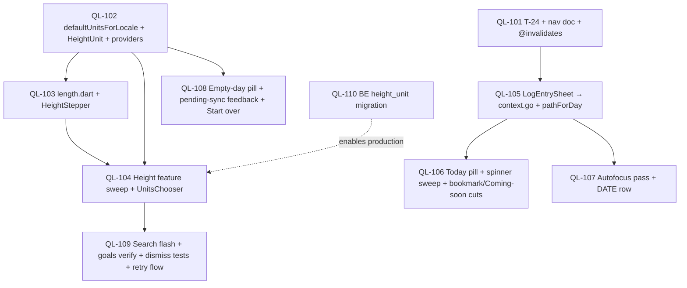

# Developer Tickets — QoL Audit Pack (2026-05-16)

Source of truth for the post-LU / post-SC polish pack. Every ticket
below is sized for a single developer agent to pick up, finish, and
review in one session. Agents do **not** have a Flutter SDK — they
write tests to disk inspection-correct, but they do **not** run
`flutter test` or `flutter analyze`. Inspect for typos; assume CI
gates run on a host machine later.

**Read order**:

1. This file (you are here).
2. `specs/pm_qol_audit.md` — the PM's *what* and *why* across
   QL-001 through QL-018.
3. `specs/architect_qol.md` — the architect's *how* (Refactors 1–3,
   Features 1–2, the T-24 proposal, the per-screen ticket sketches
   §7.1–§7.14, and the open questions in §10).
4. `specs/flutter_ui_architecture.md` — the 23 tenants. Cited by
   ID. T-24 is proposed by this pack and lands as part of QL-104.
5. `specs/pm_decisions_flutter_ui.md` — Display Units Principle, etc.
6. `specs/dev_tickets.md`, `specs/dev_tickets_log_edit_and_units.md`,
   `specs/dev_tickets_barcode.md` — prior ticket shapes. Same
   conventions; same Owns-files discipline.

Tickets reference these docs by section/ID instead of re-quoting them.

**Numbering note.** The PM audit numbers items `QL-001 … QL-018`. To
avoid ID collision with PM audit items inside the same pack, this
pack prefixes its tickets `QL-101 … QL-1NN`. Every ticket's header
maps back to the PM audit ID(s) it satisfies (e.g., "QL-101 covers
PM audit QL-003 + QL-004"). The mapping is also collected in the
"Per-item map" table near the end of this doc.

**Branch model**: dispatch on top of `main` at the head of the SC
pool plus any `QL-1NN` commits that landed first. Each ticket lists
`Owns files:` — an agent must not touch any file outside that list
without flagging in the ticket Notes. If two tickets share a file in
their `Owns files:` list, the dependency graph below sequences them.

**Ticket status legend**:

- `pending` — not started.
- `pending (backend)` — assigned to the backend team; the Flutter
  pool does not pick this up.
- `pending-pm` — surfaced as v1.1 by the architect or PMgr; not
  blocking and not in this pack's scope.
- `in-progress` — claimed by an agent; uncommitted work-in-progress.
- `done` — committed to `main`; agent has updated this doc.
- `blocked-needs-pm` — agent gave up; see failure protocol at the
  bottom.

---

## QL-101  T-24 codification + post-mutation nav doc pass + `@invalidates` repository docs

**Status**: pending
**Priority**: P0
**Effort**: M
**Depends on**: none
**Owns files**:
- `specs/flutter_ui_architecture.md` (§8 — add T-24 tenant; §9 —
  add the per-screen "Post-save: Case N" annotations from architect
  §3.4 table)
- `client/lib/features/log_entry/log_entry_sheet.dart` (dartdoc-only
  on `_onCreatePressed` and `_onEditPressed`; no behavioural change
  in this ticket — that lives in QL-105)
- `client/lib/features/profile/widgets/height_stepper_sheet.dart`
  (dartdoc-only on the save handler)
- `client/lib/features/profile/widgets/current_weight_sheet.dart`
  (dartdoc-only)
- `client/lib/features/profile/widgets/sex_picker.dart` (dartdoc-only)
- `client/lib/features/profile/widgets/birth_date_picker.dart`
  (dartdoc-only)
- `client/lib/features/profile/widgets/activity_level_picker.dart`
  (dartdoc-only)
- `client/lib/features/profile/widgets/weight_unit_chooser.dart`
  (dartdoc-only)
- `client/lib/features/weight/widgets/log_weight_sheet.dart`
  (dartdoc-only)
- `client/lib/features/goals/widgets/new_goal_dialog.dart`
  (dartdoc-only)
- `client/lib/features/goals/widgets/edit_goal_sheet.dart`
  (dartdoc-only)
- `client/lib/features/custom_food/custom_food_screen.dart`
  (dartdoc-only on save handlers — Case 1 (create) / Case 3 (edit))
- `client/lib/features/onboarding/onboarding_screen.dart` (dartdoc
  on the finish handler — Case 2)
- `client/lib/repositories/log_repository.dart` (add `@invalidates`
  dartdoc blocks on `create`, `update`, `delete` if present)
- `client/lib/repositories/weight_repository.dart` (add
  `@invalidates` on `create`, `delete` if present)
- `client/lib/repositories/profile_repository.dart` (add
  `@invalidates` on `update`)
- `client/lib/repositories/goal_repository.dart` (add `@invalidates`
  on `create`, `update`, `markActive`, `end`)
- `client/lib/repositories/food_repository.dart` (add `@invalidates`
  on `create`, `update`, `addServing`, `removeServing`)

### Goal
Land the documentation spine for the pack: the new T-24 tenant
(post-mutation navigation has exactly three cases), the per-screen
brief annotations naming which case each existing save handler
implements, the per-save-handler dartdoc comments, and the
`@invalidates` doc-tag block on every public repository mutator. All
prose — zero behavioural change. The intent is that QL-105
(`LogEntrySheet` swap to `context.go`) and the QL-001 widget sweep
that lands later have a single named tenant + a single per-mutator
contract to reference, instead of re-deriving the rule per ticket.

### Context
Architect §1 ("Pattern A — accepted"), §3 (Refactor 2 in full —
the three cases, the decision tree, the per-screen table), §3.5
(file list), §4 (Refactor 3 — the `@invalidates` convention and the
file inventory), §8.1 (exact T-24 wording). PM audit items: QL-003
(post-save nav rule) and the Pattern C documentation pass. Tenants
referenced: **T-14** (routes vs sheets — the nearest sibling),
**T-18** (minimal explicit invalidation — the rule the
`@invalidates` block makes contractual), **T-22** (pending-sync
visible — unchanged but mentioned in the LogEntrySheet dartdoc).

### Scope
- [ ] In `specs/flutter_ui_architecture.md` §8, append the T-24
      tenant with the exact wording from architect §8.1. Number it
      "24" continuing the existing list; do not renumber the existing
      23 tenants. Update the §8 preamble paragraph if it says "23
      tenants" anywhere — it now says "24".
- [ ] In `specs/flutter_ui_architecture.md` §9 per-screen briefs,
      append a one-line "**Post-save**: Case N — *target/payload*"
      annotation to each screen brief that owns a save handler. Use
      the architect §3.4 table verbatim. Screens 01/02/03 have no
      save handler — explicitly note "**Post-save**: n/a — no save
      handler."
- [ ] Add the addendum block at the bottom of `flutter_ui_architecture.md`
      (sibling of the existing 2026-05-16 LU addendum), naming the
      QoL pack and noting: "T-24 added; no other tenants. The
      per-screen briefs gain `Post-save:` annotations; no shape
      changes."
- [ ] In each of the 11 sheet/screen files listed in Owns files
      under `client/lib/features/`, add a dartdoc paragraph at the
      top of the save handler (or the class doc if the save handler
      is a private method) naming the T-24 case and one sentence of
      rationale. Example shape:
      ```dart
      /// T-24 Case 1 — pop-to-source.
      ///
      /// `/me` is the source; the user expects to see the new
      /// height value rendered on the row they tapped from. The
      /// repo write happens before pop; `meProvider` invalidation
      /// is enough — `heightUnitProvider` re-derives automatically
      /// on the next frame (T-18).
      void _onSavePressed() { … }
      ```
      The wording is the agent's discretion as long as the case is
      explicit and the rationale is one sentence. No behavioural
      change.
- [ ] In `log_entry_sheet.dart` specifically, the dartdoc on
      `_onCreatePressed` and `_onEditPressed` reads "T-24 Case 2 —
      route-to-effect. Implementation lands in QL-105 (see ticket);
      this dartdoc is forward-declaring the case for reviewer
      reference." The handler body is **unchanged** in this ticket.
- [ ] In each of the 5 repository files, add an `@invalidates`
      dartdoc block on every public mutator. The shape per architect
      §4.1:
      ```dart
      /// Patch an existing log entry. Mirrors `PATCH /log/{id}`.
      ///
      /// `@invalidates`
      /// - `daySummaryProvider(newDate)` — the ring + summary card.
      /// - `logEntriesProvider(newDate)` — the meal section list.
      /// - `daySummaryProvider(oldDate)` IF `consumed_on` changed.
      /// - `logEntriesProvider(oldDate)` IF `consumed_on` changed.
      /// - `recentFoodsProvider` — the row's food may shift rank.
      /// - `frequentFoodsProvider` — same.
      ///
      /// Call sites are responsible for invalidating per T-18
      /// (minimal + explicit); this list is the **contract** the
      /// call site reads.
      Future<LogEntry> update(String id, LogPatch patch) { … }
      ```
      The mutator list and the per-mutator providers are in
      architect §4.2. Confirm each provider matches what the existing
      call sites already invalidate today by reading the sheet's
      invalidation block side-by-side with the repo dartdoc.
- [ ] Verify mechanically: `grep -rn '@invalidates' client/lib/repositories/`
      returns ≥ 14 hits after the pass.

### Out of scope
- The `LogEntrySheet` behavioural change to `context.go` —
  that's QL-105.
- A lint script asserting `@invalidates` exists on every public
  mutator — architect §4.3 names this as v1.1 only. The doc pass is
  the QL deliverable.
- Any `SaveFlowRouter` helper class. Architect §1 explicitly
  rejected the class — the rule is documentation + per-handler
  comments, not a wrapper.
- Touching the `@invalidates` lists' content beyond writing down
  what's already there. If the audit finds a mismatch between the
  doc block and the call site, **flag in Notes / gotchas** rather
  than fix in this ticket — the fix may have ripple effects an agent
  can't gauge.

### Acceptance criteria
- [ ] `specs/flutter_ui_architecture.md` §8 contains a T-24 tenant
      whose wording matches architect §8.1 verbatim.
- [ ] Every screen brief in §9 with a save handler has a
      `**Post-save**: Case N` line. Screens 01/02/03 have
      `**Post-save**: n/a — no save handler`.
- [ ] Every save handler in the 11 sheet/screen files has a dartdoc
      paragraph naming its T-24 case. Reviewable by `grep -n 'T-24
      Case' client/lib/features/` returning ≥ 11 hits.
- [ ] Every public mutator on the 5 repositories has an
      `@invalidates` dartdoc block. `grep -rn '@invalidates'
      client/lib/repositories/` returns ≥ 14 hits.
- [ ] No behavioural change. `git diff --stat` shows the touched
      files but no test files are modified or added by this ticket.
- [ ] Tenants honored: T-14, T-18, T-22 (un-changed; documentation
      reinforces them); T-24 newly introduced.

### Tests
- None. This is a doc-only PR; agents write tests for the QL-105
  behavioural change in that ticket.

### Notes / gotchas
- Architect §3.3 explicitly chose **review-time enforcement**, not
  lint enforcement. Do not add `tool/lint_t24.sh` or similar — the
  rule is greppable by reviewer, not by CI.
- Architect §4.3 named `tool/lint_invalidations_documented.sh` as
  *nice-to-have*, **out of scope**. Same call applies here.
- If the audit surfaces that an existing sheet's invalidation list
  diverges from what the repo dartdoc would document (e.g., the
  weight sheet invalidates a provider the architect didn't list, or
  vice-versa), **leave the code unchanged** and add a `// TODO(QL-101):
  reconcile with @invalidates block on WeightRepository.create` at
  the divergence. Surface the mismatch in Notes / gotchas. The
  resolution is a v1.1 ticket, not a hot-fix in this PR.
- The §9 per-screen brief annotations need to fit the existing
  one-paragraph-per-screen format. Append the `Post-save:` line at
  the end of the paragraph, not a new sub-heading.

---

## QL-102  `defaultUnitsForLocale` record + `localeDefaultsProvider` + `HeightUnit` enum

**Status**: pending
**Priority**: P0
**Effort**: M
**Depends on**: none
**Owns files**:
- `client/lib/domain/enums.dart` (add `HeightUnit { cm, ftIn }` enum
  with `wire`, `shortLabel`, `longLabel`, `fromWire`)
- `client/lib/domain/locale_defaults.dart` (add `UnitDefaults`
  typedef + `defaultUnitsForLocale`; annotate existing
  `defaultWeightUnitForLocale` `@Deprecated`; add `@Deprecated`
  `defaultHeightUnitForLocale` wrapper)
- `client/lib/domain/user.dart` (add `heightUnit` field with
  `HeightUnit.cm` default; `copyWith`, `operator==`, `hashCode`,
  `fromJson` tolerant of missing key, `toJson` always emits; mirror
  `UserPatch.heightUnit` nullable)
- `client/lib/domain/drafts.dart` (add `HeightUnit? heightUnit`
  field on the onboarding draft)
- `client/lib/providers/profile_providers.dart` (add
  `localeDefaultsProvider`; add `heightUnitProvider`; annotate
  existing `localeDefaultWeightUnitProvider` `@Deprecated`)
- `client/lib/providers/draft_providers.dart` (add `setHeightUnit`
  setter on the draft notifier; add `onboardingHeightUnitProvider`)
- `client/lib/repositories/profile_repository.dart` (extend
  `update(UserPatch)` to pass through `UserPatch.heightUnit` —
  mirror of the existing `weightUnit` plumbing)
- `client/test/domain/locale_defaults_test.dart` (extend with
  record-shape cases for the carve-outs + the height fallback)
- `client/test/providers/height_unit_provider_test.dart` (new —
  loading-fallback + read-from-me + override pattern)
- `client/test/providers/draft_height_unit_provider_test.dart`
  (new — draft-set, locale-fallback)
- `client/test/domain/user_height_unit_json_test.dart` (new —
  `fromJson` tolerates missing; `toJson` always emits;
  `UserPatch.toJson` emits only when set)

### Goal
Land the unit-preference seam generalization the architect spec'd in
§2: a single `defaultUnitsForLocale({String? countryCodeOverride})`
returning a `({WeightUnit weight, HeightUnit height})` record, a
shared `localeDefaultsProvider`, and the new `HeightUnit` enum +
`heightUnitProvider` + `onboardingHeightUnitProvider` siblings of
the existing weight infrastructure. The widget-level migration is
QL-103 and QL-104; this ticket is the foundation those depend on.

### Context
Architect §1 ("Pattern B — accepted with a directional call: stay
per-axis"), §2 (Refactor 1 in full — the unification answer in §2.1,
the joined country-code chain in §2.2, the shared
`localeDefaultsProvider` in §2.3, the file list in §2.4, the
acceptance criteria in §2.5). PM audit items: QL-001 (the height
feature; this is its scaffolding) and QL-004 (the seam
generalization). Tenants: **T-17** (Decimal in, formatted out — the
enum's wire string is exact), **T-18** (minimal invalidation — the
per-axis providers preserve fine-grained rebuild), **T-21**
(customer-expected units — `HeightUnit` is the second axis).

### Scope
- [ ] In `enums.dart`, add `enum HeightUnit { cm, ftIn }` with
      mirror-of-`WeightUnit` static methods: `String get wire` →
      `'cm'` / `'ft_in'`; `String get shortLabel` → `'cm'` /
      `'ft·in'`; `String get longLabel` → `'centimeters'` / `'feet
      and inches'`; `static HeightUnit fromWire(String s)` — strict,
      throws `ArgumentError` on unknown wire string.
- [ ] In `locale_defaults.dart`:
      - Add `typedef UnitDefaults = ({WeightUnit weight, HeightUnit
        height});`.
      - Add `UnitDefaults defaultUnitsForLocale({String?
        countryCodeOverride})` implementing the joined chain from
        architect §2.2:
        ```
        US, LR, MM           → (weight: lb,  height: ftIn)
        GB, IM, JE, GG       → (weight: st,  height: ftIn)
        else (incl. null/'') → (weight: kg,  height: cm)
        ```
        The function reads `PlatformDispatcher.instance.locale.countryCode`
        when `countryCodeOverride` is null — same shape as the
        existing `defaultWeightUnitForLocale`.
      - Annotate `defaultWeightUnitForLocale` with `@Deprecated('Use
        defaultUnitsForLocale().weight.')`. The function body becomes
        `defaultUnitsForLocale(countryCodeOverride:
        countryCodeOverride).weight` — behaviour identical to today.
      - Add `defaultHeightUnitForLocale({String? countryCodeOverride})`
        annotated `@Deprecated('Use defaultUnitsForLocale().height.')`
        for symmetry; body is the analogous one-liner.
- [ ] In `user.dart`:
      - Add `final HeightUnit heightUnit` to `User`, defaulting to
        `HeightUnit.cm` at construction.
      - Update `copyWith`, `operator==`, `hashCode`, `toString` to
        include the new field. Mirror the existing `weightUnit`
        treatment exactly.
      - `User.fromJson`: read `json['height_unit']` and default to
        `HeightUnit.cm` when null/missing (pre-backend window
        tolerance per architect §5.1).
      - `User.toJson`: always emit `'height_unit': heightUnit.wire`.
      - `UserPatch`: add `final HeightUnit? heightUnit` field;
        `toJson` emits the key only when non-null. Mirror of the
        existing `UserPatch.weightUnit`.
- [ ] In `drafts.dart`:
      - Add `final HeightUnit? heightUnit` to `OnboardingDraft`.
      - Add to `copyWith` + `OnboardingDraft.empty()` (defaults
        `null`).
      - The Hive adapter (or JSON serializer, whichever the draft
        uses) tolerates the field's absence — read with default null,
        write only when non-null.
- [ ] In `profile_providers.dart`:
      - Add `final localeDefaultsProvider = Provider<UnitDefaults>((ref)
        => defaultUnitsForLocale());` with the dartdoc from architect
        §2.3 (test override hook + named).
      - Annotate the existing `localeDefaultWeightUnitProvider` with
        `@Deprecated('Read localeDefaultsProvider.weight.')`. Body:
        `(ref) => ref.watch(localeDefaultsProvider).weight`.
      - Add `final heightUnitProvider = Provider<HeightUnit>((ref) =>
        ref.watch(meProvider).maybeWhen(data: (u) => u.heightUnit,
        orElse: () => ref.watch(localeDefaultsProvider).height));`
        with the architect §2.3 dartdoc.
- [ ] In `draft_providers.dart`:
      - Add `void setHeightUnit(HeightUnit v)` to the existing draft
        notifier (mirror `setWeightUnit`).
      - Add `final onboardingHeightUnitProvider = Provider<HeightUnit>((ref)
        { final draft = ref.watch(onboardingDraftProvider); return
        draft.heightUnit ?? ref.watch(localeDefaultsProvider).height;
        });` with architect §2.3 dartdoc.
- [ ] In `profile_repository.dart`:
      - Extend the mock + (where present) real-wire `update` method
        to pass `patch.heightUnit` through, mirroring how
        `patch.weightUnit` is plumbed today. One `if (patch.heightUnit
        != null)` block.
      - Update the `@invalidates` dartdoc block on `update` (added
        in QL-101) — note that height changes also flow through
        `heightUnitProvider` automatically via `meProvider`.

### Out of scope
- The `formatHeight` / `parseHeightToCm` seam — that's QL-103.
- The `HeightStepper` widget — that's QL-103.
- The `HeightUnitChooser` / `UnitsChooser` widgets — that's QL-104.
- Onboarding step 2's UI change (segmented control + stepper swap)
  — that's QL-104.
- The Rust migration for `users.height_unit` — that's QL-110
  (backend ticket, pending).
- Deleting the `@Deprecated` wrappers. Architect §2.1 names them as
  "kept for one release"; the deletion follow-up is implicit, not a
  QL-pack ticket.

### Acceptance criteria
- [ ] `HeightUnit` exists in `enums.dart` with two variants (`cm`,
      `ftIn`). `wire` returns `'cm'` / `'ft_in'`. `fromWire` is
      strict.
- [ ] `defaultUnitsForLocale` exists in `locale_defaults.dart` and
      returns a `UnitDefaults` record. The joined country-code chain
      matches architect §2.2.
- [ ] `defaultWeightUnitForLocale` is annotated `@Deprecated` and
      its body reads through the record. Behaviour unchanged.
- [ ] `defaultHeightUnitForLocale` exists, is annotated
      `@Deprecated`, and reads through the record.
- [ ] `User` has a `heightUnit` field; `fromJson` defaults to
      `HeightUnit.cm` on missing; `toJson` always emits.
- [ ] `UserPatch.heightUnit` is nullable; `toJson` emits only when
      set.
- [ ] `OnboardingDraft.heightUnit` is nullable; `setHeightUnit`
      mutates it.
- [ ] `localeDefaultsProvider` is a `Provider<UnitDefaults>`.
- [ ] `localeDefaultWeightUnitProvider` is annotated `@Deprecated`
      and derives from `localeDefaultsProvider.weight`.
- [ ] `heightUnitProvider` exists, mirrors `weightUnitProvider`,
      reads `meProvider`'s `heightUnit` with locale fallback.
- [ ] `onboardingHeightUnitProvider` exists, reads draft +
      locale fallback.
- [ ] `ProfileRepository.update` passes `UserPatch.heightUnit`
      through to the mock and the (eventual) real wire.
- [ ] Tenants honored: T-17, T-18, T-21.

### Tests
- `client/test/domain/locale_defaults_test.dart`:
  - `defaultUnitsForLocale("US") → (weight: lb, height: ftIn)`
  - `defaultUnitsForLocale("GB") → (weight: st, height: ftIn)`
  - `defaultUnitsForLocale("IM") → (weight: st, height: ftIn)`
  - `defaultUnitsForLocale("JE") → (weight: st, height: ftIn)`
  - `defaultUnitsForLocale("GG") → (weight: st, height: ftIn)`
  - `defaultUnitsForLocale("LR") → (weight: lb, height: ftIn)`
  - `defaultUnitsForLocale("MM") → (weight: lb, height: ftIn)`
  - `defaultUnitsForLocale("DE") → (weight: kg, height: cm)`
  - `defaultUnitsForLocale(null) → (weight: kg, height: cm)`
  - `defaultUnitsForLocale("") → (weight: kg, height: cm)`
  - `defaultWeightUnitForLocale("US") → lb` (deprecated wrapper
    still works)
  - `defaultHeightUnitForLocale("DE") → cm` (deprecated wrapper
    still works)
- `client/test/providers/height_unit_provider_test.dart`:
  - `heightUnitProvider falls back to localeDefaultsProvider.height
    when meProvider is loading` (override `meProvider` with
    `AsyncValue.loading()`; override `localeDefaultsProvider` to
    return `(weight: WeightUnit.kg, height: HeightUnit.ftIn)`;
    expect `ftIn`).
  - `heightUnitProvider reads user.heightUnit when meProvider has
    data` (seed via `buildSeedUser(heightUnit: HeightUnit.ftIn)`;
    expect `ftIn`).
  - `heightUnitProvider falls back when meProvider errors` (override
    with `AsyncValue.error`; expect the locale default).
- `client/test/providers/draft_height_unit_provider_test.dart`:
  - `onboardingHeightUnitProvider returns draft.heightUnit when set`
    (set draft via the notifier; expect that value).
  - `onboardingHeightUnitProvider falls back to localeDefaults when
    draft is null` (default draft state; expect
    `localeDefaultsProvider.height`).
- `client/test/domain/user_height_unit_json_test.dart`:
  - `User.fromJson tolerates missing height_unit → HeightUnit.cm`
  - `User.fromJson reads "ft_in" → HeightUnit.ftIn`
  - `User.toJson always emits "height_unit"`
  - `UserPatch(heightUnit: HeightUnit.cm).toJson` emits the key.
  - `UserPatch().toJson` omits the key.
  - `UserPatch(heightUnit: null).toJson` omits the key (Dart treats
    these as equivalent; assert both).

### Notes / gotchas
- Architect §2.1 explicitly chose **per-axis providers** over a
  unified `userPreferencesProvider`. The PMgr is restating this call
  in §"Architect's flagged risks" of this doc — do **not** introduce
  the unified record. If a junior reviewer suggests it, point them
  at architect §2.1.
- The `UnitDefaults` typedef uses Dart 3 record syntax (`({WeightUnit
  weight, HeightUnit height})`). `pubspec.yaml` is on `dart: ^3.6`,
  so this compiles. No new dependency.
- The Hive adapter for `OnboardingDraft` — if one exists — needs the
  same tolerant-read shape. Check `lib/data/` for a hand-written
  `TypeAdapter` and update or regenerate per the existing pattern.
  If the draft is JSON-only (no Hive box), this is a no-op.
- Do **not** delete `defaultWeightUnitForLocale` or
  `localeDefaultWeightUnitProvider`. They remain `@Deprecated`
  wrappers; deletion is a follow-up ticket outside this pack.
- The `Provider`-shape `meProvider.maybeWhen` matches the existing
  `weightUnitProvider` body. Mirror it exactly; do not "improve" the
  null-handling.

---

## QL-103  `length.dart` seam + `HeightStepper` widget + carry-edge tests

**Status**: pending
**Priority**: P0
**Effort**: M
**Depends on**: QL-102
**Owns files**:
- `client/lib/domain/units/length.dart` (new — `formatHeight`,
  `formatHeightWithUnit`, `parseHeightToCm`, `parseFeetInchesToCm`,
  internal `_formatCm` / `_formatFtIn` / `_inPerCm` / `_cmPerIn`)
- `client/lib/widgets/height_stepper.dart` (new — `HeightStepper`
  widget with cm-mode + ftIn-mode dual stepper; private `_TapStepper`
  sibling of `WeightStepper`'s)
- `client/test/domain/units/length_test.dart` (new — the §5.5
  carry-edge table plus parse round-trips)
- `client/test/widgets/height_stepper_test.dart` (new — cm-mode
  clamp, ftIn-mode carry/borrow, unitOverride seam)

### Goal
Build the length-conversion seam and the lifted `HeightStepper` widget
the height feature needs. After this lands, any caller can render a
height stored as canonical `Decimal cm` in the user's chosen unit
(`5 ft 9 in` for ftIn / `175 cm` for cm) via `formatHeight` /
`formatHeightWithUnit`, and any input UI can collect a height in
either unit via `HeightStepper`. The widget mirrors `WeightStepper`'s
shape so a developer who has read the weight seam reads length in
30 seconds.

### Context
Architect §5.4 (the `formatHeight` seam — public surface + private
internals), §5.5 (test table with the 182cm carry edge), §5.6
(`HeightStepper` shape — cm-mode + ftIn-mode). PM audit item QL-001
("Height units"). Tenants: **T-17** (Decimal in, formatted out;
`length.dart` is the only place that multiplies by 2.54 or divides
by 12), **T-20** (Semantics labels include the rendered value with
its long-form unit), **T-23** (lifted to `lib/widgets/`; package
imports only).

### Scope
- [ ] Create `client/lib/domain/units/length.dart`. Public surface:
      ```dart
      String formatHeight(Decimal cm, HeightUnit unit, {String? locale});
      String formatHeightWithUnit(Decimal cm, HeightUnit unit,
          {String? locale});
      Decimal parseHeightToCm(String input, HeightUnit unit);
      Decimal parseFeetInchesToCm(int feet, int inches);
      ```
      Private internals follow architect §5.4:
      - `final Decimal _cmPerIn = Decimal.parse('2.54');`
      - `final Decimal _inPerCm = Decimal.parse('0.393700787');`
      - `String _formatCm(Decimal cm, {String? locale})` — round
        half-to-even to integer via `_rounding.dart`'s
        `roundHalfToEvenScaled(cm, 0)`, format via
        `NumberFormat.decimalPatternDigits(...).format(...toDouble())`.
        Result is integer cm with no suffix (caller appends `" cm"`
        via `formatHeightWithUnit`, or paints the suffix in the
        widget).
      - `String _formatFtIn(Decimal cm)` — multiply by `_inPerCm`,
        round to integer inches via `roundHalfToEven`, divmod by 12;
        render `"$feet ft $remainder in"`. **Drop the ` 0 in` suffix
        when remainder is zero** (so 152.4 cm → `"5 ft"`, not
        `"5 ft 0 in"`). Carry rule: `5 ft 11.6 in` rounds to 72
        inches → carries to `6 ft`, not `5 ft 12 in`.
      - `_formatCm` and `_formatFtIn` are pure-Decimal until the
        final `.toDouble()` inside `NumberFormat.format`. No
        intermediate floats.
- [ ] `formatHeight(cm, unit)`:
      - `unit == HeightUnit.cm` → `_formatCm(cm)` (no suffix).
      - `unit == HeightUnit.ftIn` → `_formatFtIn(cm)` (composite
        already inlines its units; no caller-side suffix).
- [ ] `formatHeightWithUnit(cm, unit)`:
      - `unit == HeightUnit.cm` → `"${_formatCm(cm)} cm"`.
      - `unit == HeightUnit.ftIn` → same as `formatHeight` (the
        composite is already self-suffixing).
- [ ] `parseHeightToCm(input, unit)`:
      - `unit == HeightUnit.cm` — parse a locale-tolerant decimal
        (use the existing `parseDecimalLocaleTolerant` helper if
        present in `decimal_format.dart`; otherwise a strict
        `Decimal.parse` is acceptable). Throws `FormatException` on
        unparseable input.
      - `unit == HeightUnit.ftIn` — accept several shapes:
        `"5"` (treated as feet, inches=0); `"5 9"` (feet, inches);
        `"5 ft 9 in"` (verbose). Use a single regex with optional
        groups; reject negative inputs; reject out-of-range inches
        (`>= 12`). Convert via `parseFeetInchesToCm` and return.
- [ ] `parseFeetInchesToCm(int feet, int inches)`:
      - `feet < 0` or `inches < 0` or `inches >= 12` → throw
        `ArgumentError`.
      - Return `(Decimal.fromInt(feet * 12 + inches) * _cmPerIn)`
        rounded half-to-even to integer via
        `roundHalfToEvenScaled(..., 0)`. Result is canonical cm.
- [ ] Create `client/lib/widgets/height_stepper.dart`:
      ```dart
      class HeightStepper extends ConsumerStatefulWidget {
        const HeightStepper({
          required this.value,
          required this.onChanged,
          this.unitOverride,
          this.minCm,
          this.maxCm,
          this.hasError = false,
          this.semanticsLabel,
          super.key,
        });
        final Decimal value;
        final ValueChanged<Decimal> onChanged;
        final HeightUnit? unitOverride;
        final Decimal? minCm;
        final Decimal? maxCm;
        final bool hasError;
        final String? semanticsLabel;
      }
      ```
      - Effective unit: `widget.unitOverride ?? ref.watch(heightUnitProvider)`.
      - **cm-mode**: one `_TapStepper` rendering `"${cmInt} cm"`,
        integer step (architect §5.6 explicit: integer, not the
        half-cm step PM mentioned), clamp `[minCm ?? Decimal.fromInt(80),
        maxCm ?? Decimal.fromInt(250)]`. On `+`/`-` tap, compute
        new value in cm and call `widget.onChanged(newCm)`.
      - **ftIn-mode**: a `Row` with two `_TapStepper`s — feet (3..8
        soft clamp; buttons disable at edges) and inches (0..11).
        Inches `+` at 11 **carries**: inches → 0, feet += 1. Inches
        `-` at 0 **borrows**: inches → 11, feet -= 1 (no-op if feet
        already at 3 lower bound). On every commit:
        `widget.onChanged(parseFeetInchesToCm(feet, inches))`.
      - Initial render derives `feet`/`inches` from `widget.value`
        via the same algorithm as `_formatFtIn` (round total inches
        first, then divmod). When the parent re-passes a new
        `value`, `didUpdateWidget` reseeds.
      - Private `_TapStepper` is a sibling of `WeightStepper`'s
        inline `_TapStepper` (see `weight_stepper.dart:310–408`).
        Re-inline the shape — same 48-px row, same Semantics, same
        ripple. A future v1.1 ticket converges the two; do not lift
        in this pack.
      - `Semantics(label: ...)`:
        - cm mode → `"$cmInt centimeters"` (or the override).
        - ftIn mode → `"$feet feet $inches inches"` (or override).
- [ ] All number rendering through `NumberText` / `tabularFigures`
      where the existing pattern uses them. Match
      `weight_stepper.dart`'s shape; do not invent a new variant.

### Out of scope
- Wiring the `HeightStepper` into onboarding or the profile editor —
  that's QL-104.
- Migrating the `profile_screen.dart` Height row's render call —
  that's QL-104.
- Any Hive / repository changes — those landed in QL-102.
- Lifting `_TapStepper` to a shared primitive — architect §5.6
  explicitly defers this to v1.1.

### Acceptance criteria
- [ ] `client/lib/domain/units/length.dart` exists. The four public
      functions exist with the architect §5.4 signatures.
- [ ] `_cmPerIn = Decimal.parse('2.54')` and `_inPerCm =
      Decimal.parse('0.393700787')` are file-level finals. No widget
      or feature file multiplies by `2.54` or divides by `12` after
      this ticket lands — verify with `grep -rn '2.54\|/ 12\|\* 12'
      client/lib/features/ client/lib/widgets/` returning zero hits
      (or only hits inside `length.dart` itself or its tests).
- [ ] The carry-edge test table from architect §5.5 passes (see
      Tests below).
- [ ] `HeightStepper` exists at `client/lib/widgets/height_stepper.dart`,
      package-importable as
      `package:fulfilled/widgets/height_stepper.dart` (T-23).
- [ ] cm-mode integer step (1 cm), clamp `[80, 250]`.
- [ ] ftIn-mode carries inches→feet at 12; borrows feet→inches at 0.
- [ ] Round-trip stability: `value: Decimal.parse('175')` renders
      `"5 ft 9 in"` in ftIn mode and `"175 cm"` in cm mode.
- [ ] `Semantics` labels include the rendered value with its
      long-form unit (T-20).
- [ ] No `double`-typed intermediate; every arithmetic step is
      `Decimal`-typed until the final `.toDouble()` inside
      `NumberFormat.format` for cm-mode.
- [ ] Tenants honored: T-17, T-20, T-23.

### Tests
- `client/test/domain/units/length_test.dart` — formatter:
  - `formatHeight(Decimal.fromInt(0), HeightUnit.ftIn) == "0 ft"`
  - `formatHeight(Decimal.parse("30.48"), HeightUnit.ftIn) == "1 ft"`
  - `formatHeight(Decimal.parse("152.4"), HeightUnit.ftIn) == "5 ft"`
  - `formatHeight(Decimal.fromInt(175), HeightUnit.ftIn) == "5 ft 9 in"`
  - `formatHeight(Decimal.parse("182.88"), HeightUnit.ftIn) == "6 ft"`
  - `formatHeight(Decimal.fromInt(182), HeightUnit.ftIn) == "6 ft"`
    (the carry edge — 71.65 → 72 → carries; NOT `"5 ft 12 in"`)
  - `formatHeight(Decimal.fromInt(181), HeightUnit.ftIn) == "5 ft 11 in"`
    (just below carry)
  - `formatHeight(Decimal.fromInt(200), HeightUnit.ftIn) == "6 ft 7 in"`
  - `formatHeight(Decimal.fromInt(250), HeightUnit.ftIn) == "8 ft 2 in"`
  - `formatHeight(Decimal.fromInt(175), HeightUnit.cm) == "175"`
  - `formatHeightWithUnit(Decimal.fromInt(175), HeightUnit.cm) == "175 cm"`
  - `formatHeightWithUnit(Decimal.fromInt(175), HeightUnit.ftIn) == "5 ft 9 in"`
- `client/test/domain/units/length_test.dart` — parser:
  - `parseHeightToCm("175", HeightUnit.cm) == Decimal.fromInt(175)`
  - `parseFeetInchesToCm(5, 9) == Decimal.fromInt(175)` (rounded)
  - `parseFeetInchesToCm(6, 0) == Decimal.parse("183")` (rounded
    from 182.88)
  - `parseFeetInchesToCm(-1, 0)` throws `ArgumentError`
  - `parseFeetInchesToCm(5, 12)` throws `ArgumentError`
  - `parseHeightToCm("not a number", HeightUnit.cm)` throws
    `FormatException`
- `client/test/widgets/height_stepper_test.dart`:
  - `cm-mode +1 increments by 1 cm`
  - `cm-mode + at maxCm is a no-op (button disabled)`
  - `ftIn-mode inches + at 11 carries to feet`
  - `ftIn-mode inches - at 0 borrows from feet`
  - `ftIn-mode inches - at 0 with feet at minFeet is a no-op`
  - `unitOverride: cm renders cm row even if heightUnitProvider says
    ftIn`
  - `didUpdateWidget reseeds when parent passes new value`
  - `Semantics label includes the rendered value`

### Notes / gotchas
- Architect §5.6 explicitly chose **integer step (1 cm), not PM's
  half-cm**. The reasoning: half-cm doesn't render at integer
  resolution and produces non-intuitive double-tap behaviour. If a
  reviewer asks "why not 0.5 cm?" — point at architect §5.6.
- The carry edge at 182 cm is the analog of the stone carry in
  `weight_stepper.dart`. Reuse the same algorithm shape; do not
  re-derive it.
- The internal `_TapStepper` re-inlines the weight-stepper sibling.
  Do **not** lift to a shared primitive in this pack; the
  weight-stepper deferral already named this as v1.1 work.
- `package:decimal` only. No `double` math anywhere except the final
  `.toDouble()` inside `NumberFormat.format`.
- The Semantics label for the ftIn-mode stepper is the rendered
  composite (`"5 feet 9 inches"`), not the abbreviated form (`"5 ft
  9 in"`) — T-20 requires the long-form for screen readers.

---

## QL-104  Height feature sweep — onboarding step 2, profile screen, `HeightStepperSheet`, `UnitsChooser`

**Status**: pending
**Priority**: P0
**Effort**: L
**Depends on**: QL-102, QL-103
**Owns files**:
- `client/lib/features/profile/widgets/height_stepper_sheet.dart`
  (rewrite to compose `HeightStepper`; drop inline stepper / field /
  clamp; shrink to ~80 lines)
- `client/lib/features/profile/widgets/height_unit_chooser.dart`
  (new — per-axis chooser primitive mirror of `weight_unit_chooser.dart`)
- `client/lib/features/profile/widgets/units_chooser.dart` (new —
  joined chooser sheet/popup that composes weight + height
  primitives; "Done" footer; in-place selection without dismissal)
- `client/lib/features/profile/profile_screen.dart` (Height row
  value → `formatHeightWithUnit`; Units row tap → `showUnitsChooser`;
  Units row value → `"<weight>, <height>, kcal, g"`)
- `client/lib/features/onboarding/widgets/step_2_about_you.dart`
  (delete `_NumberStepper` private + `_formatHeightCm` helper;
  replace height column with `HeightStepper(unitOverride:
  ref.watch(onboardingHeightUnitProvider))`; reshape Units row to
  stacked weight/height segmented controls)
- `client/lib/features/onboarding/onboarding_screen.dart` (extend
  the finish PATCH to include `heightUnit: draft.heightUnit ??
  defaultUnitsForLocale().height`)
- `client/test/features/profile/units_chooser_test.dart` (new —
  joined-sheet behaviour, both sections stay open across selections,
  two separate PATCHes fire)
- `client/test/features/profile/height_stepper_sheet_test.dart`
  (new — sheet seeds from `widget.initial`, save calls
  `repo.update(UserPatch(heightCm: _cm))` + invalidates `meProvider`
  + pops T-24 Case 1)
- `client/test/features/onboarding/step_2_height_test.dart` (new —
  the Units row renders two segmented controls; the height column
  renders `HeightStepper`; finish PATCH includes `heightUnit`)

### Goal
The widget-level sweep that lands the QL-001 height feature
end-to-end. After this ticket, the Profile screen's Height row
renders `5 ft 9 in` for an ftIn user and `175 cm` for a cm user;
the Profile screen's Units row opens a joined chooser with both
weight and height sections that don't dismiss each other; the
onboarding flow's step 2 collects both unit preferences via stacked
segmented controls and a `HeightStepper`; and the
`HeightStepperSheet` editor respects the user's unit.

### Context
Architect §5.7 (`HeightUnitChooser`), §5.8 (joined `UnitsChooser` —
the PM acceptance §2.1 "editing one doesn't dismiss the other"
clause), §5.9 (onboarding step 2 shape), §5.10
(`HeightStepperSheet` simplification), §5.11 (Profile screen Height
row render), §5.12 (the inventoried-files table), §5.13 (acceptance
criteria). PM audit item QL-001. Tenants: **T-04** (accent on
primary "Done" affordance), **T-08** (skeletons match final layout
— relevant if the chooser fetches anything; in practice it reads
from already-fetched `meProvider`), **T-15** (form-factor branches at
the root — `showUnitsChooser` picks sheet-vs-popup at its top),
**T-21** (Display Units Principle for height — only `formatHeight*`
renders, no `2.54` literals leak), **T-23** (the new widgets are
package-importable), **T-24** Case 1 (every save handler in this
ticket pops to source).

### Scope
- [ ] `HeightStepperSheet` rewrite:
      - Drop the inline `_NumberStepper`, hand-rolled `TextField`,
        and clamp logic.
      - Render `HeightStepper(value: _cm, onChanged: (v) =>
        setState(() => _cm = v))`.
      - The widget reads `heightUnitProvider` automatically (no
        `unitOverride` needed — this is the post-onboarding editor).
      - Save handler: `await repo.update(UserPatch(heightCm: _cm))`,
        `ref.invalidate(meProvider)`, `Navigator.pop()`. T-24 Case 1
        dartdoc per QL-101.
      - Cancel / dismiss path: no repository write. The widget's
        local state is discarded; `meProvider` is unchanged.
      - The file should shrink from ~200 lines today to ~80 lines.
- [ ] `HeightUnitChooser` new file:
      - Mirror `weight_unit_chooser.dart`'s public-API shape:
        `Future<void> showHeightUnitChooser(BuildContext context,
        WidgetRef ref, {required HeightUnit initial})`.
      - Compact: `showModalBottomSheet` with two `ActivityOption`
        rows — "Centimeters (cm) — Common worldwide" and "Feet &
        inches (ft, in) — Common in the US and UK". Labels from
        architect §5.7.
      - Medium / expanded: anchored `PopupMenuButton`-shaped popup
        (use the same shape `weight_unit_chooser.dart` uses).
      - On selection: PATCH `height_unit` via `ProfileRepository.update`,
        invalidate `meProvider`, close the chooser. T-24 Case 1 in
        the dartdoc.
- [ ] `UnitsChooser` new file (the joined sheet):
      - Public API:
        ```dart
        Future<void> showUnitsChooser(
          BuildContext context,
          WidgetRef ref, {
          required WeightUnit initialWeight,
          required HeightUnit initialHeight,
        });
        ```
      - Compact: `showModalBottomSheet` rendering two stacked
        sections — Weight (three `ActivityOption`s — kg, lb, st)
        above Height (two `ActivityOption`s — cm, ft·in). A "Done"
        footer button (uses `PrimaryButton`) dismisses. Swipe-down
        and tap-outside also dismiss; tapping a row **does not**
        dismiss.
      - Medium / expanded: anchored popup, max-width 360 px, two
        sections stacked vertically (architect §5.8 explicit:
        stacked, not side-by-side).
      - In-place selection: tapping a Weight row fires a PATCH for
        `weight_unit` only; tapping a Height row fires a PATCH for
        `height_unit` only; the sheet's local `selectedWeight`
        and `selectedHeight` state updates immediately (optimistic)
        and rolls back on network failure with a SnackBar surfaced
        through the parent's `ScaffoldMessenger`.
      - Each section uses the per-axis primitives from
        `weight_unit_chooser.dart` and `height_unit_chooser.dart`,
        composed inline. The primitives are kept (architect §5.8
        explicit: "the existing per-axis chooser widgets are kept
        as primitive renderers").
      - T-24 Case 1 dartdoc (the chooser is one of the existing
        Case-1 editors; the sheet pops; `/me` re-renders beneath).
- [ ] `profile_screen.dart` migrations:
      - Line 159–161 today renders `'${user.heightCm!.toBigInt()} cm'`.
        Replace with `formatHeightWithUnit(user.heightCm!,
        user.heightUnit)`. Semantics label updated to include the
        long-form unit (`"Height 5 feet 9 inches"` for ftIn,
        `"Height 175 centimeters"` for cm).
      - Lines 203–216 today: the Units row's `value` reads
        `user.weightUnit.shortLabel + ", kcal, g"` (or similar) and
        `onTap` is `showWeightUnitChooser`. After: `value:
        '${user.weightUnit.shortLabel}, ${user.heightUnit.shortLabel},
        kcal, g'`; `semanticsLabel: 'Weight ${user.weightUnit.longLabel},
        height ${user.heightUnit.longLabel}. Tap to change.'`;
        `onTap: () => showUnitsChooser(context, ref, initialWeight:
        user.weightUnit, initialHeight: user.heightUnit)`.
- [ ] `step_2_about_you.dart` migrations:
      - Delete the private `_NumberStepper` widget (used by the
        height column today). Delete the `_formatHeightCm` helper
        (lines 359–365 today, flagged as "v2 lift" in a comment —
        this ticket is the v2).
      - The Height column body becomes
        `HeightStepper(value: heightCm, onChanged: notifier.setHeightCm,
        unitOverride: ref.watch(onboardingHeightUnitProvider))`.
      - The `_FieldLabel('Weight unit')` above the existing weight
        `SegmentedSelect<WeightUnit>` is renamed to
        `_FieldLabel('Units')`. Below it, a `Column` stacks two
        rows: a `_SubLabel('Weight')` + the existing weight
        `SegmentedSelect`, then a `_SubLabel('Height')` + a new
        `SegmentedSelect<HeightUnit>(options: const <HeightUnit>[
        HeightUnit.cm, HeightUnit.ftIn], labelBuilder: _heightUnitLabel,
        selected: activeHeightUnit, onChanged: notifier.setHeightUnit,
        key: const Key('onboarding-height-unit-chooser'))`.
      - `_SubLabel` is a private feature-local widget — smaller-text
        variant of `_FieldLabel`. Inline; no new lifted primitive.
      - `_heightUnitLabel(HeightUnit)`: returns `'Centimeters (cm)'`
        / `'Feet & inches'` (architect §5.9 verbatim).
- [ ] `onboarding_screen.dart` finish PATCH:
      - The existing PATCH payload at the finish handler today
        passes `weightUnit: draft.weightUnit ??
        defaultUnitsForLocale().weight`. Add
        `heightUnit: draft.heightUnit ??
        defaultUnitsForLocale().height`. One field; mirror of the
        weight-axis line.
- [ ] T-24 Case 1 dartdoc on `HeightStepperSheet._onSavePressed`,
      `HeightUnitChooser._onTap` (the per-row save), and the
      `UnitsChooser`'s per-section row handlers. The dartdoc was
      added by QL-101 for the existing files; the new files (chooser
      + joined sheet + simplified sheet) need their own. T-24 Case 2
      dartdoc on `onboarding_screen.dart`'s finish handler — the
      onboarding finish routes to `Routes.todayPath` (per architect
      §3.4 row 09).

### Out of scope
- The Rust migration adding `users.height_unit` — that's QL-110
  (backend, pending).
- Touching `current_weight_sheet.dart` to make it mirror — the
  weight feature already shipped; this ticket is height-only.
- Lifting `_TapStepper` (already deferred in QL-103 Notes; v1.1).
- Touching `_NumberStepper` if it's used elsewhere — verify with
  `grep -n '_NumberStepper' client/lib/` returning hits only inside
  `step_2_about_you.dart`. If hits appear elsewhere, **flag in
  Notes** and leave the other usage alone; do not silently widen
  scope.

### Acceptance criteria
- [ ] `HeightStepperSheet` composes `HeightStepper`; inline
      `_NumberStepper`, `TextField`, and clamp logic are deleted.
      File shrinks to ~80 lines.
- [ ] `showUnitsChooser` exists; opening it renders Weight (three
      rows) and Height (two rows). Tapping a Weight row PATCHes
      `weight_unit` only; tapping a Height row PATCHes `height_unit`
      only. Neither dismisses the sheet.
- [ ] The sheet's "Done" footer button dismisses. Swipe-down /
      tap-outside also dismiss.
- [ ] On the Profile screen, the Height row reads `5 ft 9 in` for
      an ftIn user and `175 cm` for a cm user.
- [ ] On the Profile screen, the Units row reads
      `lb, ft·in, kcal, g` (or the equivalent for the user's units).
- [ ] On the Profile screen, tapping the Units row opens
      `showUnitsChooser`, not `showWeightUnitChooser`.
- [ ] Onboarding step 2 shows a single "Units" label with two
      stacked segmented controls (Weight + Height) below it,
      followed by the existing weight + (new) height stepper row.
      `HeightStepper` is used for the height column.
- [ ] Onboarding finish PATCH includes both `weightUnit` and
      `heightUnit`. Defaults pull from `defaultUnitsForLocale()`
      when the draft fields are null.
- [ ] The inline `_NumberStepper` private and the `_formatHeightCm`
      helper are deleted from `step_2_about_you.dart`.
- [ ] No widget multiplies by `2.54` or divides by `12`; the only
      conversion site is `length.dart`. `grep` confirms.
- [ ] Tenants honored: T-04, T-08, T-15, T-21, T-23, T-24 Case 1
      for the choosers and Case 2 for the onboarding finish.

### Tests
- `client/test/features/profile/units_chooser_test.dart`:
  - `tapping a weight row PATCHes weight_unit only` (assert two
    `repo.update` calls — one weight, one height — only after both
    tapped; not after just one).
  - `tapping a height row keeps the weight section selection`
  - `tapping Done dismisses the sheet`
  - `network failure on weight PATCH rolls back the weight section
    selection and shows a SnackBar; the height selection is
    unaffected`.
- `client/test/features/profile/height_stepper_sheet_test.dart`:
  - `sheet seeds heightCm from widget.initial`
  - `tapping save calls repo.update with UserPatch(heightCm: _cm)
    and pops`
  - `dismissing without save does NOT call repo.update` (this is
    also covered by QL-108; the case is regression-protective
    against a future refactor of this sheet)
  - `sheet renders cm row when heightUnitProvider == cm`
  - `sheet renders ftIn row when heightUnitProvider == ftIn`
- `client/test/features/onboarding/step_2_height_test.dart`:
  - `step 2 renders the Units label with two SegmentedSelects below
    it`
  - `step 2 renders HeightStepper for the height column`
  - `setting the height segmented control to ftIn updates the
    stepper's mode`
  - `finish handler PATCH includes both heightUnit and weightUnit`
  - `finish handler defaults heightUnit to defaultUnitsForLocale()
    when draft is null`

### Notes / gotchas
- Architect §5.8 chose a **single joined sheet** with two sections,
  not two stacked sheets that can both be open at once. The "doesn't
  dismiss the other" PM acceptance is implemented by the sheet
  *staying open* across in-section selections. If a reviewer
  proposes two separate flows on the Units row, point at architect
  §5.8 and §10.2 (PMgr restates the call in this doc).
- The `showWeightUnitChooser` from the LU pack is **kept** as a
  primitive — `showUnitsChooser` composes it. Existing tests that
  mount `showWeightUnitChooser` directly continue to pass. The only
  callsite migration is in `profile_screen.dart`.
- Architect §10.3 flagged the pre-backend window: this ticket can
  ship before QL-110 (backend migration) lands, provided the Rust
  API ignores unknown JSON keys on `PATCH /me`. PMgr-to-user:
  same call as the LU pack's pre-BE window — assumed safe per the
  architect's expectation; flag if the user disagrees. The mock
  repo accepts the field unconditionally, so test signal is
  unaffected.
- The `OnboardingDraft.empty()` returns null for `heightUnit` after
  QL-102. The QL-107 "Start over" affordance (covered later) resets
  to that state, which means the locale default takes over until
  the user explicitly picks. Document this in the
  `step_2_about_you.dart` dartdoc.
- Architect §10.4 named an edge case: the locale default flipping
  mid-onboarding. The `localeDefaultsProvider` ensures both axes
  flip atomically. Verify by running the test that overrides
  `localeDefaultsProvider` mid-test.
- T-23 enforcement: `HeightStepper` is imported as
  `package:fulfilled/widgets/height_stepper.dart` — never as a
  relative path. Same rule for `units_chooser.dart` (it's
  feature-private to profile; relative imports inside the feature
  folder are fine).

---

## QL-105  `LogEntrySheet` save → `context.go(pathForDay(_date))` + `pathForDay` helper

**Status**: pending
**Priority**: P0
**Effort**: M
**Depends on**: QL-101
**Owns files**:
- `client/lib/features/log_entry/log_entry_sheet.dart` (swap the 3
  pop-after-save sites — compact create, expanded create, edit (all
  3 sub-branches) — to pop + `context.go(pathForDay(date))` pairs;
  the dartdoc was added in QL-101)
- `client/lib/features/today/today_internals.dart` (extract
  `pathForDay(DateTime)` from the inlined logic in `navigateDay`;
  refactor `navigateDay` to thin-wrapper through `pathForDay`)
- `client/test/features/log_entry/log_save_returns_home_test.dart`
  (new — four assertions: compact-create, compact-edit,
  expanded-create, expanded-edit)
- `client/test/features/today/path_for_day_test.dart` (new — unit
  test for `pathForDay`: today returns `/today`, backdate returns
  `/today/YYYY-MM-DD`, midnight-boundary case)

### Goal
The single behavioural change in the navigation pack: `LogEntrySheet`
save handlers route the user to the day-view for the entry's
`consumedOn` date instead of popping back to the food-detail page.
Implements T-24 Case 2 (route-to-effect). Reuses the
`navigateDay`-internal date-to-path math via a shared
`pathForDay(DateTime)` helper so both callers (chevrons + log-save)
agree on the canonical `/today` vs `/today/YYYY-MM-DD` form.

### Context
Architect §6 (Feature 2 in full — the exact-change paragraph in
§6.1, the create-mode compact branch in §6.2, the create-mode
expanded branch in §6.3 with the two-step dialog dismissal, the
edit-mode three-sub-case in §6.4, the architect's "both go to
`/today/$consumedOn`" call in §6.5, the test fixture in §6.6,
the file list in §6.7, the acceptance criteria in §6.8). PM audit
items QL-002 + QL-003. T-24 Case 2 from QL-101 / architect §3.

### Scope
- [ ] In `today_internals.dart`, extract `pathForDay(DateTime
      date) → String`:
      ```dart
      /// The canonical day-view path for [date]. `/today` for the
      /// local-now day; `/today/$y-$m-$d` otherwise. Pairs with
      /// [navigateDay].
      String pathForDay(DateTime date) {
        final now = DateTime.now();
        final isToday = date.year == now.year &&
            date.month == now.month &&
            date.day == now.day;
        if (isToday) return Routes.todayPath;
        final y = date.year.toString().padLeft(4, '0');
        final m = date.month.toString().padLeft(2, '0');
        final d = date.day.toString().padLeft(2, '0');
        return '${Routes.todayPath}/$y-$m-$d';
      }
      ```
- [ ] Refactor `navigateDay` to use `pathForDay`:
      ```dart
      void navigateDay(BuildContext context, DateTime current, int delta) {
        final target = DateTime(current.year, current.month,
            current.day + delta);
        context.go(pathForDay(target));
      }
      ```
- [ ] In `log_entry_sheet.dart` `_onCreatePressed` compact branch
      (around line 366–395 today): after the outbox enqueue +
      SnackBar + invalidations, replace the trailing
      `Navigator.of(context).pop<LogEntry?>(_optimisticEntry(logCreate))`
      with:
      ```dart
      if (!mounted) return;
      context.go(pathForDay(_date));
      ```
      The optimistic entry's return value is dropped — see
      architect §6.2 "we drop the `_optimisticEntry` return-value
      path because the caller's `await showLogEntrySheet(...)` future
      no longer matters." `context.go` replaces the stack on
      compact, so the sheet's route disappears as a side effect.
- [ ] In `log_entry_sheet.dart` `_onCreatePressed` expanded branch
      (line 397–415 today): the dialog isn't a route in the
      navigator stack the way the bottom sheet is. Two-step:
      ```dart
      Navigator.of(context).pop<LogEntry?>(entry);
      if (!context.mounted) return;
      context.go(pathForDay(_date));
      ```
      Order matters per architect §6.3 / PM acceptance §2.2: pop the
      dialog first; without that the new page renders under the
      orphaned dialog frame.
- [ ] In `_onEditPressed`:
      - **No-op branch** (`patch.isEmpty`, line 432–435 today): pop
        with `widget.existing`, then `context.go(pathForDay(_date))`.
        Even when nothing changed, the user pressed save and expects
        to land at Today. Architect §6.4 explicit.
      - **Success branch** (line 444–456 today): after the invalidations,
        pop with `updated`, then `if (!context.mounted) return;
        context.go(pathForDay(newDate));`. The route uses **newDate**
        — the date the user just saved with — not the original. If
        the user edited a May 14 entry's date to May 15, they land
        on `/today/2026-05-15`.
      - **Failure branch** (line 457–460 today): **unchanged**.
        `setState(_submitting = false)`, SnackBar, sheet stays open.
- [ ] Add T-24 Case 2 implementation comments to each of the three
      save handlers — the dartdoc paragraph at the top of the
      handler was added in QL-101; this ticket adds a one-line
      inline comment immediately above each `context.go` call
      reminding the reader that the order (`pop` first, then `go`)
      matters on the dialog path.
- [ ] The optimistic outbox merge — already in place — continues to
      render the optimistic row on Today via `daySummaryProvider`
      invalidation + the outbox provider's merge. No additional
      wiring needed for the optimistic insert to appear on the
      day-view post-save.

### Out of scope
- The "Jump to today" pill (QL-106 — different ticket, consumes
  the same `pathForDay` helper).
- A new DATE row in the log-entry sheet (QL-107 — different ticket).
- The `showLogEntrySheet` return-value contract — the architect
  flagged in §6.2 that callers can ignore the return; do **not**
  silently break the contract by changing the signature. Existing
  call sites (`food_detail_screen.dart` "Add to log" button,
  `today_internals.dart` `editLogEntry`) discard the return today;
  they continue to compile and the future resolves to whatever the
  pop yields (the optimistic entry on compact, the real entry on
  expanded, `null` on the dropped-return path).

### Acceptance criteria
- [ ] `pathForDay(DateTime)` exists in `today_internals.dart`,
      package-importable from
      `package:fulfilled/features/today/today_internals.dart`.
- [ ] `navigateDay` is refactored to use `pathForDay`. No
      duplication of the date-to-path math.
- [ ] `LogEntrySheet._onCreatePressed` (compact branch) calls
      `context.go(pathForDay(_date))` after the outbox enqueue +
      SnackBar + invalidations. The SnackBar still fires; the user
      lands on the day-view with the optimistic row visible.
- [ ] `LogEntrySheet._onCreatePressed` (expanded branch) calls
      `Navigator.pop` first, then `context.go(pathForDay(_date))`,
      with a `context.mounted` check between.
- [ ] `LogEntrySheet._onEditPressed` no-op branch pops with
      `widget.existing` first, then `context.go(pathForDay(_date))`.
- [ ] `LogEntrySheet._onEditPressed` success branch pops with the
      updated entry first, then `context.go(pathForDay(newDate))` —
      with `newDate`, not the original.
- [ ] `LogEntrySheet._onEditPressed` failure branch is unchanged.
- [ ] `LogEntrySheet._onCreatePressed` failure branch is unchanged.
- [ ] The four router-assertion tests pass (see Tests).
- [ ] Tenants honored: T-24 Case 2 across all three save paths.

### Tests
- `client/test/features/log_entry/log_save_returns_home_test.dart`:
  - `compact-create from food detail lands on /today`
    (push to `/foods/:id`, tap "Add to log", set quantity, tap Save;
    assert `router.routerDelegate.currentConfiguration.fullPath ==
    Routes.todayPath`; assert the SnackBar text contains
    "Logged — syncing"; assert the optimistic row appears in the
    day-view's meal section).
  - `compact-create with a backdated date lands on /today/YYYY-MM-DD`
    (manipulate the sheet's `_date` to yesterday via a hooked
    setter; assert the path is `/today/2026-05-15` for the test's
    fixed `DateTime.now()`).
  - `expanded-create from food detail lands on /today`
    (same shape, dialog form; assert the dialog frame closes before
    the new page renders).
  - `compact-edit a backdated entry whose date doesn't change lands
    on /today/<original-date>`.
  - `compact-edit shifting an entry's date from May 14 to May 15
    lands on /today/2026-05-15` (the **new** date, not the
    original).
  - `expanded-edit no-op branch lands on /today/<entry-date>`.
  - `expanded-create failure stays on the sheet (no route change)`
    (force the mock `LogRepository.create` to throw; assert the
    path is still `/foods/:id` after the SnackBar surfaces).
- `client/test/features/today/path_for_day_test.dart`:
  - `pathForDay(DateTime.now()) == Routes.todayPath`
  - `pathForDay(DateTime(2026, 5, 15)) == '/today/2026-05-15'`
    (fixture freezes `DateTime.now()` to 2026-05-16)
  - `pathForDay(DateTime(2099, 12, 31)) == '/today/2099-12-31'`
  - `pathForDay(DateTime(2026, 1, 1)) == '/today/2026-01-01'`
    (zero-padding case)

### Notes / gotchas
- Architect §6.5 explicit: edit-mode routes to `pathForDay(newDate)`,
  the date-the-user-just-saved-with — not the original. If the user
  edited the date, they land on the new day. This is the unified
  mental model: "show me where the entry lives now."
- The `_optimisticEntry` helper in `log_entry_sheet.dart` continues
  to exist (the outbox still needs an optimistic entry to render on
  Today). The change is that we no longer **return** it from the
  save handler — we still construct it for the outbox.
- `context.mounted` on the second leg (after `pop`) is defence: if
  the `BuildContext` gets disposed during pop, `go` is a no-op.
  Architect §6.3 explicit about this; do not remove the check.
- The `LogEntrySheet`'s caller — `showLogEntrySheet(...)` —
  returns `Future<LogEntry?>`. Callers that today `await` and use
  the result need to be re-audited; architect §6.2 says: in
  practice every existing caller discards the return. Verify with
  `grep -rn 'await showLogEntrySheet' client/lib/` and confirm
  no caller reads the value. If a hit shows a caller using the
  return, **flag in Notes** — the architect didn't expect that.
- The dialog-on-expanded sheet is a `showDialog` (not a route via
  `Navigator.push`). That's why `context.go` doesn't pop it
  automatically — the dialog isn't in the navigator's stack. The
  two-step pop+go is the correct fix per T-24's "Dialog-on-expanded
  sheets that use `context.go` must `pop()` the dialog first" clause.

---

## QL-106  "Today" pill + `CircularProgressIndicator` sweep + bookmark/Coming-soon row cuts

**Status**: pending
**Priority**: P1
**Effort**: M
**Depends on**: QL-105 (consumes `pathForDay`)
**Owns files**:
- `client/lib/features/today/today_internals.dart` (add `TodayPill`
  widget; export from the same file as `pathForDay`)
- `client/lib/features/today/day_view_compact.dart` (render
  `TodayPill` in the date row when `date != local-now-day`)
- `client/lib/features/today/day_view_expanded.dart` (same render
  rule in the expanded date bar)
- `client/lib/routing/app_router.dart` (line ~309: replace
  `_BarcodeResolveScreen`'s `CircularProgressIndicator` with a
  `Skeleton` sized to the eventual food-detail hero)
- `client/lib/widgets/primary_button.dart` (line ~92: button-level
  loader swap)
- `client/lib/widgets/button_loading_bar.dart` (new — shared
  button-loader extracted from `_SaveButtonSkeleton` per architect
  §7.1 "lock-step prevents drift")
- `client/lib/features/weight/widgets/log_weight_sheet.dart` (line
  ~482: save-button loader swap)
- `client/lib/features/profile/widgets/editor_footer.dart` (line
  ~73: save-button loader swap)
- `client/lib/features/food_detail/food_detail_screen.dart` (lines
  ~256–262: delete the bookmark icon button)
- `client/lib/features/profile/profile_screen.dart` (delete the
  Identity Edit row around line 351; delete the Export data row
  around line 235)
- `client/test/features/today/today_pill_test.dart` (new — pill
  hides on `/today`, renders on `/today/:date`, tap routes to
  `/today`)
- `client/test/widgets/button_loading_bar_test.dart` (new — basic
  render + size assertions)

### Goal
A bundle of P1 cleanups that share a "no spurious chrome" theme:
the "Today" pill that gives the user a one-tap return from a
backdated day-view; the four-site `CircularProgressIndicator` sweep
that brings the codebase in line with T-08 (skeletons match final
layout); and the cuts for two non-functional affordances the PM
audit flagged as eroding trust (the Food Detail bookmark icon, the
two "Coming soon" Profile rows).

### Context
Architect §7.5 (Today pill — consumes `pathForDay`), §7.1
(`CircularProgressIndicator` sweep — four sites + the lift to
`button_loading_bar.dart`), §7.2 (delete the bookmark icon), §7.3
(hide the Identity Edit and Export data rows). PM audit items
QL-005, QL-006, QL-007, QL-009. Tenants: **T-08** (loading states
are skeletons, never centered spinners; the four-site sweep closes
the gap), **T-04** (the Today pill is a chip — use `accentSoft`,
not `accent`, per PM §3 "small `Chip`"), **T-06** (the chip's hit
slop is ≥ 44 px), **T-20** (Semantics: "Jump to today" for the chip,
which doesn't include the rendered value because the chip's value
is the action, not a number).

### Scope
- [ ] `TodayPill` widget in `today_internals.dart`:
      ```dart
      class TodayPill extends StatelessWidget {
        const TodayPill({super.key});

        @override
        Widget build(BuildContext context) {
          return ActionChip(
            label: const Text('Today'),
            onPressed: () => context.go(Routes.todayPath),
            // chip styling matches accentSoft; 44px hit slop via
            // the chip's internal padding + materialTapTargetSize.
          );
        }
      }
      ```
      Use the existing chip token set; do not invent new tokens.
- [ ] Render `TodayPill` in the date bar of `day_view_compact.dart`
      and `day_view_expanded.dart` when the rendered `date !=
      local-now-day`. The check uses the same shape as
      `pathForDay`'s `isToday` comparison. Position: between the
      title (e.g., "May 14") and the chevrons on compact; same
      position on expanded.
- [ ] `_BarcodeResolveScreen` at `app_router.dart:309`: replace the
      centered `CircularProgressIndicator` with a `Skeleton.box`
      sized ~140 px tall × full width (matching the eventual
      food-detail hero per architect §7.1). The intent is that the
      ~80 ms cache-hit window doesn't flash a spinner; the skeleton
      is layout-stable.
- [ ] Extract `_SaveButtonSkeleton` from `log_entry_sheet.dart` (~line
      722) to a new shared widget at
      `client/lib/widgets/button_loading_bar.dart` named
      `ButtonLoadingBar`. The widget renders a horizontal bar that
      matches the height of a `PrimaryButton` body (44 px) with a
      shimmer pulse. The old `_SaveButtonSkeleton` private widget
      can either stay (re-export the shared one) or be deleted with
      its sole call site updated — agent's call; the simpler path
      is delete + replace. **Do not** change the visual shape; the
      shimmer / radius / fill should match what `_SaveButtonSkeleton`
      renders today.
- [ ] `PrimaryButton`'s loading state at line ~92: replace the
      inline `CircularProgressIndicator` with `ButtonLoadingBar`.
      The button's interactive state (disabled, pointer events
      blocked) is unchanged.
- [ ] `log_weight_sheet.dart` save button at line ~482: same swap.
- [ ] `editor_footer.dart` save button at line ~73: same swap.
- [ ] `food_detail_screen.dart` lines ~256–262: **delete** the
      `IconButton36(icon: Icons.bookmark_outline, tooltip: 'Save',
      onPressed: () {})` and the surrounding empty-callback /
      no-op-onPressed pattern. The app bar's `actions:` list
      collapses to whatever remains (likely just the existing
      overflow menu). Architect §7.2: ~10 lines.
- [ ] `profile_screen.dart`:
      - **Identity Edit row** around line 351: delete the row +
        the surrounding `SettingsRow` for "Identity" (the Edit
        affordance and the SnackBar handler `"Coming soon"`).
        Architect §7.3 + PM audit QL-007 "Hide the row entirely
        until auth ships."
      - **Export data row** around line 235: delete the row + its
        SnackBar handler. The Data card collapses to whatever
        remains (likely just "My foods"). PM audit QL-007: "Hide
        the row in v1. Export is real product surface and a v1.1
        ticket."
- [ ] Verify cleanly: `grep -rn 'CircularProgressIndicator'
      client/lib/` returns zero hits, or only hits inside
      `lib/widgets/skeleton.dart` as documentation. `grep -rn
      'Coming soon' client/lib/` returns zero hits.

### Out of scope
- Wiring the favorites feature — PM punted this to v1.1. The cut
  in `food_detail_screen.dart` is permanent for v1; the icon
  restoration happens when the feature lands.
- Real auth / email-magic-link login — out of scope (PM punted in
  the audit doc). The Identity Edit row stays cut until that lands.
- A CSV / PDF Export feature — out of scope. The row stays cut.
- Changing the chip color from `accentSoft` to something else.
  Architect §7.5 / PM QL-009 explicit: accent-soft for the pill.

### Acceptance criteria
- [ ] `TodayPill` exists in `today_internals.dart`. Rendered on
      backdated views (`/today/:date`), hidden on `/today`.
- [ ] Tapping the pill calls `context.go(Routes.todayPath)`.
- [ ] The four `CircularProgressIndicator` sites are replaced:
      `_BarcodeResolveScreen` → `Skeleton`; `PrimaryButton`,
      `log_weight_sheet.dart`, `editor_footer.dart` → all use
      `ButtonLoadingBar`.
- [ ] `client/lib/widgets/button_loading_bar.dart` exists; it's a
      shared widget package-imported from
      `package:fulfilled/widgets/button_loading_bar.dart` (T-23).
- [ ] The bookmark icon on Food Detail is deleted.
- [ ] The Identity Edit and Export data rows on Profile are
      deleted.
- [ ] `grep -rn 'CircularProgressIndicator' client/lib/` returns
      zero hits or only documentation hits inside `skeleton.dart`.
- [ ] `grep -rn 'Coming soon' client/lib/` returns zero hits.
- [ ] Tenants honored: T-04, T-06, T-08, T-20, T-23.

### Tests
- `client/test/features/today/today_pill_test.dart`:
  - `pill is hidden on /today` (push `/today`; assert no `TodayPill`
    in the widget tree)
  - `pill renders on /today/2026-05-14` (push backdate; assert one
    `TodayPill`)
  - `tapping pill navigates to /today` (assert
    `router.routerDelegate.currentConfiguration.fullPath ==
    Routes.todayPath`)
  - `pill on expanded form factor renders the same target`
- `client/test/widgets/button_loading_bar_test.dart`:
  - `ButtonLoadingBar renders at 44px height`
  - `ButtonLoadingBar has a Semantics label hinting at loading`
  - smoke-test that `PrimaryButton(state: loading)` renders
    `ButtonLoadingBar` (mount + finder; no shimmer assertions
    since agents can't run pumps).

### Notes / gotchas
- Architect §7.5 explicit: the Today pill consumes the same
  `pathForDay` helper from QL-105. If QL-105 hasn't landed when this
  ticket starts, the agent can use `Routes.todayPath` directly
  (since the pill's target is always today) and call it a day —
  the chevrons share `pathForDay` already.
- The `_BarcodeResolveScreen` is in `app_router.dart` — it's a
  private widget inside the router, not in a `features/` folder.
  The skeleton lives inline at the call site, or extracted to a
  small private widget — agent's call.
- The `ButtonLoadingBar` shape should match `_SaveButtonSkeleton`'s
  visual today. Pixel-equivalent. The lift is to a shared widget,
  not a redesign.
- Architect §7.2 explicit: the bookmark icon is deleted for v1, not
  hidden behind a feature flag. The intent is to restore it cleanly
  when favorites ship — a tracking note in the file's dartdoc would
  be helpful but not required.
- The Profile rows are deleted with their containing `SettingsRow`,
  not stubbed out. The `SettingsCard` re-flows automatically when a
  row disappears. If the Data card ends up with only one row,
  consider whether to collapse the card header — architect's call
  in §7.3 is to keep the header, just remove the rows. Follow that
  call.
- `grep` checks at the end are part of the acceptance — run them
  yourself before marking the ticket done.

---

## QL-107  Autofocus pass + DATE row in `LogEntrySheet`

**Status**: pending
**Priority**: P1
**Effort**: M
**Depends on**: QL-105 (the date-shift on edit must already route to
the new date; QL-107's DATE row produces a date shift on edit and
relies on QL-105's `context.go(pathForDay(newDate))`)
**Owns files**:
- `client/lib/features/log_entry/log_entry_sheet.dart` (add `DATE`
  section between MEAL and NOTE; mirror `log_weight_sheet.dart`'s
  `_DateRow`; ensure `autofocus: true` on the quantity stepper in
  create-mode only)
- `client/lib/features/weight/widgets/log_weight_sheet.dart`
  (`autofocus: true` on the first input)
- `client/lib/features/profile/widgets/current_weight_sheet.dart`
  (`autofocus: true` on the first input)
- `client/lib/features/custom_food/custom_food_screen.dart`
  (`autofocus: true` on the name field, **create-mode only** —
  edit-mode is reviewing pre-filled values)
- `client/test/features/log_entry/log_entry_sheet_date_row_test.dart`
  (new — DATE row renders, tap opens picker, picked date persists,
  the row label reads "Today · MMM d" / backdated date)
- `client/test/features/log_entry/log_entry_sheet_autofocus_test.dart`
  (new — quantity field has focus on first paint in create-mode,
  not in edit-mode)

### Goal
Two related single-screen fixes: the DATE row inside `LogEntrySheet`
that gives the user an explicit "backdate this entry" affordance
inside the sheet (instead of chevron-walking on Today first), and
the autofocus sweep across four input-primary sheets that saves a
tap per session.

### Context
Architect §7.4 (Autofocus pass — the four sites + the create-mode-
only exclusion + the explicit `MyFoodsScreen`-is-out call), §7.7
(DATE row — mirrors `log_weight_sheet.dart`'s `_DateRow`,
`firstDate: today − 365d`, `lastDate: today`, default-collapsed to
today). PM audit items QL-008 and QL-011. Tenants: **T-06** (touch
target floor — the DATE row is a full-width tap target ≥ 44 px),
**T-08** (no skeletons needed; the row is static), **T-15** (the
row renders the same on compact and expanded), **T-22** (no
pending-sync interaction).

### Scope
- [ ] In `log_entry_sheet.dart`, add a `_DateRow`-shaped section
      between MEAL and NOTE. The shape mirrors
      `log_weight_sheet.dart`'s `_DateRow` exactly — same label
      eyebrow, same tap-target row, same `showDatePicker(
      firstDate: now - Duration(days: 365), lastDate: now)`.
- [ ] The row's label text is the architect §7.7 wording: `"Today
      · ${DateFormat('MMM d').format(_date)}"` when the picked
      date equals today; otherwise `DateFormat('EEE, MMM d').format(_date)`
      (e.g., `"Wed, May 14"`).
- [ ] The picked date updates the `_date` state. The existing
      submit path already reads `_date` to construct the payload;
      no other wiring needed.
- [ ] Edit-mode seed: the sheet pre-seeds `_date` from
      `widget.existing?.consumedOn ?? DateTime.now()`. This is
      unchanged from today.
- [ ] On compact, the row is between MEAL and NOTE per architect
      §7.7. On expanded, same position. T-15 is honored at the row
      level (the row renders the same on both).
- [ ] Autofocus pass — add `autofocus: true` to the **first input**
      of:
      - `LogEntrySheet` quantity stepper. **Create-mode only** —
        check `widget.existing == null`. Edit-mode pre-fills the
        value; autofocus would steal focus from a pre-filled review
        UI per architect §7.4.
      - `LogWeightSheet` weight stepper. No create-vs-edit
        distinction (the sheet is single-mode).
      - `CurrentWeightSheet` weight stepper.
      - `CustomFoodScreen` name `TextField`. **Create-mode only** —
        `existing == null`.
- [ ] **Explicitly excluded** from the autofocus pass per architect
      §7.4 / PM audit QL-008: `MyFoodsScreen` filter. The page's
      primary action is "scroll the list," not "filter immediately."
- [ ] **Excluded after QL-104**: `HeightStepperSheet`. The
      simplified sheet (post-QL-104) no longer has a `TextField`;
      the `HeightStepper` widget's `_TapStepper` doesn't accept
      focus the same way a `TextField` does. Architect §7.4 named
      this drop-from-list explicitly.

### Out of scope
- A "Time of day" picker. PM punted: the wire is
  `YYYY-MM-DD`, time-of-day is not a per-entry concept in v1.
- A future "edit this entry's `food_id`" affordance — the OpenAPI
  forbids it and the sheet remains read-only on the food header.
- Auto-dismissing the date picker on selection — `showDatePicker`'s
  default is fine.

### Acceptance criteria
- [ ] `LogEntrySheet` renders a DATE row between MEAL and NOTE.
- [ ] Tapping the row opens `showDatePicker(firstDate: now − 365d,
      lastDate: now)`. Selecting a date updates the row label and
      the underlying `_date` state.
- [ ] The row label reads `"Today · MMM d"` for today;
      `"EEE, MMM d"` for backdated.
- [ ] The save path consumes the picked date — verified by editing
      an entry's date and confirming QL-105's route lands the user
      on the new date.
- [ ] Autofocus is present on the four target inputs.
- [ ] Edit-mode does NOT autofocus the `LogEntrySheet` quantity or
      `CustomFoodScreen` name.
- [ ] `MyFoodsScreen` filter does NOT autofocus.
- [ ] Tenants honored: T-06, T-15.

### Tests
- `client/test/features/log_entry/log_entry_sheet_date_row_test.dart`:
  - `DATE row renders between MEAL and NOTE`
  - `tapping the row opens showDatePicker with firstDate: now − 365d`
  - `picking a backdate updates the row label`
  - `the picked date is in the LogCreate / LogPatch payload` (assert
    on the captured `repo.create`/`repo.update` call args).
- `client/test/features/log_entry/log_entry_sheet_autofocus_test.dart`:
  - `create-mode: quantity stepper has focus on first paint`
  - `edit-mode: no field has focus on first paint`
  - other sheets: separate quick test files or inline asserts in
    their existing test files. Agent's call.

### Notes / gotchas
- The DATE row interacts with QL-105: a user who edits an entry's
  date via the new row triggers `context.go(pathForDay(newDate))`
  on save — landing on the new date's day-view, not the original.
  Architect §6.4 explicit; QL-107's DATE row produces the input
  signal that exercises that branch.
- The `firstDate: now − 365d` window is the PM call (audit §3
  QL-011). Do not widen it; if a user genuinely wants to backdate
  beyond a year, the picker can be re-tuned in a v1.1 ticket.
- `showDatePicker` returns `Future<DateTime?>`. On null (user
  cancelled), do not change `_date`. Same shape as
  `log_weight_sheet.dart`.
- Autofocus respects the keyboard-dismiss-on-drag pattern already
  in the sheets (`ScrollViewKeyboardDismissBehavior.onDrag`). Do
  not override the scroll view's keyboard behaviour.
- After QL-104 lands, `HeightStepperSheet` doesn't have a
  `TextField` — its initial `_TapStepper` doesn't accept text-input
  focus the same way. The "autofocus the height stepper" item PM
  named in audit §3 QL-008 is **dropped** from this ticket's site
  list; architect §7.4 names this drop.

---

## QL-108  Empty-day pill + pending-sync row feedback + onboarding "Start over"

**Status**: pending
**Priority**: P2
**Effort**: M
**Depends on**: QL-102 (Start-over needs `OnboardingDraft.empty()`
to reset both `weightUnit` and `heightUnit`)
**Owns files**:
- `client/lib/features/today/day_view_compact.dart` (render the
  empty-day pill between the ring and the meal sections when every
  meal subtotal is zero AND `date == local-now-day`)
- `client/lib/widgets/meal_section.dart` (add `isPendingSync`
  constructor flag to `_EntryRow`; 200ms `dangerSoft` tint on
  rejected tap; Semantics label addition)
- `client/lib/features/today/today_internals.dart` (`editLogEntry`
  reads `LogRepository.isPendingSync` per ticket-row and passes
  `isPendingSync: ...` down)
- `client/lib/features/onboarding/onboarding_screen.dart` (Step 3
  "Start over" text button under the primary CTA; calls
  `notifier.reset()` then `context.go('/onboarding/1')`)
- `client/lib/providers/draft_providers.dart` (add `reset()` method
  on the draft notifier if absent; reads `OnboardingDraft.empty()`)
- `client/test/widgets/meal_section_pending_sync_test.dart` (new —
  pending row's tap triggers tint cycle + Semantics label)
- `client/test/features/today/empty_day_pill_test.dart` (new —
  pill renders on all-zero today; hidden on backdated empty day;
  hidden the moment the first entry lands)
- `client/test/features/onboarding/start_over_test.dart` (new —
  Start over resets draft, lands on step 1, draft is empty)

### Goal
Three P2 polish items bundled into one ticket because they share
the "small-affordance-with-tests" shape: the empty-day pill on
Today (a compact-only nudge when a brand-new user lands), the
pending-sync row feedback (a 200ms tint that supplements the existing
SnackBar so the user sees the tap registered), and the onboarding
"Start over" button (a single-tap reset from step 3 instead of two
chevron-backs).

### Context
Architect §7.6 (pending-sync row feedback — 200ms `dangerSoft` tint
+ Semantics label), §7.9 (empty-day pill — accent-soft, hidden on
backdates, hidden after first entry), §7.10 (Start over — text
button under primary CTA on step 3, calls `notifier.reset()` +
`context.go('/onboarding/1')`). PM audit items QL-010, QL-013,
QL-014. Tenants: **T-04** (the empty-day pill uses `accentSoft`),
**T-15** (form-factor branch: empty-day pill is compact-only;
expanded has the Quick add card already), **T-20** (the pending-sync
row gets a Semantics label addition), **T-22** (pending-sync visible
— the tint reinforces the existing SnackBar).

### Scope
- [ ] Empty-day pill:
      - In `day_view_compact.dart`, render an `accentSoft` pill
        between the ring summary and the meal sections when:
        `daySummary.byMeal.values.every((m) => m.kcal == 0) &&
        date == local-now-day`.
      - Pill text: `"Tap + to log your first food"`. Use
        `context.text.body` (or whatever the existing pill widget
        uses for body text). No new tokens.
      - The pill disappears the moment the first entry lands.
        Because `daySummary` is reactive, this happens
        automatically on the next frame.
      - On non-today empty days, no pill — the user is in a
        known-empty backdate.
      - On expanded, no change — the Quick add card on the right
        rail (`B9`) is the existing equivalent.
- [ ] Pending-sync row feedback:
      - Extend `_EntryRow` (in `widgets/meal_section.dart`) with
        a `bool isPendingSync` constructor parameter and a
        rejected-tap handler. On a tap that hits the row when
        `isPendingSync == true`, fire the existing SnackBar
        (already in place per LU-005) **and** start a 200ms
        `AnimatedContainer` tint cycle from the row's background
        to `dangerSoft` and back.
      - The state machine: on tap, set `_recentlyRejected = true`,
        schedule a 200ms `Timer` to clear it. The
        `AnimatedContainer`'s `color` reads from
        `_recentlyRejected ? dangerSoft : default`.
      - Add to the row's `Semantics(label: ...)`: if
        `isPendingSync`, suffix the label with `", still syncing,
        edit unavailable"`. Architect §7.6 explicit.
      - `today_internals.dart` `editLogEntry` already reads
        `LogRepository.isPendingSync(entry.id)`. The day-view
        passes that value through to `_EntryRow.isPendingSync`. One
        constructor arg threading.
- [ ] Onboarding "Start over":
      - Step 3 of `onboarding_screen.dart` gains a `TextButton`
        under the primary CTA. Label: `"Start over"`. The styling
        is the existing text-button shape (low-emphasis, ink2).
      - Tap handler:
        ```dart
        ref.read(onboardingDraftProvider.notifier).reset();
        if (!context.mounted) return;
        context.go('/onboarding/1');
        ```
      - `OnboardingDraftNotifier.reset()` (in `draft_providers.dart`):
        if it already exists, leave it; otherwise add a one-line
        method `void reset() => state = OnboardingDraft.empty();`.
        Verify `OnboardingDraft.empty()` returns null for both
        `weightUnit` and `heightUnit` (architect §7.10 explicit;
        QL-102 already ensured `heightUnit` defaults to null in
        empty).

### Out of scope
- A "Skip onboarding" affordance — PM audit QL-014 explicit:
  no skip until real auth.
- A 4-second undo SnackBar after log-entry save — PM punt list
  explicit.
- The Quick add card on expanded right rail — it exists already
  (`B9`); the empty-day pill is its compact-day-view sibling, not
  a replacement.
- Reworking the pending-sync SnackBar copy — the existing
  "Still syncing — edit when sync finishes" is unchanged.

### Acceptance criteria
- [ ] Empty-day pill renders on compact `/today` when all meals
      are zero; hidden when any meal has data; hidden on backdated
      `/today/:date`.
- [ ] Pending-sync `_EntryRow` shows a 200ms `dangerSoft` tint
      cycle on rejected tap.
- [ ] The row's Semantics label includes "still syncing, edit
      unavailable" when `isPendingSync == true`.
- [ ] Onboarding step 3 renders a "Start over" text button under
      the primary CTA. Tapping it resets the draft and routes to
      `/onboarding/1`.
- [ ] `OnboardingDraft.empty()` returns null for both `weightUnit`
      and `heightUnit`.
- [ ] Tenants honored: T-04, T-15, T-20, T-22.

### Tests
- `client/test/widgets/meal_section_pending_sync_test.dart`:
  - `_EntryRow with isPendingSync: true on tap, sets recently-rejected
    flag`
  - `recently-rejected clears after 200ms` (use
    `tester.pump(Duration(milliseconds: 200))` — note agents
    can't run, but the test structure compiles correctly).
  - `Semantics label includes "still syncing, edit unavailable"
    when isPendingSync: true`
- `client/test/features/today/empty_day_pill_test.dart`:
  - `pill renders when daySummary.byMeal is all-zero AND date is
    today`
  - `pill hidden when daySummary.byMeal has any non-zero subtotal`
  - `pill hidden when date is a backdate (/today/2026-05-14)`
  - `pill hidden on expanded form factor` (the expanded right rail
    handles the equivalent surface; the compact pill is
    compact-only)
- `client/test/features/onboarding/start_over_test.dart`:
  - `tapping Start over on step 3 resets the draft and lands on
    step 1`
  - `the draft after Start over has null heightUnit and null
    weightUnit`

### Notes / gotchas
- Architect §7.6 named **belt-and-braces**: 200ms tint + the
  existing SnackBar + the Semantics label. Don't replace the
  SnackBar; supplement it.
- The empty-day pill is rendered between the ring summary and the
  meal sections — not above the ring, not at the bottom of the
  list. Architect §7.9 / PM QL-013 explicit.
- `OnboardingDraft.empty()` after QL-102 has `heightUnit: null` and
  `weightUnit: null`. Verify by reading `empty`'s implementation;
  if a field defaults to a non-null value, **flag in Notes** — the
  reset semantics should put both axes back to "locale default
  takes over."
- Tap-target on the Start over text button: 44 px hit slop minimum
  (T-06). `TextButton` default is 48 px so this is a no-op, but
  worth confirming visually.
- The `editLogEntry` handler in `today_internals.dart` already
  guards on `isPendingSync` (per LU-005). This ticket extends the
  visual side of the guard — the SnackBar already fires; the new
  signal is the row tint + the Semantics label.

---

## QL-109  Search empty-query flash + goals weight-sweep verify + dismiss-without-save regression tests + custom-food retry flow

**Status**: pending
**Priority**: P2
**Effort**: L
**Depends on**: QL-104 (the dismiss-without-save test set covers
the simplified `HeightStepperSheet`; this ticket needs the
post-QL-104 file shape)
**Owns files**:
- `client/lib/features/search/search_screen.dart` (verify and, if
  needed, tighten the `isQueryActive` ternary in `_ResultsSection`
  so clearing the query doesn't leave a 250 ms stale-result flash)
- `client/lib/features/custom_food/custom_food_screen.dart`
  (track failed servings in the existing
  `customFoodDraftProvider`; route to `/foods/$foodId/edit` with
  the failed servings still in the draft; new SnackBar copy with
  a "Fix" affordance)
- `client/lib/providers/food_providers.dart` (extend
  `customFoodDraftProvider` to carry a `pendingFailedServings`
  field; reset on successful complete-save)
- `client/test/features/search/empty_query_flash_test.dart` (new —
  clearing the query eagerly clears the results UI)
- `client/test/features/profile/dismiss_without_save_test.dart`
  (new — five regression tests for the five profile editors)
- `client/test/features/custom_food/retry_failed_servings_test.dart`
  (new — partial-failure mock + route assertion + draft state
  assertion)
- `client/test/features/goals/goals_no_kg_literals_test.dart`
  (new — read the three goal files at runtime, assert no `kg`
  literals — verification test for QL-016)

### Goal
The bottom of the P2 bucket: four small fixes / verifications that
share the "regression-protective + small-diff" shape. The custom-food
retry flow is the biggest of them; the rest are S-effort.

### Context
Architect §7.13 (Search empty-query flash — verify the
`isQueryActive` ternary covers the rebuild path on
`_onQueryChanged('')`), §7.11 (Dismiss-without-save tests for the
five profile editors), §7.12 (Goals weight-sweep verification — grep
the three goal files for `kg` literals), §7.14 (Custom-food retry
flow — draft `pendingFailedServings` field, route to
`/foods/$foodId/edit`, "Fix" affordance). PM audit items QL-015,
QL-016, QL-017, QL-018. Tenants: **T-11** (errors inline — the
"X servings need a retry" SnackBar with a "Fix" affordance is the
inline error pattern), **T-18** (the retry flow invalidates only the
food + the food's servings list, not the whole world), **T-21**
(verify no `kg` literals slipped through the goal forms).

### Scope
- [ ] Search empty-query flash:
      - In `search_screen.dart` `_ResultsSection`, audit the
        `isQueryActive` ternary. The intent: when `_query` becomes
        empty (user backspaced), the results UI clears **eagerly**
        — without waiting for the 250 ms `foodSearchProvider`
        debounce.
      - If the ternary already covers this, no code change needed.
      - If the ternary only covers the data-arrival path (not the
        query-change path), tighten it: in `_onQueryChanged('')`,
        either short-circuit the `_ResultsSection` render via
        `setState(() => _showResults = false)` or check `_query.isEmpty`
        before reading the provider.
      - The expected user-visible behaviour: backspace to empty
        and the chip section (Recent / Frequent) returns
        immediately, with no "Greek yogurt" results visible behind.
- [ ] Dismiss-without-save regression tests:
      - Five tests at `client/test/features/profile/dismiss_without_save_test.dart`,
        one per editor: `height_stepper_sheet.dart` (post-QL-104
        shape), `current_weight_sheet.dart`, `sex_picker.dart`,
        `birth_date_picker.dart`, `activity_level_picker.dart`.
      - Each test: open the editor, mutate the value via the
        widget's input affordance, dismiss without tapping save
        (swipe-down / tap-outside / Esc), assert
        `repo.updateCallCount == 0`.
      - The mock `ProfileRepository` should already track call
        counts (mirror the existing pattern from LU-tested
        repositories); if not, extend its test fixture.
      - **No behaviour change** — these are regression-protective
        tests that pin existing-correct behaviour against a future
        refactor that "improves" the dismiss handler to write on
        close.
- [ ] Goals weight-sweep verification:
      - Write a unit test (`goals_no_kg_literals_test.dart`) that
        reads the three goal files at test-run time via
        `File('client/lib/features/goals/widgets/goal_active_card.dart').readAsStringSync()`
        and asserts no `kg` literal occurrences outside of comments
        / dartdoc / Semantics labels. The check is "no `'kg'` or
        `\"kg\"` string literal in non-comment code." An
        easy-to-write regex: split on lines; for each line, strip
        the comment prefix and trailing `// …` blocks; assert no
        match for `r"['\"]kg['\"]"` in the remainder.
      - If the test surfaces a hit, **flag in Notes** and add a
        TODO comment at the hit site; do **not** silently rewrite
        the file. The weight sweep was the architect's
        responsibility in the LU pack; if it missed a site, the
        fix is a separate LU follow-up.
- [ ] Custom-food retry flow:
      - Extend `customFoodDraftProvider`'s state shape with
        `List<ServingDraft> pendingFailedServings`. Default empty.
      - In `custom_food_screen.dart` `_onSavePressed`, when
        `repo.addServing` throws for any serving in the loop:
        - Capture the failed serving as a `ServingDraft` in the
          draft.
        - The food itself is still saved (existing behaviour).
        - On loop completion: count failures (`failed > 0`).
        - SnackBar copy: `"Your food saved, but $failed servings
          need a retry"` with action button `"Fix"`.
        - Action button: routes to `/foods/$foodId/edit`. The
          edit screen reads `customFoodDraftProvider.pendingFailedServings`
          on init and pre-fills them.
      - On successful complete-save (zero failures), clear
        `pendingFailedServings` from the draft.
      - T-24 Case 2 dartdoc on the save handler (route-to-effect:
        the right home for the partial-failure case is the edit
        screen with the failed rows visible, not the source).

### Out of scope
- A retry counter / exponential backoff for the failed servings
  — out of scope; the user manually retries via the edit screen.
- A Hive box for the pending failed servings — architect §7.14
  explicit: the draft is the smallest delta, not a new persistence
  surface.
- A separate "draft inspector" screen — the failed servings live
  in the edit screen's pre-filled state.

### Acceptance criteria
- [ ] Backspacing to empty query clears `_ResultsSection`
      immediately; no 250 ms stale-flash.
- [ ] Five dismiss-without-save tests pass (post-QL-104 shape).
- [ ] `goals_no_kg_literals_test.dart` asserts the three goal
      files are kg-literal-free in non-comment code.
- [ ] Custom-food partial-failure SnackBar reads `"Your food
      saved, but $failed servings need a retry"` with a "Fix"
      action.
- [ ] Tapping "Fix" routes to `/foods/$foodId/edit` with the
      failed servings pre-filled.
- [ ] `customFoodDraftProvider.pendingFailedServings` clears on a
      successful complete-save.
- [ ] Tenants honored: T-11, T-18, T-21, T-24 Case 2 for the
      retry flow.

### Tests
- `client/test/features/search/empty_query_flash_test.dart`:
  - `clearing the query hides _ResultsSection immediately`
- `client/test/features/profile/dismiss_without_save_test.dart`:
  - `height stepper sheet dismiss without save`
  - `current weight sheet dismiss without save`
  - `sex picker dismiss without save`
  - `birth date picker dismiss without save`
  - `activity level picker dismiss without save`
- `client/test/features/goals/goals_no_kg_literals_test.dart`:
  - `goal_active_card.dart has no kg literals in non-comment code`
  - `new_goal_dialog.dart has no kg literals in non-comment code`
  - `edit_goal_sheet.dart has no kg literals in non-comment code`
- `client/test/features/custom_food/retry_failed_servings_test.dart`:
  - `partial failure routes to /foods/:id/edit with failed servings
    pre-filled`
  - `complete success clears pendingFailedServings`
  - `the SnackBar action label is "Fix"`

### Notes / gotchas
- Architect §7.13 explicit: the search fix may already be in
  place (the `isQueryActive` ternary in the build method). If the
  audit finds the path is already covered, the only deliverable
  is the regression test pinning the behaviour. Update Notes if
  no code change was needed.
- The goals weight-sweep test is **verification-only**. If a `kg`
  literal slipped through, do not silently rewrite — the LU sweep
  is the canonical fix site. Add a TODO + a `pending-pm` follow-up
  ticket at the bottom of this doc.
- Architect §7.14 mechanism: `pendingFailedServings` on the draft.
  Do not introduce a query parameter (`?retry=...`) or a Hive box
  — the draft is in-memory and the user-flow is bounded by the
  same session.
- The "Fix" SnackBar action is a `SnackBarAction` with a label;
  do not invent a new UI primitive. The action stays visible for
  the SnackBar's duration (default 4 seconds).
- T-24 Case 2 applies to the custom-food save handler **only when
  there's a partial failure**. The full-success path stays
  Case 1 (`pop` to source / search). Add a dartdoc note that the
  case is conditional.

---

## QL-110  Backend — `users.height_unit` migration

**Status**: pending (backend)
**Priority**: P0
**Effort**: S (backend team)
**Depends on**: none
**Owns files** (backend repo, not this Flutter pool):
- Rust migration adding `height_unit` to `users` (Postgres enum or
  text + check constraint)
- `users` row default value `'cm'`
- OpenAPI schema (`specs/openapi.yaml`): add `HeightUnit` schema
  + add field to `User` (required) and `UserPatch` (optional)
- `GET /me` handler returns the field
- `PATCH /me` handler accepts and persists the field

### Goal
Land the wire change that makes QL-001's height preference
cross-device. The Flutter client can ship without this (per
architect §5.1; the client tolerates missing field by defaulting
to `cm` and writes are mock-backed in v1) — but the user's
preference will not survive a re-login until this ticket ships.

### Context
PM audit §2.1 "Backend implication — flag for the user, do not
design unilaterally". Architect §5.1 (wire shape + the pre-backend
window tolerance). Architect §10.3 flagged the open question
"does the current Rust API ignore unknown JSON keys on PATCH /me,
or 400?" — this ticket is predicated on the answer being "ignore",
matching the LU pack's BE-001 assumption.

### Scope
- [ ] Rust migration on the `users` table:
      ```sql
      ALTER TABLE users
        ADD COLUMN height_unit TEXT NOT NULL DEFAULT 'cm'
        CHECK (height_unit IN ('cm', 'ft_in'));
      ```
      (Or a Postgres enum, backend team's call — keep the wire
      string the same.)
- [ ] OpenAPI schema:
      ```yaml
      HeightUnit:
        type: string
        enum: [cm, ft_in]
      User:
        required: [..., height_unit]
        properties:
          ...
          height_unit: { $ref: '#/components/schemas/HeightUnit' }
      UserPatch:
        properties:
          ...
          height_unit: { $ref: '#/components/schemas/HeightUnit' }
      ```
- [ ] `GET /me` returns the field for every user (existing rows
      default to `'cm'`).
- [ ] `PATCH /me` accepts the field. Validates membership in
      `{cm, ft_in}`; returns 400 with an explicit message
      otherwise.
- [ ] Confirm the relax-on-unknown-keys behaviour for `PATCH /me`
      so the Flutter sweep can ship in either order (same
      question as BE-001 in the LU pack — should already be
      resolved).

### Out of scope
- Any change to body height storage on the wire. Heights are
  canonical cm on `User.height_cm`; the Display Units Principle
  is bidirectional in the client, not the server. Same shape as
  the weight migration.
- A separate `display_units` blob for v2. PM punted; one field,
  two values is the v1 contract.

### Acceptance criteria
- [ ] A migrated user with no explicit preference shows
      `height_unit: 'cm'` on `GET /me`.
- [ ] `PATCH /me { height_unit: 'ft_in' }` persists and the next
      `GET /me` returns `'ft_in'`.
- [ ] `PATCH /me { height_unit: 'unknown' }` returns 400.
- [ ] OpenAPI doc compiles and matches the client's
      `User`/`UserPatch` shape (QL-102).

### Tests
- Backend integration tests on the two handlers; format per
  backend team's existing conventions.

### Notes / gotchas
- Pre-backend window: the Flutter client (QL-102 + QL-103 +
  QL-104) can ship without this ticket landing first. When this
  ships, the only visible change is "the picked unit persists
  across sessions." If the order swaps (backend ships first),
  nothing breaks on the client.
- Same shape as BE-001 in the LU pack — the architect's
  expectation is that the API ignores unknown JSON keys on
  `PATCH /me`. If the user has flipped that since BE-001, this
  ticket gates the QL-104 sweep.

🔗 Moved to **BE-004** in `backend_tickets_ledger.md` — this is
backend-team work, not a client ticket. The QoL client-pack
ledger lists this row only as a navigation pointer; do not
dispatch this ticket through the Flutter pool.

---

## Dependency graph



**Wave 1 (no client-side deps)**: QL-101, QL-102, QL-110 (backend).
**Wave 2**: QL-103 (needs QL-102), QL-105 (needs QL-101).
**Wave 3**: QL-104 (needs QL-102 + QL-103), QL-106 (needs QL-105),
            QL-107 (needs QL-105).
**Wave 4**: QL-108 (needs QL-102 for `OnboardingDraft.empty()`),
            QL-109 (needs QL-104 for `HeightStepperSheet` shape).

**Longest dependency chain (Flutter side)**:

```
QL-102 → QL-103 → QL-104 → QL-109
```

Four hops. Estimated effort: M + M + L + L ≈ 11–13 hours
sequential. The Feature 2 chain is shorter — `QL-101 → QL-105 →
{QL-106, QL-107}` — three hops at ~5–6 hours total.

---

## Dispatch plan

### Wave 1 — dispatch immediately in parallel

These have no upstream dependencies. Send them at once.

- **QL-101** — T-24 codification + nav doc pass + `@invalidates`
  blocks (M — doc-only refactor; refactor pair lands first per
  architect §1 "Sequencing")
- **QL-102** — `defaultUnitsForLocale` + `HeightUnit` + providers
  (M — refactor pair lands first; QL-103/QL-104 depend on this)
- **QL-110** — backend `height_unit` column (non-coding; backend
  team picks up)

QL-101 and QL-102 touch entirely disjoint files (specs + features +
domain on one side; domain enums + providers + repository on the
other). They can run in two parallel agents.

### Wave 2 — dispatch when Wave 1 lands

- **QL-103** — `length.dart` + `HeightStepper` widget (needs QL-102
  for `HeightUnit` + `heightUnitProvider`)
- **QL-105** — `LogEntrySheet` `context.go` swap (needs QL-101 for
  the T-24 dartdocs)

QL-103 and QL-105 are file-disjoint. Two parallel agents.

### Wave 3 — dispatch when Wave 2 lands

- **QL-104** — Height feature sweep (needs QL-102 + QL-103)
- **QL-106** — Today pill + spinner sweep + cuts (needs QL-105 for
  `pathForDay`)
- **QL-107** — Autofocus pass + DATE row (needs QL-105 because the
  DATE row generates date shifts on edit and relies on
  `context.go(pathForDay(newDate))`)

QL-104 / QL-106 / QL-107 are file-disjoint (QL-104 is profile +
onboarding; QL-106 is today + widgets + food-detail; QL-107 is
log-entry + weight + custom-food). Three parallel agents.

### Wave 4 — cleanup + the long-tail P2 bundle

- **QL-108** — Empty-day pill + pending-sync feedback + Start over
  (needs QL-102 for `OnboardingDraft.empty()` shape after height
  added)
- **QL-109** — Search flash + goals verify + dismiss tests + retry
  flow (needs QL-104 for the post-simplification
  `HeightStepperSheet` shape)

QL-108 and QL-109 are file-disjoint. Two parallel agents.

### Strict serial constraints (sequential, NOT parallel)

- **QL-102 and QL-103** — QL-103 imports `HeightUnit` and
  `heightUnitProvider` from QL-102. Strict serial.
- **QL-103 and QL-104** — QL-104's widget sweep mounts
  `HeightStepper` and `formatHeightWithUnit`. Strict serial.
- **QL-101 and QL-105** — QL-101 adds the T-24 dartdoc on
  `_onCreatePressed`/`_onEditPressed`; QL-105 fills in the
  behaviour. Strict serial.
- **QL-104 and QL-109** — QL-109's dismiss-without-save tests
  target the post-QL-104 simplified `HeightStepperSheet`. Strict
  serial.

### Pre-backend window — Flutter ships first is OK

Per architect §5.1 (and §10.3), the entire Flutter sweep (QL-101
through QL-109) can ship before QL-110 lands, provided:

1. `User.fromJson` tolerates missing `height_unit` → ✓ QL-102
   acceptance criterion.
2. `UserPatch.toJson` only emits when set → ✓ QL-102.
3. Mock `ProfileRepository.update` accepts and writes the field
   → ✓ QL-102.
4. The Rust API ignores unknown JSON keys on `PATCH /me` (same
   question as BE-001 in the LU pack). Assumed yes per the LU
   resolution; flag if the user has flipped that.

The only user-visible difference: the picked unit persists in the
mock for the session but not across re-installs / sign-outs. When
QL-110 lands, no client change is required.

---

## Backend coordination

The PM audit flagged **one** backend ticket: the migration that
makes `User.heightUnit` cross-device-durable. It's restated above
as **QL-110**, status `pending (backend)`. The architect
confirmed in §5.1 that the wire shape mirrors the just-shipped
`weight_unit` migration (BE-001 in the LU pack): one additive
column, lowercase wire strings, server default `cm`, additive on
the wire. The pre-backend window is safe per the same reasoning
that let the LU pack ship its Flutter sweep ahead of BE-001.

No other backend work is in this pack. Specifically:
- No new endpoints.
- No change to `User.height_cm` storage (the canonical cm value
  on the wire is unchanged).
- No change to `WeightEntry`, `LogEntry`, `Food`, `Goal` shapes.
- No new auth surfaces (PM punted; QL-007's Identity Edit row
  cut in QL-106 is the placeholder until that lands).
- No new "Export data" endpoint (PM punted; QL-007's row cut
  in QL-106 is the placeholder).

---

## Architect's flagged risks → resolution

The architect (§10) listed five open items. PMgr resolution:

### Converted to acceptance criteria

1. **Pre-backend window for `height_unit`** (architect §10.3) →
   QL-102 acceptance criterion ("`User.fromJson` tolerates missing
   `height_unit` → defaults to `HeightUnit.cm`"). The same
   reasoning the LU pack used for BE-001 applies; the architect's
   expectation is that the Rust API ignores unknown JSON keys, and
   no user-facing change is needed if QL-104 ships before QL-110.

2. **Locale default flipping mid-onboarding** (architect §10.4) →
   QL-102 acceptance criterion ("`localeDefaultsProvider` returns a
   record so both axes flip atomically"). The shared provider is
   the architect's structural answer; no separate decision needed.

3. **Record type vs class for `UnitDefaults`** (architect §10.5) →
   confirmed as a record. Dart 3.6 supports the syntax; no new pub
   deps. If the user prefers a class type later, the swap is
   five lines.

### PMgr re-states the architect's calls (so no ticket re-debates)

4. **Per-axis providers vs unified `userPreferencesProvider`**
   (architect §10.1, PM audit §3 QL-004). The PM was opinionated
   for unification; the architect ruled **against** with three
   reasons in architect §2.1. The runtime supervisor accepted the
   architect's call. **This pack ships per-axis providers
   (`weightUnitProvider`, `heightUnitProvider`).** No ticket in
   this pack revisits the question. If the user wants the unified
   record later, a v1.1 ticket can migrate; the cost is small in
   either direction per the architect's own assessment. The PMgr
   does not re-litigate the call inside any QL-1NN ticket; agents
   reading QL-102 see "per-axis providers" stated as the
   implementation and move on.

5. **`SheetScaffold` refactor (Pattern D)** (architect §1). The
   PM identified the pattern; the architect punted to v1.1 with
   one cherry-pick: `SheetCloseButton`. The PM doc itself noted
   the punt was acceptable ("flagged for v1.1 only. Don't block
   on it"). **This pack does not ship `SheetCloseButton` as a
   separate ticket** — the broader Pattern D refactor is
   v1.1-only, and the QL-012 close-button audit on its own is
   small (~80 lines, single new widget + ~3 callsite migrations)
   but the architect's plan in §1 explicitly puts it inside the
   v1.1 Pattern D bucket. **PMgr ruling: hold the
   `SheetCloseButton` carve-out for v1.1** to keep this pack
   focused on the QL items PM named and avoid silently widening
   scope. If the user wants the close-button standardised in
   this pack, flip QL-012-equivalent into a Wave 4 ticket; the
   audit names the file inventory.

### Pattern C → single Wave 1 ticket

6. **Provider-invalidation docs** (architect Pattern C / §4).
   **Resolved**: bundled into **QL-101** as one Wave 1 ticket.
   Every public repository mutator gets an `@invalidates` dartdoc
   block. No new code path, no lint script, no event bus. The
   ticket spans 5 repository files + ~14 mutators per architect
   §4.2.

### Decisions surfaced for user

The architect surfaced one item in §10.2 that this PMgr is
re-stating for user input — the joined `UnitsChooser` sheet vs
two separate per-axis flows on the Profile Units row. The
architect recommends the joined sheet with two sections
(architect §5.8); **PMgr concurs and ships the joined sheet via
QL-104**. If the user prefers two separate flows (each axis on a
sub-row that taps to its own chooser), the per-axis primitives
already exist in QL-104; QL-104 collapses to just the per-axis
chooser usage in `profile_screen.dart`, and the joined sheet
becomes a v1.1 ticket. Cost of the swap: ~40 lines, zero
throwaway code. **Flag for user**: confirm the joined sheet
shape before Wave 3 dispatches; default to the architect's
recommendation if no answer.

---

## Per-item map — QL-1NN → PM audit items

| Ticket | PM audit items covered | Architect section |
|---|---|---|
| QL-101 | QL-003 (post-save nav rule), Pattern C | §1, §3, §4, §8.1 |
| QL-102 | QL-001 (foundation), QL-004 (unify seam) | §2 (Refactor 1) |
| QL-103 | QL-001 (length seam + widget) | §5.4, §5.5, §5.6 |
| QL-104 | QL-001 (widget sweep + chooser) | §5.7 – §5.13 |
| QL-105 | QL-002 (log-save returns home) | §6 (Feature 2) |
| QL-106 | QL-005 (spinners), QL-006 (bookmark), QL-007 (Coming-soon), QL-009 (Today pill) | §7.1, §7.2, §7.3, §7.5 |
| QL-107 | QL-008 (autofocus), QL-011 (DATE row) | §7.4, §7.7 |
| QL-108 | QL-010 (pending-sync feedback), QL-013 (empty-day pill), QL-014 (Start over) | §7.6, §7.9, §7.10 |
| QL-109 | QL-015 (dismiss tests), QL-016 (goals verify), QL-017 (search flash), QL-018 (retry flow) | §7.11 – §7.14 |
| QL-110 | QL-001 (backend wire) | §5.1, §10.3 |
| (pending-pm) | QL-012 (SheetCloseButton) | §1 Pattern D cherry-pick — punted to v1.1 |

Every QL-001 through QL-018 audit item is covered by a QL-1NN
ticket or explicitly punted to v1.1 (QL-012 / Pattern D).

---

## Definition of done

When all QL-1NN tickets ship (QL-101..QL-109 client + QL-110
backend, QL-012 deferred to v1.1), the user should see:

**Refactor pair (QL-101, QL-102):**

- `flutter_ui_architecture.md` §8 has 24 tenants. T-24 names the
  three post-mutation navigation cases.
- Every save handler in the client's 11 sheet/screen files has a
  dartdoc paragraph naming its T-24 case.
- Every public repository mutator has an `@invalidates` dartdoc
  block; `grep -rn '@invalidates' client/lib/repositories/`
  returns ≥ 14 hits.
- `defaultUnitsForLocale` returns a record covering both weight
  and height axes; both per-axis providers
  (`weightUnitProvider`, `heightUnitProvider`) derive from a
  single `localeDefaultsProvider`.

**Feature 1 — Height units (QL-001 satisfied):**

- `User.heightUnit` exists end-to-end: OpenAPI (QL-110), Rust
  migration (QL-110), Dart `User` model (QL-102), provider
  (QL-102), Hive cache (QL-102).
- Onboarding step 2 shows two stacked segmented controls under a
  single "Units" label — one Weight, one Height — followed by
  the weight + height stepper row. The default selection is
  `defaultUnitsForLocale()` for each axis. Submit PATCH writes
  both picked units.
- Profile → Preferences → Units is tappable; opens
  `showUnitsChooser` with both axes side-by-side. Tapping a
  Weight row PATCHes `weight_unit` only; tapping a Height row
  PATCHes `height_unit` only; neither dismisses the sheet.
- Profile → Body → Height row renders `5 ft 9 in` for an ftIn
  user and `175 cm` for a cm user. The Profile editor sheet
  respects the unit (ftIn shows a feet+inches dual stepper; cm
  shows a single integer-cm stepper).
- The wire is `cm` / `ft_in`; the client tolerates a missing
  field by defaulting to `cm`.

**Feature 2 — Log-save returns home (QL-002 satisfied):**

- After a successful save in `LogEntrySheet` (create or edit, on
  compact or expanded), the user lands on the day-view for the
  entry's `consumedOn` date — `/today` for today, or
  `/today/YYYY-MM-DD` for a backdate.
- The optimistic outbox row continues to appear on the Today
  view; the SnackBar "Logged — syncing" still fires on compact
  create.
- The save handler's failure path is unchanged — the sheet stays
  open with the user's input intact.

**QoL polish items:**

- The Food Detail bookmark icon is deleted.
- The Profile → Identity Edit row and Profile → Export data row
  are deleted.
- `CircularProgressIndicator` exists in zero non-documentation
  sites.
- The Today pill renders on backdated day-views; one tap returns
  to `/today`.
- The empty-day pill on compact `/today` renders when all meals
  are zero; disappears on first entry.
- The pending-sync `_EntryRow` flashes a 200ms `dangerSoft` tint
  on rejected tap; the Semantics label includes "still syncing,
  edit unavailable."
- The `LogEntrySheet` has a DATE row between MEAL and NOTE.
- Autofocus is present on the four named input-primary sheets;
  excluded from `MyFoodsScreen` filter and edit-mode reviews.
- Onboarding step 3 has a "Start over" text button under the
  primary CTA.
- The custom-food partial-failure flow routes the user to
  `/foods/$foodId/edit` with the failed servings pre-filled, via
  a "Fix" SnackBar action.
- The search screen's empty-query state clears the results UI
  eagerly; no 250 ms stale-flash.
- The goal forms are kg-literal-free (verified by a test).

**Backend:**

- `User.height_unit` round-trips on `GET /me` and `PATCH /me`,
  with `cm` as the server default. (QL-110.)

**Deploy:**

- The GitHub Pages deploy at
  `https://sdstolworthy.github.io/fulfilled/app/` stays green
  through the QL pool.
- This `dev_tickets_qol.md` reflects the final state: every
  shipped ticket has `Status: done`; any partial/blocked ticket
  has the failure mode in its Notes section so morning
  continuation is obvious. QL-012 stays `pending-pm` for v1.1.

**Verification commands** (run by a human or CI, not the agents):
- `flutter test test/features/log_entry/log_save_returns_home_test.dart`
  — four assertions pass.
- `flutter test test/domain/units/length_test.dart` — height
  formatter + parser tests pass, including the 182 cm carry
  edge.
- `flutter test test/features/profile/units_chooser_test.dart` —
  joined-sheet behaviour passes.
- `grep -rn 'CircularProgressIndicator' client/lib/` — zero or
  documentation-only hits.
- `grep -rn 'Coming soon' client/lib/` — zero hits.
- `grep -rn '@invalidates' client/lib/repositories/` — ≥ 14
  hits.
- Manual: walk QL-002's four sheet-save flows and confirm the
  user lands on Today.
- Manual: flip the Units chooser's height row; confirm Profile
  → Height re-renders in the new unit on the next frame.

---

## Failure protocol

A ticket may fail mid-session. The protocol:

1. **Do not commit partial work** that puts the tree in a broken
   state. Agents don't run `flutter analyze` / `flutter test`,
   but a half-deleted file or an unresolved import is obvious on
   inspection — leave the workspace clean.
2. **Update the ticket Status** to `blocked-needs-pm` in this
   doc.
3. **Write the failure mode in the ticket's Notes / gotchas
   section**, briefly:
   - What you tried.
   - What broke (compile error, missing dependency, ambiguous
     spec, etc.).
   - What a follow-up agent or human reviewer should look at
     next.
4. **Move on** to the next available ticket in the pool. Do not
   keep retrying.
5. **Do not block other tickets** waiting for the blocked one.
   If downstream tickets can proceed without the blocked work,
   run them (the dependency graph above is the authority).

A ticket that succeeds: update Status to `done`, commit the work
with a message referencing the ticket ID (`QL-NNN: <short
title>`), and the next agent will move on.

A ticket that succeeds *but* surfaces follow-up work for v1.1:
add a new ticket at the bottom of this doc with `Status:
pending-pm` and a brief note. Do not silently expand the current
ticket's scope.
